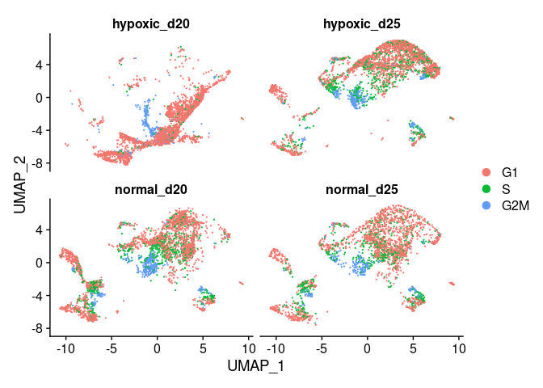

<h1 align="center">
Quality Controls and Preprocessing   
</h1>
<h2 align="center">
Deanna Deveson and Laura Perlaza-Jiménez (2022-09-25)
</h2>


Quality Control per sample from Cellranger

| Sample ID |  Condition| Replicate | Day | QC | Counts Matrix|
| :---:|  :----: | :----: | :----: | :----: | :----: |
|n1_d20 | Normoxia | 1 | day 20 | [QC](1.QC_and_Preprocessing_files/n1_d20.web_summary.html)|[Matrix](../Data/n1_d20_sample_filtered_feature_bc_matrix.h5)|
|n2_d20 | Normoxia | 2 | day 20 |[QC](1.QC_and_Preprocessing_files/n2_d20.web_summary.html)|[Matrix](../Data/n2_d20_sample_filtered_feature_bc_matrix.h5)|
|n3_d20 | Normoxia | 3 | day 20 |[QC](1.QC_and_Preprocessing_files/n3_d20.web_summary.html)|[Matrix](../Data/n3_d20_sample_filtered_feature_bc_matrix.h5)|
|h1_d20 | Hypoxia | 1 | day 20 |[QC](1.QC_and_Preprocessing_files/h1_d20.web_summary.html)|[Matrix](../Data/h1_d20_sample_filtered_feature_bc_matrix.h5)|
|h2_d20 | Hypoxia | 2 | day 20 |[QC](1.QC_and_Preprocessing_files/h2_d20.web_summary.html)|[Matrix](../Data/h2_d20_sample_filtered_feature_bc_matrix.h5)|
|h3_d20 | Hypoxia | 3 | day 20  |[QC](1.QC_and_Preprocessing_files/h3_d20.web_summary.html)|[Matrix](../Data/h3_d20_sample_filtered_feature_bc_matrix.h5)|
|n1_d25 | Normoxia | 1 | day 25 |[QC](1.QC_and_Preprocessing_files/n1_d25.web_summary.html)|[Matrix](../Data/n1_d25_sample_filtered_feature_bc_matrix.h5)|
|n2_d25 | Normoxia | 2 | day 25 |[QC](1.QC_and_Preprocessing_files/n2_d25.web_summary.html)|[Matrix](../Data/n2_d25_sample_filtered_feature_bc_matrix.h5)|
|n3_d25 | Normoxia | 3 | day 25 |[QC](1.QC_and_Preprocessing_files/n3_d25.web_summary.html)|[Matrix](../Data/n3_d25_sample_filtered_feature_bc_matrix.h5)|
|h1_d25 | Hypoxia | 1 | day 25 |[QC](1.QC_and_Preprocessing_files/h1_d25.web_summary.html)|[Matrix](../Data/h1_d25_sample_filtered_feature_bc_matrix.h5)|
|h2_d25 | Hypoxia | 2 | day 25 |[QC](1.QC_and_Preprocessing_files/h2_d25.web_summary.html)|[Matrix](../Data/h2_d25_sample_filtered_feature_bc_matrix.h5)|
|h3_d25 | Hypoxia | 3 | day 25 |[QC](1.QC_and_Preprocessing_files/h3_d25.web_summary.html)|[Matrix](../Data/h3_d25_sample_filtered_feature_bc_matrix.h5)|


<h1 align="left">
Preprocessing in R
</h1>
Clean Environment

``` r
rm(list=ls());
```

Load libraries

``` r
library(dplyr)
library(Seurat)
library(hdf5r)
library(fs)
library(scCustomize)
library(clustree)
library(SeuratDisk)
library(clustree)
```

Get working path and set it

``` r
path_wd<-getwd()
setwd(path_wd)
```

Parsing file names and extracting details for replicates, condition, and
day.

``` r
path <-"../Data/"
file_dir<- dir_ls(path = path, recurse = TRUE)
file_list <- file_dir[grepl("sample_filtered_feature_bc_matrix.h5",file_dir)]
sample_vec <- gsub(file_list, pattern = path, replacement = "") %>% 
              gsub(pattern = "_sample_filtered_feature_bc_matrix.h5", replacement = "")

replicate_vec <-  as.numeric( gsub(sample_vec, pattern = "^.", replacement = "") %>% 
                    gsub(sample_vec, pattern = "_d..", replacement = "") )

condition_vec <-   gsub(sample_vec, pattern = "^h.*", replacement = "hypoxic") %>%  
                    gsub(sample_vec, pattern = "^n.*", replacement = "normal")

day_vec <-   gsub(sample_vec, pattern = "^.._", replacement = "") 
```

Load each sample as an individual seurat object

``` r
for (x in 1:length(file_list)) {
  i <- file_list[x]
  name <- gsub(".*/(.*)_sample_filtered_feature_bc_matrix.h5","\\1",i)
  #print(name)
  z <- Read10X_h5(i)
  libEX<- CreateSeuratObject(z$`Gene Expression`, project = name)
  libEX$CMO <- CreateAssayObject(z$`Multiplexing Capture`)
  libEX$replicate <- replicate_vec[x]
  libEX$day <- day_vec[x]
  libEX$condition <- condition_vec[x]
  assign(name, libEX)
}
```

Merge Seurat object to combine samples

``` r
merged.kidneys <- merge(n1_d20, 
                    y = c(n2_d20,n3_d20,h1_d20,h2_d20,h3_d20,n1_d25,n2_d25,n3_d25,h1_d25,h2_d25,h3_d25), 
                    add.cell.ids=c("n1_D20","n2_d20","n3_d20","h1_d20","h2_d20","h3_d20","n1_d25","n2_d25","n3_d25","h1_d25","h2_d25","h3_d25"),
                    project = "hypoxic_kidney")
```

Remove the unnecessary seurat. You will need the RAM

``` r
rm(list = c('n2_d20','n3_d20','h1_d20','h2_d20','h3_d20','n1_d25','n2_d25','n3_d25','h1_d25','h2_d25','h3_d25'))
```

Data summary: Number of cells per sample

``` r
x<-data.frame(table(merged.kidneys$orig.ident))
colnames(x) <- c("sample","number of cells")
x
```

    ##    sample number of cells
    ## 1  h1_d20            1011
    ## 2  h1_d25             959
    ## 3  h2_d20             897
    ## 4  h2_d25            1168
    ## 5  h3_d20            1008
    ## 6  h3_d25            1049
    ## 7  n1_d20            1061
    ## 8  n1_d25             942
    ## 9  n2_d20            1089
    ## 10 n2_d25             645
    ## 11 n3_d20            1003
    ## 12 n3_d25             869

# Standard pre-processing workflow

## QC and selecting cells for further analysis

``` r
merged.kidneys[["percent.mt"]] <- PercentageFeatureSet(merged.kidneys, pattern = "^MT-")
```

## Distribution of features, read counts, percentage of mithocondrial content

``` r
VlnPlot(merged.kidneys, features = "nFeature_RNA")
```

<!-- -->

``` r
VlnPlot(merged.kidneys, features = "nCount_RNA")
```

<!-- -->

``` r
VlnPlot(merged.kidneys, features = "percent.mt")
```

<!-- -->

## Read counts vs mithocondrial percentage

``` r
FeatureScatter(merged.kidneys, feature1 = "nCount_RNA", feature2 = "percent.mt")
```

<!-- -->

## Feature counts vs mithocondrial percentage

``` r
FeatureScatter(merged.kidneys, feature1 = "nCount_RNA", feature2 = "nFeature_RNA")
```

<!-- -->

## Removing the ambiguous cells and subset for high counts (avoiding ambient RNA): Filtering cell with less than 200 features

Subsetting data

``` r
merged.kidneys <- subset(merged.kidneys, subset = nFeature_RNA > 200 )
```

Plot the variables after filtering

``` r
VlnPlot(merged.kidneys, features = "nFeature_RNA")
```

<!-- -->

``` r
VlnPlot(merged.kidneys, features = "nCount_RNA")
```

<!-- -->

``` r
VlnPlot(merged.kidneys, features = "percent.mt")
```

<!-- -->

# Normalization: STC transform

## Distribution of raw counts vs normalized counts

``` r
#Idents(merged.kidneys)<-merged.kidneys$orig.ident
merged.kidneys <- SCTransform(merged.kidneys, vars.to.regress = "percent.mt", verbose = FALSE) 
merged.kidneys <- FindVariableFeatures(merged.kidneys,selection.method ='vst',nfeatures =1000) 
merged.kidneys <- ScaleData(merged.kidneys) 
```

Original expression distribution

``` r
raw_Counts = merged.kidneys$nCount_RNA
hist(raw_Counts)
```

<!-- -->

``` r
SCT_Normalized_Counts=merged.kidneys$nCount_SCT
```

Expression distribution after normalization

``` r
hist(SCT_Normalized_Counts)
```

<!-- -->

## Identification of highly variable genes

Identify the 10 most highly variable genes

``` r
top10 <- head(VariableFeatures(merged.kidneys), 10)
```

Plot variable features with and without labels

``` r
plot4 <- VariableFeaturePlot(merged.kidneys)
plot5 <- LabelPoints(plot = plot4, points = top10 )
plot5
```

<!-- -->

## PCA calculation

Examine and visualize PCA results a few different ways

``` r
merged.kidneys <- RunPCA(merged.kidneys, features = VariableFeatures(object = merged.kidneys))

print(merged.kidneys[["pca"]], dims = 1:5, nfeatures = 5)
```

    ## PC_ 1 
    ## Positive:  KRT19, DCDC2, ITM2B, ARHGAP29, EPCAM 
    ## Negative:  RBMS3, GAS2, AFF3, PRRX1, NFIB 
    ## PC_ 2 
    ## Positive:  NPHS2, PTPRO, NPHS1, MAFB, PODXL 
    ## Negative:  DDIT4, GAPDH, LDHA, P4HA1, ANKRD37 
    ## PC_ 3 
    ## Positive:  VIM, P4HA1, VEGFA, DDIT4, SSBP2 
    ## Negative:  LHFPL3, MT-CO3, FXYD2, LHFPL3-AS2, CD24 
    ## PC_ 4 
    ## Positive:  MYL1, ACTC1, NEB, ARPP21, MRLN 
    ## Negative:  SFRP2, PRRX1, VEGFA, P4HA1, ROBO2 
    ## PC_ 5 
    ## Positive:  TOP2A, CENPF, NUSAP1, CDK1, DLGAP5 
    ## Negative:  MRLN, ACTC1, MYOG, ARPP21, MYL4

``` r
VizDimLoadings(merged.kidneys, dims = 1:2, reduction = "pca")
```

<!-- -->

## Dimentional reduction plot PCA

``` r
DimPlot(merged.kidneys, reduction = "pca")
```

<!-- -->

## Genes in the first 3 principal components

``` r
DimHeatmap(merged.kidneys, dims = c(1:3), cells = 500, balanced = TRUE)
```

<!-- -->

# Exploring Naive Clustering with different resolutions

## Elbow plot

``` r
ElbowPlot(merged.kidneys, ndims = 20, reduction = "pca")
```

<!-- -->

Individual clusters

``` r
merged.kidneys<-RunUMAP(merged.kidneys, dims = 1:15)
```

Label UMAP with original sample name

``` r
DimPlot(merged.kidneys, reduction = "umap")
```

<!-- -->

## UMAP by day and condition

Split UMAP by day and condition. Pass one meta-column to group.by, one
meta-column to split.by

``` r
DimPlot(merged.kidneys, reduction = "umap", group.by = "day" , split.by = "condition") 
```

<!-- -->

``` r
DimPlot(merged.kidneys, reduction = "umap", group.by = "replicate", split.by = "condition" )
```

<!-- -->

Find neighbors and clusters

``` r
merged.kidneys <- FindNeighbors(merged.kidneys )
merged.kidneys <- FindClusters(merged.kidneys, resolution=2)
merged.kidneys$ident_originallabels <-Idents( merged.kidneys)
```

Find variable features for each resolution

``` r
markers_list<-list()
for (res in seq(0.1,2.1,0.1)) {
  merged.kidneys<- FindClusters(merged.kidneys, resolution = res, algorithm = 3,print.output = FALSE)
  clustername<-paste0("SCT_snn_res.",res)
  Idents(merged.kidneys)<- merged.kidneys[[clustername]] 
  markers_list[[clustername]] <- FindAllMarkers(merged.kidneys, only.pos = TRUE, min.pct = 0.25, logfc.threshold = 0.25)
}
```

## Clustree

check clustree
[tutorial](https://cran.r-project.org/web/packages/clustree/vignettes/clustree.html)

``` r
clustree(merged.kidneys)+theme(legend.key.size = unit(0.30, 'cm'))
```

<!-- -->

# Cell Cycle

Cell cycle annotation

``` r
s.genes <- cc.genes.updated.2019$s.genes
g2m.genes <- cc.genes.updated.2019$g2m.genes

merged.kidneys$treatment<-paste(merged.kidneys$condition,merged.kidneys$day,sep="_")
merged.kidneys<- CellCycleScoring(merged.kidneys, s.features = s.genes, g2m.features = g2m.genes, set.ident = TRUE)

DimPlot(merged.kidneys, split.by = "treatment",ncol=2)
```

<!-- -->

Number of cell in cycle cells in each sample

``` r
x<-data.frame(table(merged.kidneys$treatment, merged.kidneys$Phase)) 
colnames(x)<-c("sample","Phase","numberof cells")
x
```

    ##         sample Phase numberof cells
    ## 1  hypoxic_d20    G1           2503
    ## 2  hypoxic_d25    G1           2059
    ## 3   normal_d20    G1           1990
    ## 4   normal_d25    G1           1604
    ## 5  hypoxic_d20   G2M            282
    ## 6  hypoxic_d25   G2M            321
    ## 7   normal_d20   G2M            358
    ## 8   normal_d25   G2M            237
    ## 9  hypoxic_d20     S            131
    ## 10 hypoxic_d25     S            790
    ## 11  normal_d20     S            797
    ## 12  normal_d25     S            610

Save the seurat object and the features list

``` r
Idents(merged.kidneys)<-merged.kidneys$orig.ident
saveRDS( markers_list, file="../Results/markers_list.RData")
SaveH5Seurat(merged.kidneys,"../Results/merged.kidneys.seurat_NaiveUMAP_clustered",overwrite = TRUE)
```
