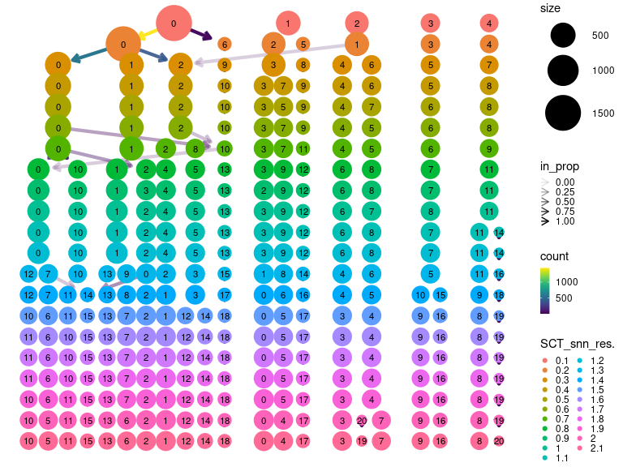
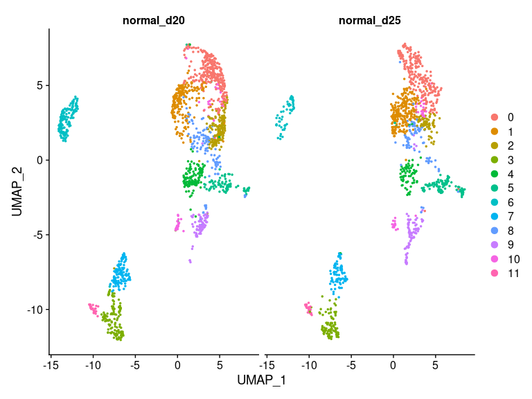
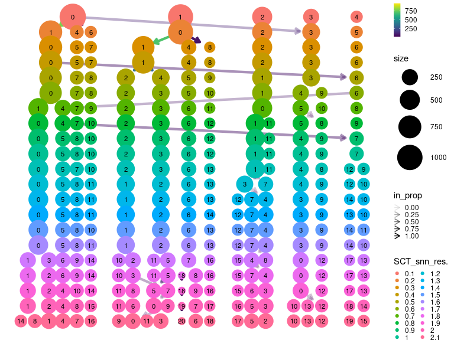
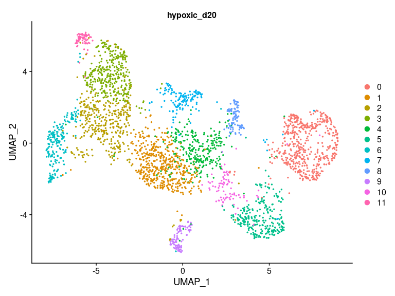
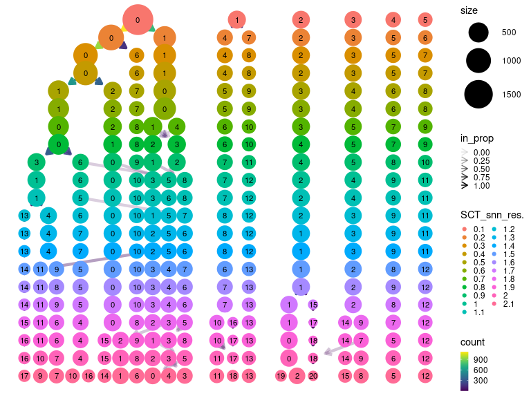
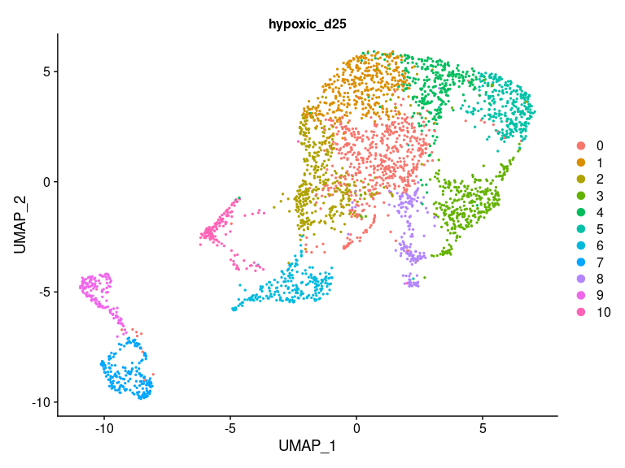
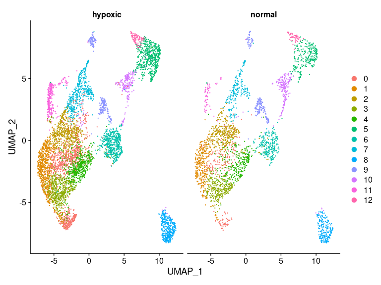
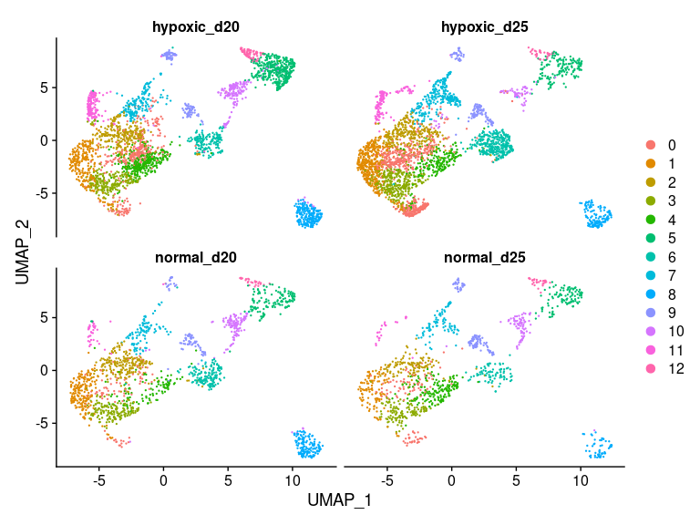
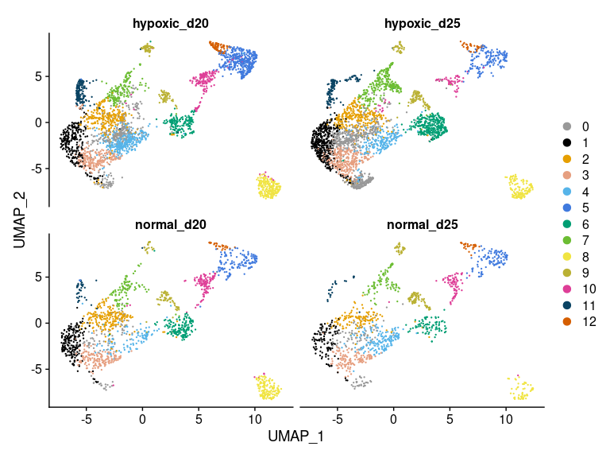
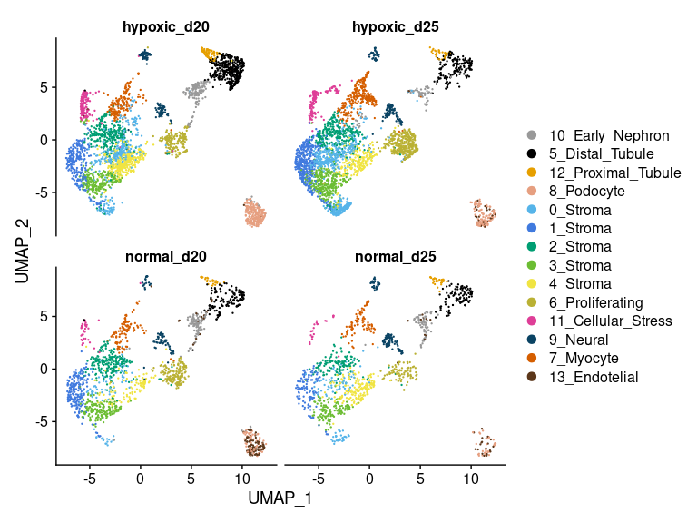

<h1 align="center">
Clustering and Cell Classification using integration
</h1>
<h2 align="center">
Laura Perlaza-Jimenez (2023-02-06)
</h1>

Clean Environment

``` r
rm(list=ls());
```

Load libraries

``` r
library(dplyr)
library(Seurat)
library(hdf5r)
library(SeuratDisk)
library(ggplot2)
library(RColorBrewer)
library(limma)
library(edgeR)
library(scCustomize)
library(clustree)
```

Get working path and set it

``` r
path_wd<-getwd()
setwd(path_wd)
```

Load data

``` r
subset_obj<-LoadH5Seurat("../Results/merged.kidneys.seurat_NaiveUMAP_clustered.h5seurat")
markers_list<-readRDS("../Results/markers_list.RData")
```

Change identity of cells

``` r
Idents(subset_obj)<-subset_obj$orig.ident
subset_obj$treatment=ordered(factor(paste(subset_obj$condition,subset_obj$day,sep="_"),
                                    levels=c("normal_d20","hypoxic_d20","normal_d25","hypoxic_d25")))
```

# Split out normal organoids and find clustering resolution

Subsetting only normal samples, normalization, dimensionality reduction
and clustering

``` r
normal <- subset(subset_obj,subset=  treatment == c("normal_d20","normal_d25"))
normal <- FindVariableFeatures(normal,selection.method ='vst',nfeatures =1000) 
normal <- ScaleData(normal) 
normal <- RunPCA(normal, features = VariableFeatures(object = normal))
normal <- RunUMAP(normal, dims = 1:15)
normal <- FindNeighbors(normal)
normal <- FindClusters(normal, resolution=2)
normal$ident_originallabels <-Idents(normal)
```

Find variable features for each resolution

``` r
markers_list<-list()
for (res in seq(0.1,2.1,0.1)) {
  normal <- FindClusters(normal, resolution = res, algorithm = 3,
                               print.output = FALSE)
  clustername <-paste0("SCT_snn_res.",res)
  Idents(normal) <-normal[[clustername]] 
  markers_list[[clustername]] <- FindAllMarkers(normal, only.pos = TRUE, min.pct = 0.25, logfc.threshold = 0.25)
}
```

## Cluster tree for normal organoids

``` r
clustree(normal)+theme(legend.key.size = unit(0.30, 'cm'))
```

<!-- -->

## Resolution 0.7 for Normal

``` r
Idents(normal)<-normal$SCT_snn_res.0.7
DimPlot(normal, split.by = "treatment",ncol=2)
```

<!-- -->

## Markers in Normal

``` r
normal_markers_list<-markers_list[["SCT_snn_res.0.7"]]
head(normal_markers_list,20)
```

    ##                  p_val avg_log2FC pct.1 pct.2     p_val_adj cluster     gene
    ## GAS2     1.739780e-171  1.9512462 0.971 0.620 4.911224e-167       0     GAS2
    ## SFRP2    5.025030e-150  1.6154558 0.936 0.509 1.418516e-145       0    SFRP2
    ## HGF      6.320226e-132  1.8275644 0.513 0.092 1.784137e-127       0      HGF
    ## NFIB     1.753877e-131  1.2347725 0.949 0.535 4.951019e-127       0     NFIB
    ## PDGFRA   9.375953e-127  1.2885335 0.956 0.573 2.646738e-122       0   PDGFRA
    ## IL1RAPL1 7.339472e-126  1.7867183 0.903 0.514 2.071860e-121       0 IL1RAPL1
    ## OGN      2.042457e-125  1.7124248 0.765 0.289 5.765653e-121       0      OGN
    ## EBF3     1.001926e-121  1.3438056 0.851 0.404 2.828337e-117       0     EBF3
    ## LRP1B    5.852272e-121  1.9188141 0.866 0.432 1.652038e-116       0    LRP1B
    ## TRPS1    7.374008e-114  1.3869200 0.971 0.768 2.081609e-109       0    TRPS1
    ## ADAMTS6  1.436059e-109  1.4815578 0.746 0.312 4.053850e-105       0  ADAMTS6
    ## TSHZ2    8.394963e-101  1.2481520 0.923 0.631  2.369814e-96       0    TSHZ2
    ## FAT3      1.124743e-95  1.4263009 0.855 0.502  3.175036e-91       0     FAT3
    ## MEIS1     3.649580e-90  1.2743446 0.748 0.383  1.030240e-85       0    MEIS1
    ## FAT4      7.266414e-90  1.1508386 0.754 0.367  2.051236e-85       0     FAT4
    ## MIR100HG  6.415429e-88  0.9085972 0.972 0.654  1.811012e-83       0 MIR100HG
    ## FOXP2     3.232051e-86  1.5195802 0.710 0.318  9.123758e-82       0    FOXP2
    ## PTN       6.827535e-86  1.1902229 0.884 0.546  1.927345e-81       0      PTN
    ## NLGN1     6.799468e-85  1.3122605 0.890 0.572  1.919422e-80       0    NLGN1
    ## IGFBP5    1.317624e-84  1.3982759 0.746 0.361  3.719520e-80       0   IGFBP5

# Split out Hypoxic d20

Find variable features for each resolution

``` r
markers_list<-list()
for (res in seq(0.1,2.1,0.1)) {
  hypoxic <- FindClusters(hypoxic, resolution = res, algorithm = 3,
                          print.output = FALSE)
  clustername <-paste0("SCT_snn_res.",res)
  Idents(hypoxic) <-hypoxic[[clustername]] 
  markers_list[[clustername]] <- FindAllMarkers(hypoxic, only.pos = TRUE, min.pct = 0.25, logfc.threshold = 0.25)
}
```

## Cluster Tree for Hypoxic d20

``` r
library(clustree)
clustree(hypoxic)+theme(legend.key.size = unit(0.30, 'cm'))
```

<!-- -->

## Resolution 0.7 for Hypoxic d20

``` r
Idents(hypoxic)<-hypoxic$SCT_snn_res.0.7
DimPlot(hypoxic, split.by = "treatment",ncol=2)
```

<!-- -->

## Markers in Hypoxic d20

``` r
hypoxicd20_markers_list<-markers_list[["SCT_snn_res.0.7"]]
head(hypoxicd20_markers_list,10)
```

    ##                    p_val avg_log2FC pct.1 pct.2     p_val_adj cluster
    ## LHFPL3-AS2 3.905308e-297   1.622505 0.667 0.038 1.102429e-292       0
    ## EPCAM      2.794659e-276   1.459599 0.829 0.119 7.889044e-272       0
    ## CKB        3.379283e-252   2.616926 0.890 0.209 9.539378e-248       0
    ## RBM47      1.035585e-240   1.199002 0.669 0.065 2.923352e-236       0
    ## DCDC2      4.725235e-236   1.809088 0.839 0.144 1.333887e-231       0
    ## CAMK2N1    4.861616e-224   1.639152 0.837 0.186 1.372386e-219       0
    ## HPN        2.412363e-222   0.802003 0.514 0.026 6.809860e-218       0
    ## CLDN4      1.118754e-221   1.793855 0.631 0.070 3.158132e-217       0
    ## MAL        2.408474e-219   1.637403 0.486 0.022 6.798880e-215       0
    ## ATP1B1     9.351112e-218   1.408693 0.813 0.163 2.639725e-213       0
    ##                  gene
    ## LHFPL3-AS2 LHFPL3-AS2
    ## EPCAM           EPCAM
    ## CKB               CKB
    ## RBM47           RBM47
    ## DCDC2           DCDC2
    ## CAMK2N1       CAMK2N1
    ## HPN               HPN
    ## CLDN4           CLDN4
    ## MAL               MAL
    ## ATP1B1         ATP1B1

``` r
hypoxicd20<-  hypoxic
```

# Split out Hypoxic d25

Find variable features for each resolution

``` r
markers_list<-list()
for (res in seq(0.1,2.1,0.1)) {
  hypoxic <- FindClusters(hypoxic, resolution = res, algorithm = 3,
                          print.output = FALSE)
  clustername <-paste0("SCT_snn_res.",res)
  Idents(hypoxic) <-hypoxic[[clustername]] 
  markers_list[[clustername]] <- FindAllMarkers(hypoxic, only.pos = TRUE, min.pct = 0.25, logfc.threshold = 0.25)
}
```

## Cluster Tree for Hypoxic d25

``` r
library(clustree)
clustree(hypoxic)+theme(legend.key.size = unit(0.30, 'cm'))
```

<!-- -->

## Resolution 0.7 for Hypoxic d25

``` r
Idents(hypoxic)<-hypoxic$SCT_snn_res.0.7
DimPlot(hypoxic, split.by = "treatment",ncol=2)
```

<!-- -->

## Markers in Hypoxic d25

``` r
hypoxicd25_markers_list<-markers_list[["SCT_snn_res.0.7"]]
head(hypoxicd25_markers_list,10)
```

    ##               p_val avg_log2FC pct.1 pct.2    p_val_adj cluster   gene
    ## RPS27  2.903724e-95  0.4687147     1 1.000 8.196921e-91       0  RPS27
    ## RPL35A 4.835846e-89  0.4321604     1 0.998 1.365111e-84       0 RPL35A
    ## RPS26  5.893451e-84  0.4349791     1 0.997 1.663662e-79       0  RPS26
    ## RPL22  2.122163e-83  0.4655648     1 0.998 5.990653e-79       0  RPL22
    ## RPS15A 4.241921e-83  0.4396001     1 0.998 1.197452e-78       0 RPS15A
    ## RPL26  1.183315e-81  0.4962556     1 0.998 3.340379e-77       0  RPL26
    ## RPL30  1.576683e-81  0.4193052     1 1.000 4.450819e-77       0  RPL30
    ## RPL32  3.741026e-80  0.4418511     1 0.999 1.056054e-75       0  RPL32
    ## NACA   6.225012e-80  0.4655683     1 0.997 1.757259e-75       0   NACA
    ## RPS15  2.818399e-77  0.4436553     1 0.999 7.956059e-73       0  RPS15

``` r
hypoxicd25<-  hypoxic
```

# Integration using normal dataset markers as anchors

Anchor the clusters using the normal organoids markers

``` r
ifnb.list <- list(normal,hypoxicd20,hypoxicd25)

found_markers<- rbind(normal_markers_list)
top10 <- found_markers %>% group_by(cluster) %>% top_n(n = 30, wt = avg_log2FC) %>% select(gene)
top10 <- top10[ !duplicated(top10$gene),]
features <- top10$gene

kidney.anchors <- FindIntegrationAnchors(object.list = ifnb.list, anchor.features = features)
kidney.combined <- IntegrateData(anchorset = kidney.anchors)
DefaultAssay(kidney.combined) <- "integrated"
```

Run PCA, UMAP and Clustering

``` r
kidney.combined <- ScaleData(kidney.combined, verbose = FALSE)
kidney.combined <- RunPCA(kidney.combined, npcs = 30, verbose = FALSE)
kidney.combined <- RunUMAP(kidney.combined, dims= 1:15)
kidney.combined <- FindNeighbors(kidney.combined)
kidney.combined <- FindClusters(kidney.combined, resolution = 0.7)
```

    ## Modularity Optimizer version 1.3.0 by Ludo Waltman and Nees Jan van Eck
    ## 
    ## Number of nodes: 8885
    ## Number of edges: 291966
    ## 
    ## Running Louvain algorithm...
    ## Maximum modularity in 10 random starts: 0.8628
    ## Number of communities: 13
    ## Elapsed time: 1 seconds

## Combined Integration using normal dataset markers as anchors

``` r
DimPlot(kidney.combined, reduction = "umap", split.by = "condition")
```

<!-- -->

``` r
DimPlot(kidney.combined, split.by = "treatment",ncol=2)
```

<!-- -->

``` r
cbPalette <- c("#999999", "#000000", "#E69F00","#E69F80", "#56B4E9", "#407ade","#009E73","#6cbd33", "#F0E442","#bab134", "#de3e97","#0a4363","#D55E00")

#cbPalette <- c("#999999", "#000000", "#E69F00","#E69F80", "#56B4E9", "#407ade","#009E73","#1b5c4a", "#F0E442","#bab134", "#0072B2","#0a4363","#D55E00",  "#a35a21", "#CC79A7","#de3e97","#5667e9")

plot1<-DimPlot(kidney.combined,  reduction = "umap",split.by = "treatment",ncol=2)

plot1 + scale_color_manual(values = cbPalette )
```

<!-- -->

## Markers combined using normal dataset markers as anchors

# Add cell_labels

find endothelial cells

``` r
genes_endo<-list(endo=c("PECAM1", "CLDN5", "ESAM", "PVLAP"))

kidney.combined<- AddModuleScore( object =kidney.combined,features = genes_endo,ctrl = 5,name = "endothelial_cell", search=TRUE)

levels(kidney.combined$integrated_snn_res.0.7) <- c(levels(kidney.combined$integrated_snn_res.0.7), "13")
kidney.combined$integrated_snn_res.0.7[kidney.combined$endothelial_cell1>1]="13"
```

use markers to label the different cell populations

``` r
kidney.combined$cell_labels<-NA
kidney.combined$cell_labels[kidney.combined$integrated_snn_res.0.7==0] <-"0_Stroma"
kidney.combined$cell_labels[kidney.combined$integrated_snn_res.0.7==1] <-"1_Stroma"
kidney.combined$cell_labels[kidney.combined$integrated_snn_res.0.7==2] <-"2_Stroma"
kidney.combined$cell_labels[kidney.combined$integrated_snn_res.0.7==3] <-"3_Stroma"
kidney.combined$cell_labels[kidney.combined$integrated_snn_res.0.7==4] <-"4_Stroma"
kidney.combined$cell_labels[kidney.combined$integrated_snn_res.0.7==5] <-"5_Distal_Tubule"
kidney.combined$cell_labels[kidney.combined$integrated_snn_res.0.7==6] <-"6_Proliferating"
kidney.combined$cell_labels[kidney.combined$integrated_snn_res.0.7==7] <-"7_Myocyte"
kidney.combined$cell_labels[kidney.combined$integrated_snn_res.0.7==8] <-"8_Podocyte"
kidney.combined$cell_labels[kidney.combined$integrated_snn_res.0.7==9] <-"9_Neural"
kidney.combined$cell_labels[kidney.combined$integrated_snn_res.0.7==10]<-"10_Early_Nephron"
kidney.combined$cell_labels[kidney.combined$integrated_snn_res.0.7==11]<-"11_Cellular_Stress"
kidney.combined$cell_labels[kidney.combined$integrated_snn_res.0.7==12]<-"12_Proximal_Tubule"
kidney.combined$cell_labels[kidney.combined$integrated_snn_res.0.7==13]<-"13_Endotelial"

kidney.combined$lineage<-NA
kidney.combined$lineage[kidney.combined$integrated_snn_res.0.7==0] <-"Stroma"
kidney.combined$lineage[kidney.combined$integrated_snn_res.0.7==1] <-"Stroma"
kidney.combined$lineage[kidney.combined$integrated_snn_res.0.7==2] <-"Stroma"
kidney.combined$lineage[kidney.combined$integrated_snn_res.0.7==3] <-"Stroma"
kidney.combined$lineage[kidney.combined$integrated_snn_res.0.7==4] <-"Stroma"
kidney.combined$lineage[kidney.combined$integrated_snn_res.0.7==5] <-"Nephron"
kidney.combined$lineage[kidney.combined$integrated_snn_res.0.7==6] <-"Proliferating"
kidney.combined$lineage[kidney.combined$integrated_snn_res.0.7==7] <-"Myocyte"
kidney.combined$lineage[kidney.combined$integrated_snn_res.0.7==8] <-"Nephron"
kidney.combined$lineage[kidney.combined$integrated_snn_res.0.7==9] <-"Neural"
kidney.combined$lineage[kidney.combined$integrated_snn_res.0.7==10]<-"Nephron"
kidney.combined$lineage[kidney.combined$integrated_snn_res.0.7==11]<-"Cellular_Stress"
kidney.combined$lineage[kidney.combined$integrated_snn_res.0.7==12]<-"Nephron"
kidney.combined$lineage[kidney.combined$integrated_snn_res.0.7==13]<-"Endotelial"


kidney.combined$cell_labels=factor(kidney.combined$cell_labels,levels=c("10_Early_Nephron","5_Distal_Tubule","12_Proximal_Tubule","8_Podocyte","0_Stroma","1_Stroma","2_Stroma","3_Stroma","4_Stroma","6_Proliferating","11_Cellular_Stress","9_Neural","7_Myocyte","13_Endotelial"))

Idents(kidney.combined)<-kidney.combined$cell_labels
```

Plot integration with new labels

``` r
cbPalette <- c("#999999", "#000000", "#E69F00","#E69F80", "#56B4E9", "#407ade","#009E73","#6cbd33", "#F0E442","#bab134", "#de3e97","#0a4363","#D55E00","#5c371a")

plot1<-DimPlot(kidney.combined, split.by = "treatment",ncol=2)

plot1 + scale_color_manual(values = cbPalette)
```

<!-- -->

Safe files

``` r
saveRDS(nk.markers,"../Results/kidney.combined.marketlist.rds")
SaveH5Seurat(kidney.combined,"../Results/kidney.combined_obj_UMAP_clustered_finalnames",overwrite = TRUE)
```
