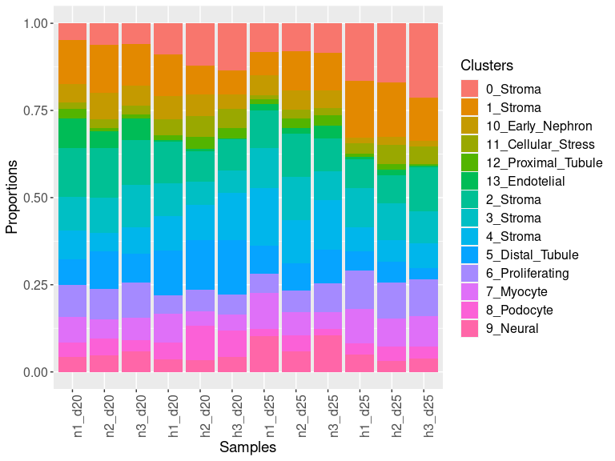
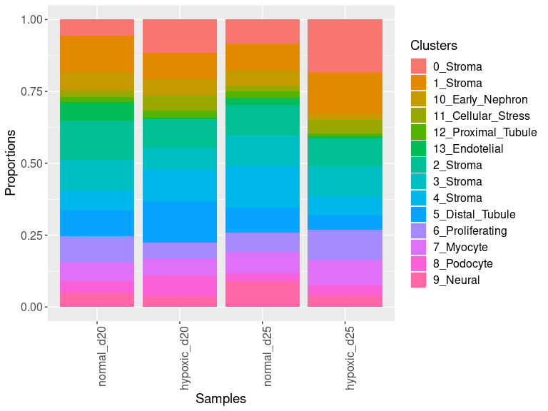
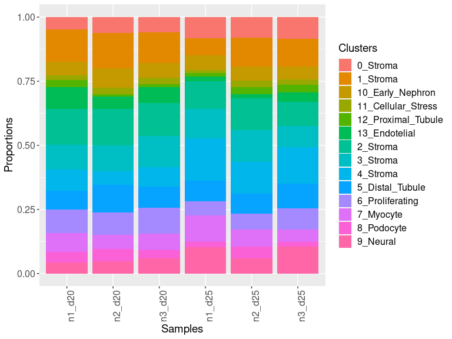
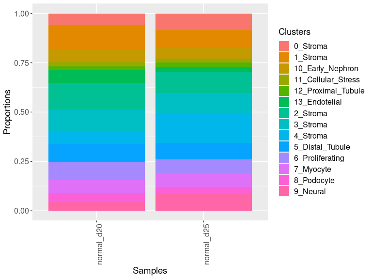
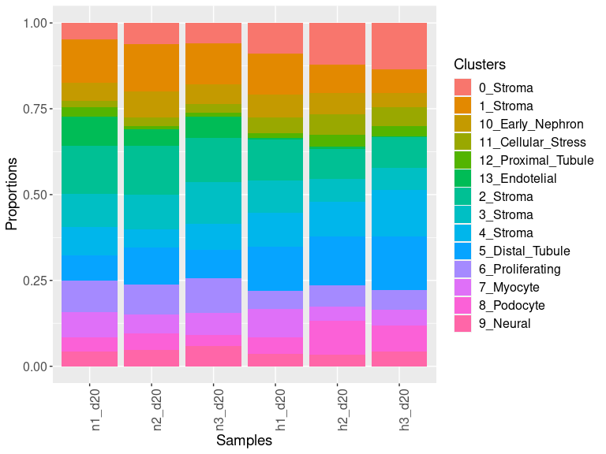
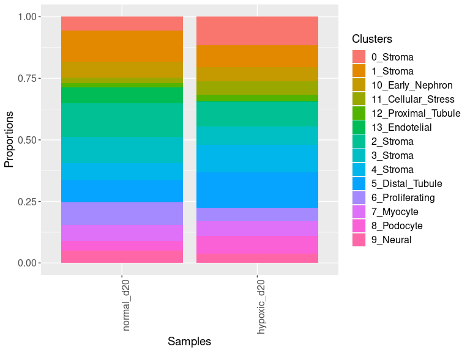
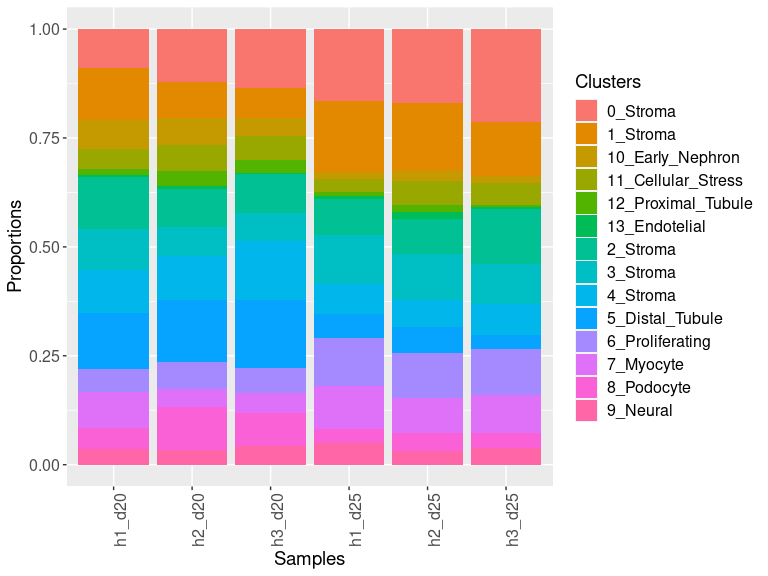
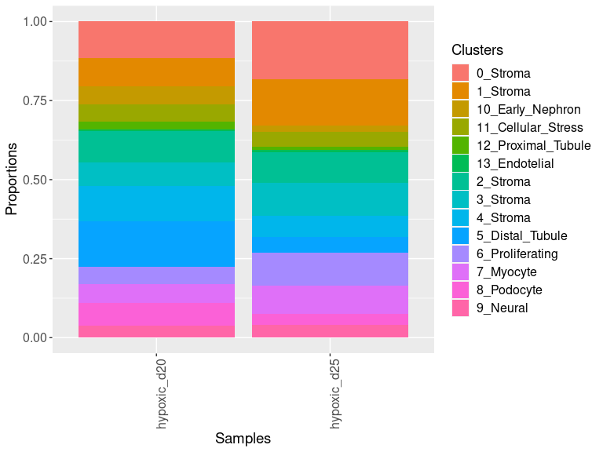
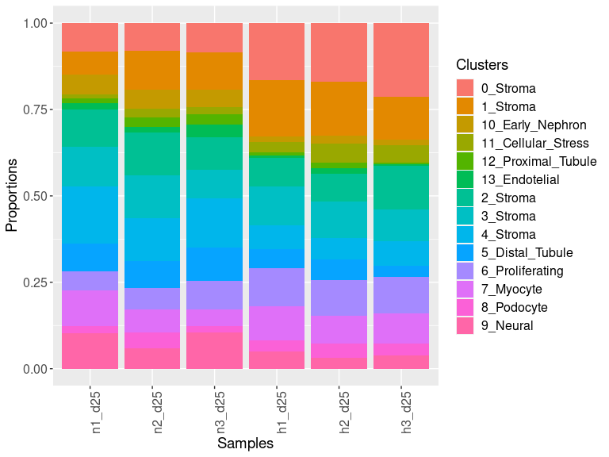
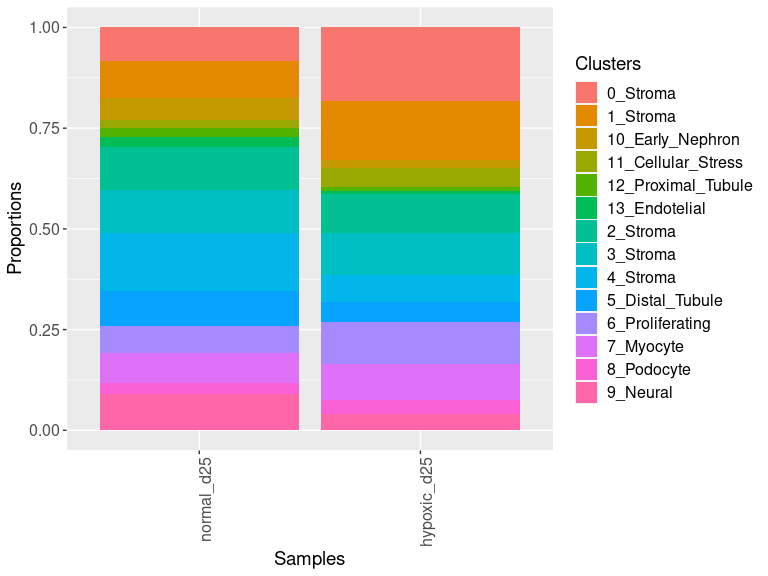

<h1 align="center">
Differential Proportions
</h1>
<h2 align="center">
Laura Perlaza-Jimenez (2023-02-06)
</h2>  


Clean Environment

``` r
rm(list=ls());
```

Load libraries

``` r
library(dplyr)
library(Seurat)
library(hdf5r)
library(fs)
library(SeuratDisk)
library(ggplot2)
library(RColorBrewer)
library(ggforce)
library(speckle)
```

Get working path and set it

``` r
path_wd<-getwd()
setwd(path_wd)
```

``` r
subset_obj<-LoadH5Seurat("../Results//kidney.combined_obj_UMAP_clustered_finalnames.h5seurat")
DefaultAssay(subset_obj) <- "RNA"
```

# ANOVA for all groups

``` r
table_results <- propeller(clusters = subset_obj$cell_labels, sample = subset_obj$orig.ident, group = subset_obj$treatment)

table_results 
```

    ##                    BaselineProp PropMean.hypoxic_d20 PropMean.hypoxic_d25
    ## 13_Endotelial        0.01935847          0.003838247          0.008856970
    ## 10_Early_Nephron     0.04423185          0.057449731          0.018701273
    ## 0_Stroma             0.12447946          0.115441309          0.182674098
    ## 5_Distal_Tubule      0.09195273          0.141975175          0.049523918
    ## 11_Cellular_Stress   0.04063028          0.053090534          0.045853796
    ## 4_Stroma             0.09319077          0.112091314          0.067548080
    ## 9_Neural             0.04805853          0.037939582          0.039995548
    ## 6_Proliferating      0.08204840          0.057132781          0.105893600
    ## 8_Podocyte           0.04783343          0.073988513          0.035974382
    ## 1_Stroma             0.11727631          0.089922240          0.147110403
    ## 12_Proximal_Tubule   0.01834553          0.026717784          0.009832419
    ## 3_Stroma             0.09532921          0.075071474          0.103894529
    ## 2_Stroma             0.10568374          0.098682827          0.095815655
    ## 7_Myocyte            0.07158132          0.056658489          0.088325331
    ##                    PropMean.normal_d20 PropMean.normal_d25 Fstatistic
    ## 13_Endotelial               0.06493605          0.02386258  33.889934
    ## 10_Early_Nephron            0.06271198          0.05467793  21.052214
    ## 0_Stroma                    0.05658633          0.08299941  20.841349
    ## 5_Distal_Tubule             0.08872663          0.08510562  12.585548
    ## 11_Cellular_Stress          0.02293355          0.01945626  11.778355
    ## 4_Stroma                    0.06953142          0.14286105  10.578823
    ## 9_Neural                    0.05042413          0.08828105   8.468796
    ## 6_Proliferating             0.09300822          0.06681813   7.497419
    ## 8_Podocyte                  0.04046067          0.02876367   6.542418
    ## 1_Stroma                    0.12689449          0.09461807   3.986364
    ## 12_Proximal_Tubule          0.01651552          0.02357075   2.782929
    ## 3_Stroma                    0.10713387          0.10733805   2.352623
    ## 2_Stroma                    0.13647690          0.10906403   2.197916
    ## 7_Myocyte                   0.06366024          0.07258340   1.974557
    ##                         P.Value          FDR
    ## 13_Endotelial      2.155596e-06 2.414736e-05
    ## 10_Early_Nephron   4.834229e-06 2.414736e-05
    ## 0_Stroma           5.174434e-06 2.414736e-05
    ## 5_Distal_Tubule    1.251049e-04 4.378672e-04
    ## 11_Cellular_Stress 1.835333e-04 5.138934e-04
    ## 4_Stroma           3.350855e-04 7.818661e-04
    ## 9_Neural           1.078686e-03 2.157372e-03
    ## 6_Proliferating    1.954277e-03 3.419985e-03
    ## 8_Podocyte         3.862203e-03 6.007872e-03
    ## 1_Stroma           2.487338e-02 3.482273e-02
    ## 12_Proximal_Tubule 9.182283e-02 1.168654e-01
    ## 3_Stroma           1.072526e-01 1.251280e-01
    ## 2_Stroma           1.245099e-01 1.340876e-01
    ## 7_Myocyte          1.549332e-01 1.549332e-01

``` r
subset_obj$samples=ordered(factor(subset_obj$orig.ident, levels = c("n1_d20", "n2_d20" ,"n3_d20", "h1_d20", "h2_d20", "h3_d20", "n1_d25", "n2_d25", "n3_d25" ,"h1_d25" ,"h2_d25", "h3_d25")))

xx<-plotCellTypeProps(clusters=subset_obj$cell_labels, sample=subset_obj$samples)+theme(axis.text.x=element_text(angle=90,hjust=1))
xx$data$Samples=factor(xx$data$Samples,levels = c("n1_d20", "n2_d20" ,"n3_d20", "h1_d20", "h2_d20", "h3_d20", "n1_d25", "n2_d25", "n3_d25" ,"h1_d25" ,"h2_d25", "h3_d25"))

xx
```

<!-- -->

``` r
xx<-plotCellTypeProps(clusters=subset_obj$cell_labels, sample=subset_obj$treatment)+theme(axis.text.x=element_text(angle=90,hjust=1))
xx$data$Samples=factor(xx$data$Samples,levels = c( "normal_d20","hypoxic_d20",  "normal_d25", "hypoxic_d25" ))
xx
```

<!-- -->

``` r
subset_obj1<-subset_obj
```

# normal_d20 vs normal_d25 (t-test)

``` r
subset_obj<-subset_obj1
subset_obj<-subset_obj[ ,subset_obj$treatment=="normal_d20" | subset_obj$treatment=="normal_d25"]

table_results <- propeller(clusters = subset_obj$cell_labels, sample = subset_obj$orig.ident, group = subset_obj$treatment)

table_results 
```

    ##                    BaselineProp.clusters BaselineProp.Freq PropMean.normal_d20
    ## 13_Endotelial              13_Endotelial        0.04715970          0.06493605
    ## 4_Stroma                        4_Stroma        0.10253662          0.06953142
    ## 9_Neural                        9_Neural        0.06823866          0.05042413
    ## 0_Stroma                        0_Stroma        0.06823866          0.05658633
    ## 6_Proliferating          6_Proliferating        0.08145766          0.09300822
    ## 1_Stroma                        1_Stroma        0.11182565          0.12689449
    ## 8_Podocyte                    8_Podocyte        0.03465523          0.04046067
    ## 2_Stroma                        2_Stroma        0.12397285          0.13647690
    ## 12_Proximal_Tubule    12_Proximal_Tubule        0.01929260          0.01651552
    ## 11_Cellular_Stress    11_Cellular_Stress        0.02107896          0.02293355
    ## 10_Early_Nephron        10_Early_Nephron        0.05930690          0.06271198
    ## 7_Myocyte                      7_Myocyte        0.06823866          0.06366024
    ## 5_Distal_Tubule          5_Distal_Tubule        0.08753126          0.08872663
    ## 3_Stroma                        3_Stroma        0.10646660          0.10713387
    ##                    PropMean.normal_d25 PropRatio  Tstatistic      P.Value
    ## 13_Endotelial               0.02386258 2.7212506  4.63336976 0.0002810418
    ## 4_Stroma                    0.14286105 0.4867066 -4.20731428 0.0005680495
    ## 9_Neural                    0.08828105 0.5711773 -2.80335313 0.0120420023
    ## 0_Stroma                    0.08299941 0.6817678 -2.30196766 0.0339661122
    ## 6_Proliferating             0.06681813 1.3919609  1.98093953 0.0636639830
    ## 1_Stroma                    0.09461807 1.3411232  1.80370722 0.0886555754
    ## 8_Podocyte                  0.02876367 1.4066587  1.76363460 0.0970108497
    ## 2_Stroma                    0.10906403 1.2513466  1.45137567 0.1645034493
    ## 12_Proximal_Tubule          0.02357075 0.7006786 -1.31081000 0.2185346250
    ## 11_Cellular_Stress          0.01945626 1.1787232  0.87663249 0.3926533951
    ## 10_Early_Nephron            0.05467793 1.1469341  0.71085278 0.4866152187
    ## 7_Myocyte                   0.07258340 0.8770633 -0.45675413 0.6537906535
    ## 5_Distal_Tubule             0.08510562 1.0425473  0.20199531 0.8422680858
    ## 3_Stroma                    0.10733805 0.9980978  0.04778335 0.9624342161
    ##                            FDR
    ## 13_Endotelial      0.003934585
    ## 4_Stroma           0.003976347
    ## 9_Neural           0.056196011
    ## 0_Stroma           0.118881393
    ## 6_Proliferating    0.178259152
    ## 1_Stroma           0.194021699
    ## 8_Podocyte         0.194021699
    ## 2_Stroma           0.287881036
    ## 12_Proximal_Tubule 0.339942750
    ## 11_Cellular_Stress 0.549714753
    ## 10_Early_Nephron   0.619328460
    ## 7_Myocyte          0.762755762
    ## 5_Distal_Tubule    0.907057939
    ## 3_Stroma           0.962434216

``` r
subset_obj$samples=ordered(factor(subset_obj$orig.ident, levels = c("n1_d20", "n2_d20" ,"n3_d20", "n1_d25", "n2_d25", "n3_d25" )))

xx<-plotCellTypeProps(clusters=subset_obj$cell_labels, sample=subset_obj$samples)+theme(axis.text.x=element_text(angle=90,hjust=1))
xx$data$Samples=factor(xx$data$Samples,levels = c("n1_d20", "n2_d20" ,"n3_d20", "n1_d25", "n2_d25", "n3_d25"))
xx
```

<!-- -->

``` r
xx<-plotCellTypeProps(clusters=subset_obj$cell_labels, sample=subset_obj$treatment)+theme(axis.text.x=element_text(angle=90,hjust=1))
xx$data$Samples=factor(xx$data$Samples,levels = c( "normal_d20", "normal_d25"))
xx
```

<!-- -->

# normal_d20 vs hypox_d20 (t-test)

``` r
subset_obj<-subset_obj1
subset_obj<-subset_obj[ ,subset_obj$treatment=="normal_d20" | subset_obj$treatment=="hypoxic_d20"]

table_results <- propeller(clusters = subset_obj$cell_labels, sample = subset_obj$orig.ident, group = subset_obj$treatment)

table_results 
```

    ##                    BaselineProp.clusters BaselineProp.Freq PropMean.hypoxic_d20
    ## 13_Endotelial              13_Endotelial        0.02517264          0.003838247
    ## 11_Cellular_Stress    11_Cellular_Stress        0.04232569          0.053090534
    ## 0_Stroma                        0_Stroma        0.09467587          0.115441309
    ## 8_Podocyte                    8_Podocyte        0.06170639          0.073988513
    ## 5_Distal_Tubule          5_Distal_Tubule        0.12341279          0.141975175
    ## 4_Stroma                        4_Stroma        0.09734908          0.112091314
    ## 6_Proliferating          6_Proliferating        0.06950323          0.057132781
    ## 1_Stroma                        1_Stroma        0.10314101          0.089922240
    ## 3_Stroma                        3_Stroma        0.08643350          0.075071474
    ## 2_Stroma                        2_Stroma        0.11227445          0.098682827
    ## 9_Neural                        9_Neural        0.04232569          0.037939582
    ## 12_Proximal_Tubule    12_Proximal_Tubule        0.02294498          0.026717784
    ## 7_Myocyte                      7_Myocyte        0.05947873          0.056658489
    ## 10_Early_Nephron        10_Early_Nephron        0.05925596          0.057449731
    ##                    PropMean.normal_d20  PropRatio  Tstatistic      P.Value
    ## 13_Endotelial               0.06493605 0.05910811 -12.9519026 8.484336e-13
    ## 11_Cellular_Stress          0.02293355 2.31497234   4.3164553 6.522694e-05
    ## 0_Stroma                    0.05658633 2.04009195   3.8915342 2.672360e-04
    ## 8_Podocyte                  0.04046067 1.82865256   3.0753246 3.248771e-03
    ## 5_Distal_Tubule             0.08872663 1.60014164   2.7427906 8.166226e-03
    ## 4_Stroma                    0.06953142 1.61209580   2.6800437 9.649428e-03
    ## 6_Proliferating             0.09300822 0.61427668  -2.6565368 1.026587e-02
    ## 1_Stroma                    0.12689449 0.70863785  -2.0701110 4.306551e-02
    ## 3_Stroma                    0.10713387 0.70072585  -2.0275124 4.737910e-02
    ## 2_Stroma                    0.13647690 0.72307349  -1.8930333 6.352532e-02
    ## 9_Neural                    0.05042413 0.75240931  -1.4934149 1.409419e-01
    ## 12_Proximal_Tubule          0.01651552 1.61773782   1.2148939 2.807817e-01
    ## 7_Myocyte                   0.06366024 0.89001382  -0.8213454 4.149326e-01
    ## 10_Early_Nephron            0.06271198 0.91608862  -0.5053864 6.152709e-01
    ##                             FDR
    ## 13_Endotelial      1.187807e-11
    ## 11_Cellular_Stress 4.565886e-04
    ## 0_Stroma           1.247101e-03
    ## 8_Podocyte         1.137070e-02
    ## 5_Distal_Tubule    2.053174e-02
    ## 4_Stroma           2.053174e-02
    ## 6_Proliferating    2.053174e-02
    ## 1_Stroma           7.370083e-02
    ## 3_Stroma           7.370083e-02
    ## 2_Stroma           8.893544e-02
    ## 9_Neural           1.793806e-01
    ## 12_Proximal_Tubule 3.275787e-01
    ## 7_Myocyte          4.468505e-01
    ## 10_Early_Nephron   6.152709e-01

``` r
subset_obj$samples=ordered(factor(subset_obj$orig.ident, levels = c("n1_d20", "n2_d20" ,"n3_d20", "h1_d20", "h2_d20", "h3_d20")))
```

``` r
plot1<-plotCellTypeProps(clusters=subset_obj$cell_labels, sample=subset_obj$samples)+theme(axis.text.x=element_text(angle=90,hjust=1))
plot1$data$Samples=factor(plot1$data$Samples,levels = c("n1_d20", "n2_d20" ,"n3_d20", "h1_d20", "h2_d20", "h3_d20"))
plot1
```

<!-- -->

``` r
plot2<-plotCellTypeProps(clusters=subset_obj$cell_labels, sample=subset_obj$treatment)+theme(axis.text.x=element_text(angle=90,hjust=1))
plot2$data$Samples=factor(plot2$data$Samples,levels = c( "normal_d20","hypoxic_d20"))
plot2
```

<!-- -->

# hypoxic_d20 vs hypox_d25 (t-test)

``` r
subset_obj<-subset_obj1
subset_obj<-subset_obj[ ,subset_obj$treatment=="hypoxic_d20" | subset_obj$treatment=="hypoxic_d25"]

table_results <- propeller(clusters = subset_obj$cell_labels, sample = subset_obj$orig.ident, group = subset_obj$treatment)

table_results 
```

    ##                    BaselineProp.clusters BaselineProp.Freq PropMean.hypoxic_d20
    ## 5_Distal_Tubule          5_Distal_Tubule       0.093986198          0.141975175
    ## 10_Early_Nephron        10_Early_Nephron       0.037298718          0.057449731
    ## 8_Podocyte                    8_Podocyte       0.053894183          0.073988513
    ## 6_Proliferating          6_Proliferating       0.082320079          0.057132781
    ## 1_Stroma                        1_Stroma       0.119783109          0.089922240
    ## 4_Stroma                        4_Stroma       0.088892540          0.112091314
    ## 0_Stroma                        0_Stroma       0.150345054          0.115441309
    ## 7_Myocyte                      7_Myocyte       0.073118633          0.056658489
    ## 13_Endotelial              13_Endotelial       0.006572461          0.003838247
    ## 12_Proximal_Tubule    12_Proximal_Tubule       0.017909957          0.026717784
    ## 3_Stroma                        3_Stroma       0.090207033          0.075071474
    ## 11_Cellular_Stress    11_Cellular_Stress       0.049622083          0.053090534
    ## 9_Neural                        9_Neural       0.038777522          0.037939582
    ## 2_Stroma                        2_Stroma       0.097272429          0.098682827
    ##                    PropMean.hypoxic_d25 PropRatio Tstatistic      P.Value
    ## 5_Distal_Tubule             0.049523918 2.8668001  5.3682124 1.579188e-06
    ## 10_Early_Nephron            0.018701273 3.0719691  5.1669519 3.283862e-06
    ## 8_Podocyte                  0.035974382 2.0567001  3.2790701 1.793678e-03
    ## 6_Proliferating             0.105893600 0.5395301 -3.0279905 3.717996e-03
    ## 1_Stroma                    0.147110403 0.6112568 -2.6071557 1.167958e-02
    ## 4_Stroma                    0.067548080 1.6594301  2.4717239 1.651232e-02
    ## 0_Stroma                    0.182674098 0.6319523 -2.4660765 1.674837e-02
    ## 7_Myocyte                   0.088325331 0.6414750 -2.3307060 2.339571e-02
    ## 13_Endotelial               0.008856970 0.4333590 -2.5931831 2.404433e-02
    ## 12_Proximal_Tubule          0.009832419 2.7173155  2.2965667 7.264530e-02
    ## 3_Stroma                    0.103894529 0.7225739 -1.6648915 1.015203e-01
    ## 11_Cellular_Stress          0.045853796 1.1578220  0.8176392 4.170286e-01
    ## 9_Neural                    0.039995548 0.9485951 -0.1973738 8.442497e-01
    ## 2_Stroma                    0.095815655 1.0299238  0.1920098 8.484291e-01
    ##                             FDR
    ## 5_Distal_Tubule    2.210863e-05
    ## 10_Early_Nephron   2.298703e-05
    ## 8_Podocyte         8.370499e-03
    ## 6_Proliferating    1.301299e-02
    ## 1_Stroma           3.270282e-02
    ## 4_Stroma           3.349674e-02
    ## 0_Stroma           3.349674e-02
    ## 7_Myocyte          3.740229e-02
    ## 13_Endotelial      3.740229e-02
    ## 12_Proximal_Tubule 1.017034e-01
    ## 3_Stroma           1.292076e-01
    ## 11_Cellular_Stress 4.865333e-01
    ## 9_Neural           8.484291e-01
    ## 2_Stroma           8.484291e-01

``` r
subset_obj$samples=ordered(factor(subset_obj$orig.ident, levels = c("h1_d20", "h2_d20" ,"h3_d20", "h1_d25", "h2_d25", "h3_d25")))
```

``` r
plot1<-plotCellTypeProps(clusters=subset_obj$cell_labels, sample=subset_obj$samples)+theme(axis.text.x=element_text(angle=90,hjust=1))
plot1$data$Samples=factor(plot1$data$Samples,levels = c("h1_d20", "h2_d20" ,"h3_d20", "h1_d25", "h2_d25", "h3_d25"))
plot1
```

<!-- -->

``` r
plot2<-plotCellTypeProps(clusters=subset_obj$cell_labels, sample=subset_obj$treatment)+theme(axis.text.x=element_text(angle=90,hjust=1))
plot2$data$Samples=factor(plot2$data$Samples,levels = c( "hypoxic_d20","hypoxic_d25"))
plot2
```

<!-- -->

# normal_d25 vs hypox_d25 (t-test)

``` r
subset_obj<-subset_obj1
subset_obj<-subset_obj[ ,subset_obj$treatment=="normal_d25" | subset_obj$treatment=="hypoxic_d25"]

table_results <- propeller(clusters = subset_obj$cell_labels, sample = subset_obj$orig.ident, group = subset_obj$treatment)

table_results
```

    ##                    BaselineProp.clusters BaselineProp.Freq PropMean.hypoxic_d25
    ## 10_Early_Nephron        10_Early_Nephron        0.02888990          0.018701273
    ## 0_Stroma                        0_Stroma        0.15491356          0.182674098
    ## 4_Stroma                        4_Stroma        0.08894449          0.067548080
    ## 9_Neural                        9_Neural        0.05391265          0.039995548
    ## 11_Cellular_Stress    11_Cellular_Stress        0.03889900          0.045853796
    ## 13_Endotelial              13_Endotelial        0.01342129          0.008856970
    ## 5_Distal_Tubule          5_Distal_Tubule        0.05982712          0.049523918
    ## 6_Proliferating          6_Proliferating        0.09485896          0.105893600
    ## 12_Proximal_Tubule    12_Proximal_Tubule        0.01364877          0.009832419
    ## 1_Stroma                        1_Stroma        0.13171065          0.147110403
    ## 8_Podocyte                    8_Podocyte        0.03366697          0.035974382
    ## 7_Myocyte                      7_Myocyte        0.08393995          0.088325331
    ## 2_Stroma                        2_Stroma        0.09895359          0.095815655
    ## 3_Stroma                        3_Stroma        0.10441310          0.103894529
    ##                    PropMean.normal_d25 PropRatio Tstatistic      P.Value
    ## 10_Early_Nephron            0.05467793 0.3420260 -5.7760679 0.0000574841
    ## 0_Stroma                    0.08299941 2.2009083  4.7351709 0.0003610488
    ## 4_Stroma                    0.14286105 0.4728236 -4.3019381 0.0008080351
    ## 9_Neural                    0.08828105 0.4530480 -3.6890490 0.0026080880
    ## 11_Cellular_Stress          0.01945626 2.3567626  3.5724684 0.0032693379
    ## 13_Endotelial               0.02386258 0.3711657 -3.5118695 0.0052335421
    ## 5_Distal_Tubule             0.08510562 0.5819113 -2.7746009 0.0154355107
    ## 6_Proliferating             0.06681813 1.5848035  2.6465654 0.0197558136
    ## 12_Proximal_Tubule          0.02357075 0.4171449 -2.7554281 0.0208380301
    ## 1_Stroma                    0.09461807 1.5547812  2.4466259 0.0289392191
    ## 8_Podocyte                  0.02876367 1.2506880  1.1850576 0.2566270199
    ## 7_Myocyte                   0.07258340 1.2168806  1.1380495 0.2750783397
    ## 2_Stroma                    0.10906403 0.8785267 -0.7485843 0.4670703660
    ## 3_Stroma                    0.10733805 0.9679189 -0.1093887 0.9145186132
    ##                             FDR
    ## 10_Early_Nephron   0.0008047773
    ## 0_Stroma           0.0025273415
    ## 4_Stroma           0.0037708305
    ## 9_Neural           0.0091283078
    ## 11_Cellular_Stress 0.0091541460
    ## 13_Endotelial      0.0122115981
    ## 5_Distal_Tubule    0.0308710214
    ## 6_Proliferating    0.0324147135
    ## 12_Proximal_Tubule 0.0324147135
    ## 1_Stroma           0.0405149068
    ## 8_Podocyte         0.3209247297
    ## 7_Myocyte          0.3209247297
    ## 2_Stroma           0.5029988557
    ## 3_Stroma           0.9145186132

``` r
subset_obj$samples=ordered(factor(subset_obj$orig.ident, levels = c("n1_d25", "n2_d25" ,"n3_d25", "h1_d25", "h2_d25", "h3_d25")))
```

``` r
plot1<-plotCellTypeProps(clusters=subset_obj$cell_labels, sample=subset_obj$samples)+theme(axis.text.x=element_text(angle=90,hjust=1))
plot1$data$Samples=factor(plot1$data$Samples,levels = c("n1_d25", "n2_d25" ,"n3_d25", "h1_d25", "h2_d25", "h3_d25"))
plot1
```

<!-- -->

``` r
plot2<-plotCellTypeProps(clusters=subset_obj$cell_labels, sample=subset_obj$treatment)+theme(axis.text.x=element_text(angle=90,hjust=1))
plot2$data$Samples=factor(plot2$data$Samples,levels = c( "normal_d25","hypoxic_d25"))
plot2
```

<!-- -->
