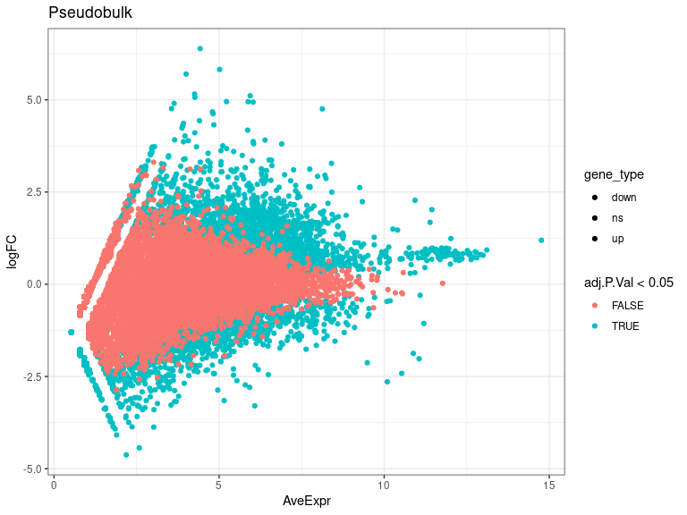
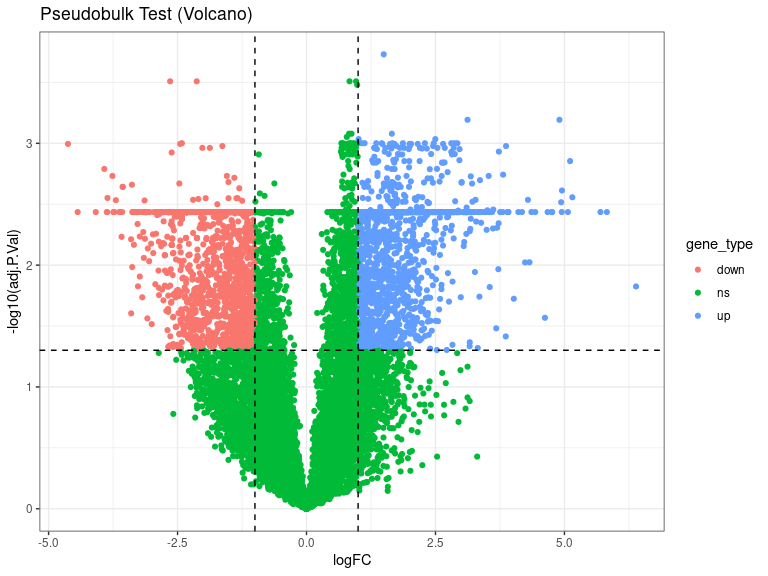
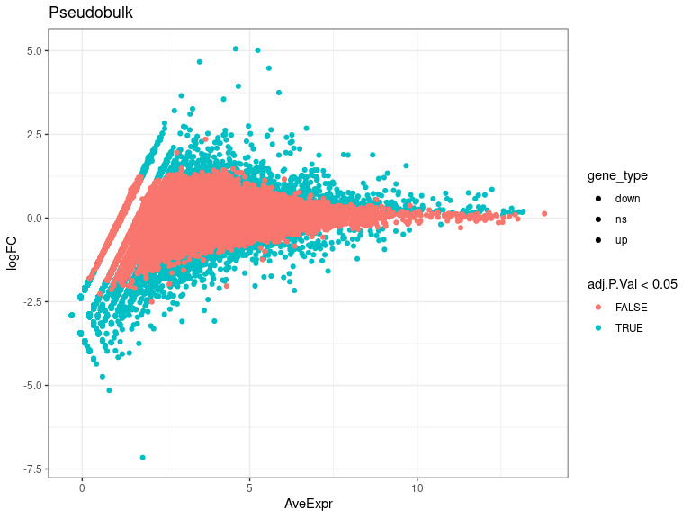
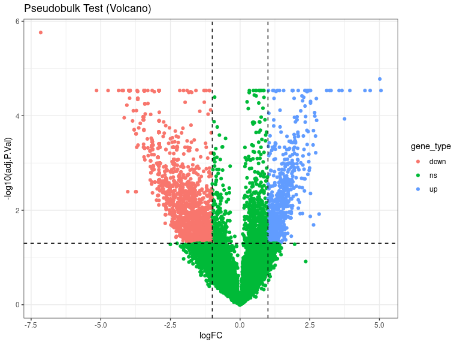
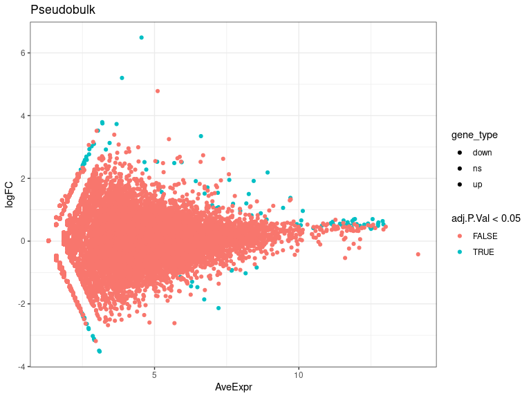
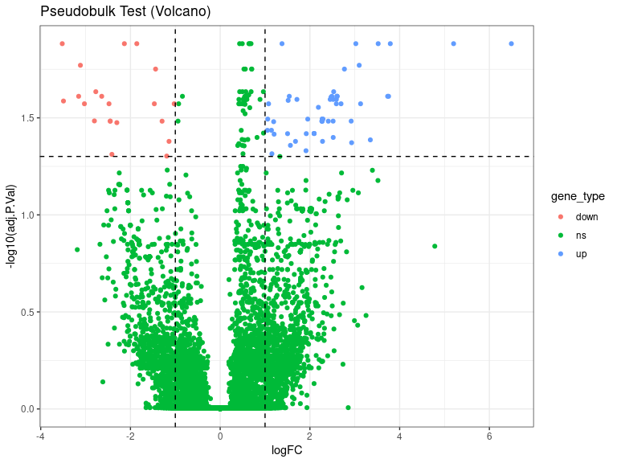
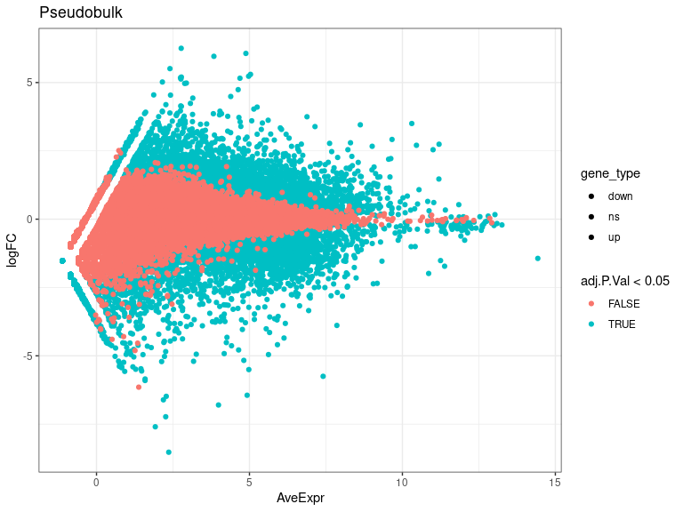
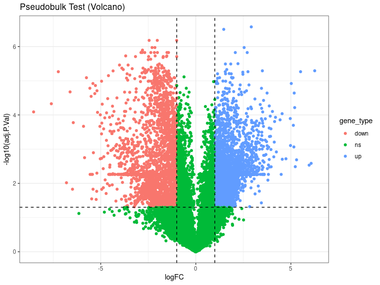

DEs
================
Laura Perlaza-Jimenez
2023-02-06

<h1 align="center">
Differential Expression Pseudobulk
</h1>

Load libraries

``` r
library(dplyr)
library(Seurat)
library(hdf5r)
library(fs)
library(scCustomize)
library(clustree)
library(SeuratDisk)
library(clustree)
library(ggplot2)
library(RColorBrewer)
library(ggforce)
library(limma)
library(edgeR)
```

Get working path and set it

``` r
path_wd<-getwd()
setwd(path_wd)
```

``` r
subset_obj<-LoadH5Seurat("../Results/kidney.combined_obj_UMAP_clustered_finalnames.h5seurat")
DefaultAssay(subset_obj) <- "RNA"
```

``` r
# functions

DE_analysis_pseudobulk <- function(cell_type,comparison1,comparison2) {
        subset_obj_tested= subset_obj[, subset_obj$cell_labels==cell_type] #change this column name for your clusters labels wherever they are
        
          replicates_lookup <- c(
        "n1_d20"="normal_d20", "n2_d20"="normal_d20", "n3_d20"="normal_d20",
        "h1_d20"="hypoxic_d20", "h2_d20"="hypoxic_d20", "h3_d20"="hypoxic_d20", 
        "n1_d25"= "normal_d25", "n2_d25"="normal_d25",  "n3_d25"="normal_d25",
        "h1_d25"="hypoxic_d25", "h2_d25"="hypoxic_d25", "h3_d25"="hypoxic_d25")
                
        replicates_lookup=replicates_lookup[replicates_lookup %in% c(comparison1,comparison2)]
        
        subset_obj_tested<-subset(subset_obj_tested, subset = orig.ident %in% c(names(replicates_lookup)))
        Idents(subset_obj_tested) <- subset_obj_tested$orig.ident

        pseudobulk_matrix <- AggregateExpression( subset_obj_tested,  slot = 'counts', assays='RNA' )[['RNA']]
        
        dge <- DGEList(pseudobulk_matrix)
        dge <- calcNormFactors(dge)
 
        condition <- factor(replicates_lookup[colnames(pseudobulk_matrix)],levels=c(comparison1,comparison2))
        condition_names<-levels(condition)
        design <- model.matrix(~condition)
        vm  <- voom(dge, design = design, plot = FALSE)
        fit <- lmFit(vm, design = design)
        fit <- eBayes(fit)
        de_result_pseudobulk <- topTable(fit, n = Inf, adjust.method = "BH")
        #> Removing intercept from test coefficients
        de_result_pseudobulk <- arrange(de_result_pseudobulk , adj.P.Val)
        
        de_result_pseudobulk <-de_result_pseudobulk %>%
          mutate(gene_type = case_when(logFC  >= log2(2) & adj.P.Val <= 0.05 ~ "up",
                               logFC  <= log2(0.5) & adj.P.Val <= 0.05 ~ "down",
                               TRUE ~ "ns"))  
        cols <- c("up" = "#ffad73", "down" = "#26b3ff", "ns" = "grey") 
        sizes <- c("up" = 2, "down" = 2, "ns" = 1) 
        alphas <- c("up" = 1, "down" = 1, "ns" = 0.5)
        
        p1 <- ggplot(de_result_pseudobulk, aes(x=AveExpr, y=logFC, col=adj.P.Val < 0.05, fill = gene_type)) +
          geom_point() +
          theme_bw() +
          ggtitle("Pseudobulk")
        p2 <- ggplot(de_result_pseudobulk, aes(x=logFC, y=-log10(adj.P.Val), col = gene_type)) +
          geom_point() +
          theme_bw() +
          ggtitle("Pseudobulk Test (Volcano)")
          
         p2<-p2+ geom_hline(yintercept = -log10(0.05),
             linetype = "dashed") + 
              geom_vline(xintercept = c(log2(0.5), log2(2)),
             linetype = "dashed")   
         
        p2<- p2+ scale_fill_manual(values = cols) + # Modify point colour
            scale_size_manual(values = sizes) + # Modify point size
          scale_alpha_manual(values = alphas)  # Modify point transparency

        return (list(p1,p2,de_result_pseudobulk,condition_names))
}
```

``` r
cat( "#", params$cluster_input)
```

# 0_Stroma

## treatment comparisons

``` r
celltype=  params$cluster_input
```

``` r
DE_treatment_pseudobulk_results=DE_analysis_pseudobulk(celltype,"normal_d20","hypoxic_d20")
cat("###",DE_treatment_pseudobulk_results[[4]][1],"vs",DE_treatment_pseudobulk_results[[4]][2],"\n")
```

### normal_d20 vs hypoxic_d20

``` r
cat("#### Reference:", DE_treatment_pseudobulk_results[[4]][1],"\n")
```

#### Reference: normal_d20

``` r
DE_treatment_pseudobulk_results[[1]]
```

<!-- -->

``` r
DE_treatment_pseudobulk_results[[2]]
```

<!-- -->

``` r
head(DE_treatment_pseudobulk_results[[3]],)
```

            logFC   AveExpr         t      P.Value    adj.P.Val         B gene_type

EIF1 1.4964924 10.263723 32.43693 5.080733e-09 0.0001859599 11.736602 up
MT-CYB -2.1285678 9.489473 -25.19204 3.048216e-08 0.0003096540 9.959648
down RPL22 0.9605532 11.415187 25.96016 2.464657e-08 0.0003096540
9.954377 ns MT-ND3 -2.6447402 10.095655 -24.05106 4.230130e-08
0.0003096540 9.582988 down RPS23 0.8335913 12.533787 24.33380
3.894781e-08 0.0003096540 9.048954 ns RPL18A 0.9825727 11.741142
23.21520 5.430788e-08 0.0003312871 8.994976 ns

``` r
 DE_treatment_pseudobulk_results=DE_analysis_pseudobulk(celltype,"normal_d25","hypoxic_d25")

cat("###",DE_treatment_pseudobulk_results[[4]][1],"vs",DE_treatment_pseudobulk_results[[4]][2],"\n")
```

### normal_d25 vs hypoxic_d25

``` r
cat("#### Reference:", DE_treatment_pseudobulk_results[[4]][1],"\n")
```

#### Reference: normal_d25

``` r
 DE_treatment_pseudobulk_results[[1]]
```

<!-- -->

``` r
 DE_treatment_pseudobulk_results[[2]]
```

<!-- -->

``` r
head(DE_treatment_pseudobulk_results[[3]],10)
```

                logFC    AveExpr         t      P.Value    adj.P.Val         B gene_type

NDUFA4L2 -7.1568390 1.8076115 -19.06947 4.729465e-11 1.731031e-06
14.269433 down CEBPD 5.0140109 5.2420800 15.12270 9.109662e-10
1.667114e-05 12.393119 up CFAP43 -5.1520937 0.8094433 -11.87075
1.853475e-08 2.925223e-05 9.316020 down PLAAT4 3.6549072 2.9583133
10.58310 7.449254e-08 2.925223e-05 8.498137 up NNMT 4.6680460 3.5034434
10.52797 7.930273e-08 2.925223e-05 8.454768 up MT-CYB 0.7400065
10.8508615 11.26320 3.515125e-08 2.925223e-05 8.325149 ns AC019080.1
-4.7387042 0.6057112 -10.71275 6.436454e-08 2.925223e-05 8.274378 down
MT-ND1 0.8266843 9.2966060 10.65031 6.904558e-08 2.925223e-05 8.019745
ns BNIP3 -1.9032772 6.1952971 -10.19878 1.158688e-07 2.925223e-05
7.981440 down H19 1.8807146 7.9343801 10.22413 1.124962e-07 2.925223e-05
7.918035 up

``` r
  DE_treatment_pseudobulk_results=DE_analysis_pseudobulk(celltype,"normal_d20","normal_d25")

cat("###",DE_treatment_pseudobulk_results[[4]][1],"vs",DE_treatment_pseudobulk_results[[4]][2],"\n")
```

### normal_d20 vs normal_d25

``` r
cat("#### Reference:", DE_treatment_pseudobulk_results[[4]][1],"\n")
```

#### Reference: normal_d20

``` r
 DE_treatment_pseudobulk_results[[1]]
```

<!-- -->

``` r
 DE_treatment_pseudobulk_results[[2]]
```

<!-- -->

``` r
 head(DE_treatment_pseudobulk_results[[3]] ,10)
```

            logFC   AveExpr          t      P.Value  adj.P.Val        B gene_type

RPL34 0.6574228 11.549973 11.219710 1.334038e-06 0.01311639 5.541411 ns
MGP 6.4900173 4.548927 11.340058 1.218656e-06 0.01311639 5.248523 up
CRABP1 1.3778467 9.708984 10.096736 3.240506e-06 0.01311639 4.989585 up
KCNK2 -3.5202017 3.098962 -11.934233 7.891451e-07 0.01311639 4.946903
down CNTN4 -2.1355209 7.217888 -9.727424 4.420165e-06 0.01311639
4.814099 down HS3ST5 -1.8587121 6.722225 -9.584885 4.996139e-06
0.01311639 4.652578 down RPL26 0.6876615 11.902012 10.178740
3.028627e-06 0.01311639 4.550579 ns GREM1 5.2024123 3.872938 10.089720
3.259379e-06 0.01311639 4.428832 up RPL10A 0.4925040 11.207073 9.620035
4.846796e-06 0.01311639 4.233112 ns RPL30 0.4324943 12.576579 10.034636
3.411835e-06 0.01311639 4.191284 ns

``` r
DE_treatment_pseudobulk_results=DE_analysis_pseudobulk(celltype,"hypoxic_d20","hypoxic_d25")

cat("###",DE_treatment_pseudobulk_results[[4]][1],"vs",DE_treatment_pseudobulk_results[[4]][2],"\n")
```

### hypoxic_d20 vs hypoxic_d25

``` r
cat("#### Reference:", DE_treatment_pseudobulk_results[[4]][1],"\n")
```

#### Reference: hypoxic_d20

``` r
  DE_treatment_pseudobulk_results[[1]]
```

<!-- -->

``` r
  DE_treatment_pseudobulk_results[[2]]
```

<!-- -->

``` r
  head(DE_treatment_pseudobulk_results[[3]],10)
```

           logFC   AveExpr         t      P.Value    adj.P.Val        B gene_type

MT-CYB 2.917801 9.660986 46.86827 7.252119e-12 2.654348e-07 17.87754 up
MT-CO1 1.469756 11.192694 42.48905 1.713744e-11 3.136236e-07 17.14840 up
WAC -2.453927 8.207925 -36.78260 6.059568e-11 6.592763e-07 15.86867 down
EIF1 -1.005618 10.284923 -35.57440 8.115944e-11 6.592763e-07 15.55702
down MSMO1 -2.025080 7.855314 -35.15353 9.006260e-11 6.592763e-07
15.43506 down WSB1 -2.150434 8.486989 -32.37108 1.851655e-10
1.067208e-06 14.85531 down MT-CO3 2.542188 11.002177 31.52641
2.332630e-10 1.067208e-06 14.50893 up KDM6A -2.298555 7.237496 -31.87822
2.117181e-10 1.067208e-06 14.49004 down DYRK1A -2.802894 7.667975
-30.49530 3.118265e-10 1.268129e-06 14.24238 down KMT2E -2.818806
8.039527 -29.84385 3.764789e-10 1.377950e-06 14.12542 down
