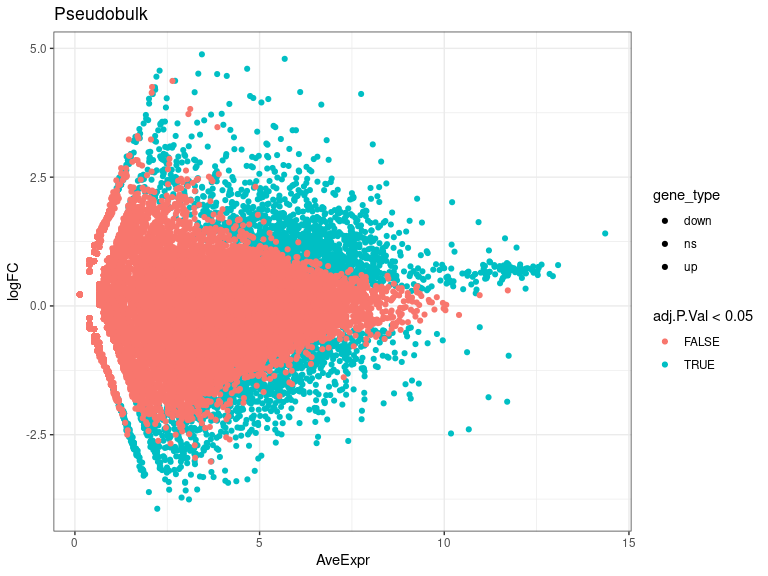
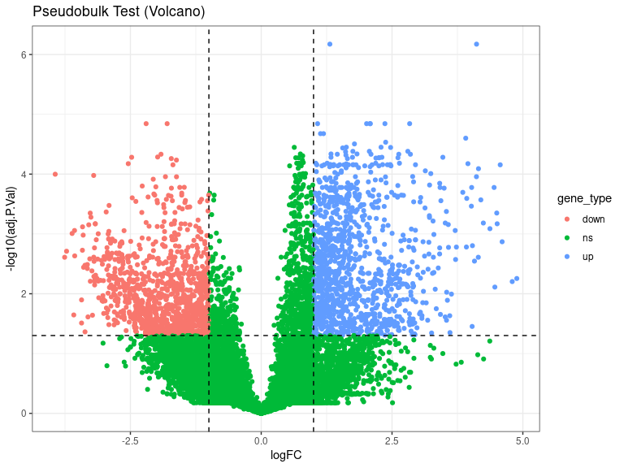
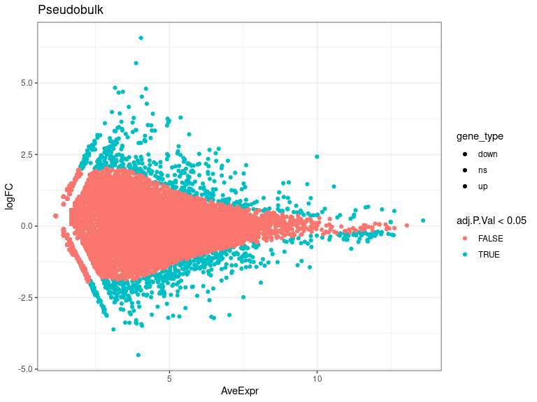
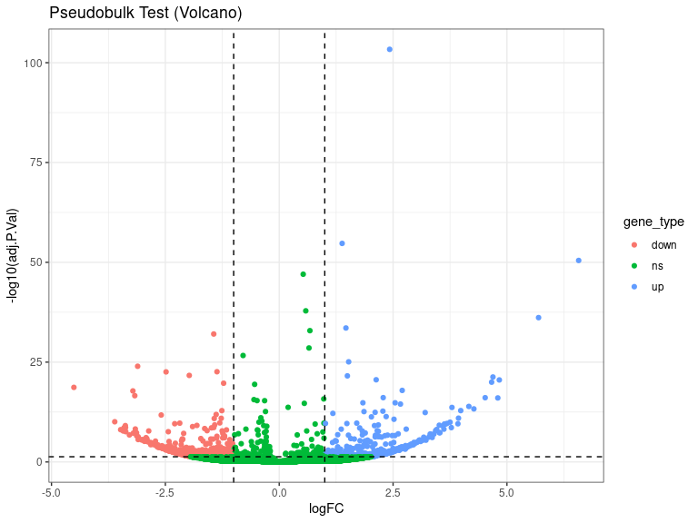
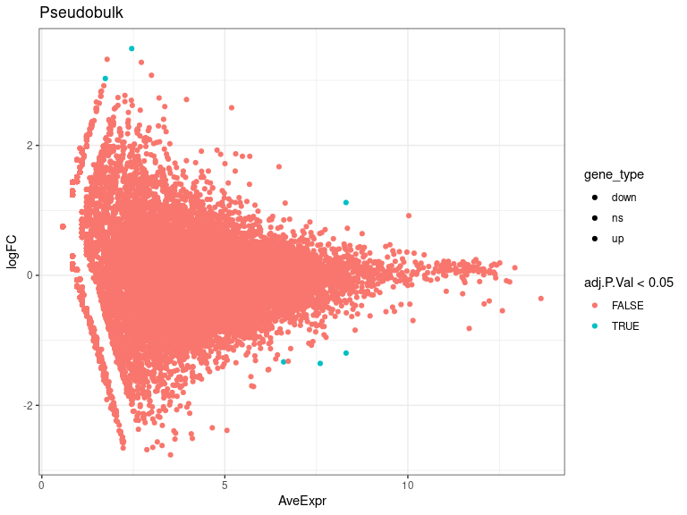
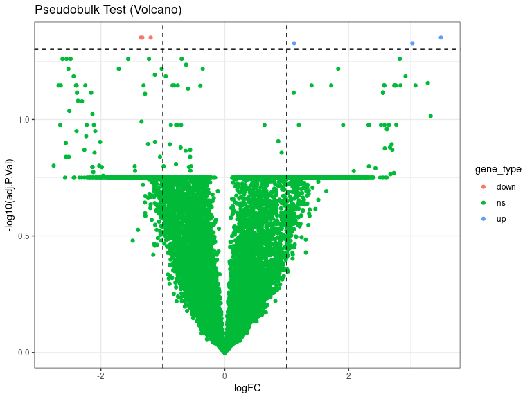
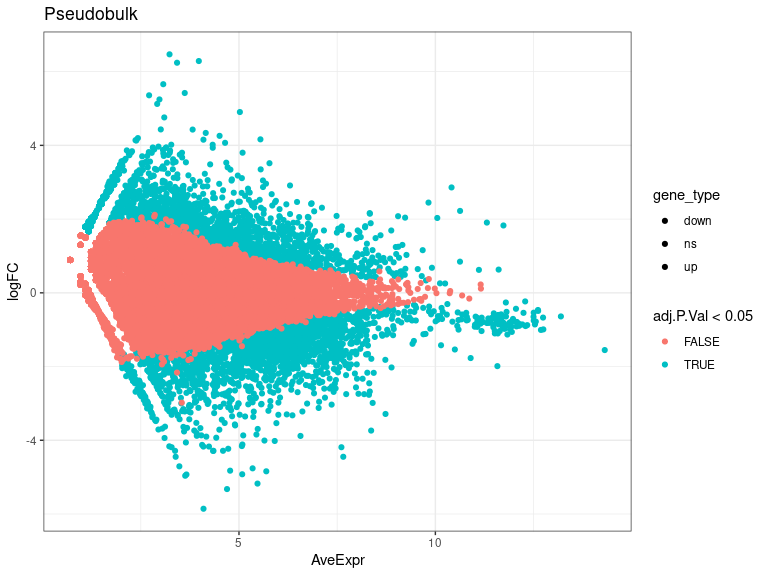
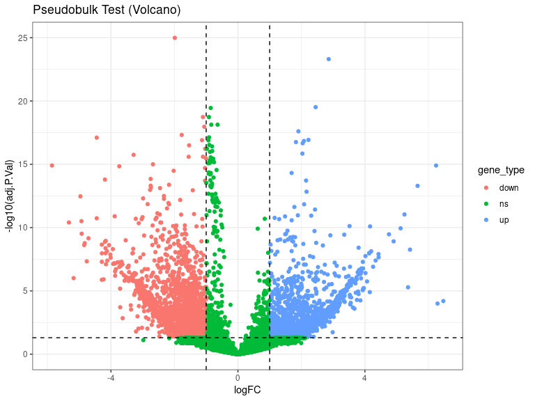

DEs
================
Laura Perlaza-Jimenez
2023-02-06

<h1 align="center">
Differential Expression Pseudobulk
</h1>

Load libraries

``` r
library(dplyr)
library(Seurat)
library(hdf5r)
library(fs)
library(scCustomize)
library(clustree)
library(SeuratDisk)
library(clustree)
library(ggplot2)
library(RColorBrewer)
library(ggforce)
library(limma)
library(edgeR)
```

Get working path and set it

``` r
path_wd<-getwd()
setwd(path_wd)
```

``` r
subset_obj<-LoadH5Seurat("../Results/kidney.combined_obj_UMAP_clustered_finalnames.h5seurat")
DefaultAssay(subset_obj) <- "RNA"
```

``` r
# functions

DE_analysis_pseudobulk <- function(cell_type,comparison1,comparison2) {
        subset_obj_tested= subset_obj[, subset_obj$cell_labels==cell_type] #change this column name for your clusters labels wherever they are
        
          replicates_lookup <- c(
        "n1_d20"="normal_d20", "n2_d20"="normal_d20", "n3_d20"="normal_d20",
        "h1_d20"="hypoxic_d20", "h2_d20"="hypoxic_d20", "h3_d20"="hypoxic_d20", 
        "n1_d25"= "normal_d25", "n2_d25"="normal_d25",  "n3_d25"="normal_d25",
        "h1_d25"="hypoxic_d25", "h2_d25"="hypoxic_d25", "h3_d25"="hypoxic_d25")
                
        replicates_lookup=replicates_lookup[replicates_lookup %in% c(comparison1,comparison2)]
        
        subset_obj_tested<-subset(subset_obj_tested, subset = orig.ident %in% c(names(replicates_lookup)))
        Idents(subset_obj_tested) <- subset_obj_tested$orig.ident

        pseudobulk_matrix <- AggregateExpression( subset_obj_tested,  slot = 'counts', assays='RNA' )[['RNA']]
        
        dge <- DGEList(pseudobulk_matrix)
        dge <- calcNormFactors(dge)
 
        condition <- factor(replicates_lookup[colnames(pseudobulk_matrix)],levels=c(comparison1,comparison2))
        condition_names<-levels(condition)
        design <- model.matrix(~condition)
        vm  <- voom(dge, design = design, plot = FALSE)
        fit <- lmFit(vm, design = design)
        fit <- eBayes(fit)
        de_result_pseudobulk <- topTable(fit, n = Inf, adjust.method = "BH")
        #> Removing intercept from test coefficients
        de_result_pseudobulk <- arrange(de_result_pseudobulk , adj.P.Val)
        
        de_result_pseudobulk <-de_result_pseudobulk %>%
          mutate(gene_type = case_when(logFC  >= log2(2) & adj.P.Val <= 0.05 ~ "up",
                               logFC  <= log2(0.5) & adj.P.Val <= 0.05 ~ "down",
                               TRUE ~ "ns"))  
        cols <- c("up" = "#ffad73", "down" = "#26b3ff", "ns" = "grey") 
        sizes <- c("up" = 2, "down" = 2, "ns" = 1) 
        alphas <- c("up" = 1, "down" = 1, "ns" = 0.5)
        
        p1 <- ggplot(de_result_pseudobulk, aes(x=AveExpr, y=logFC, col=adj.P.Val < 0.05, fill = gene_type)) +
          geom_point() +
          theme_bw() +
          ggtitle("Pseudobulk")
        p2 <- ggplot(de_result_pseudobulk, aes(x=logFC, y=-log10(adj.P.Val), col = gene_type)) +
          geom_point() +
          theme_bw() +
          ggtitle("Pseudobulk Test (Volcano)")
          
         p2<-p2+ geom_hline(yintercept = -log10(0.05),
             linetype = "dashed") + 
              geom_vline(xintercept = c(log2(0.5), log2(2)),
             linetype = "dashed")   
         
        p2<- p2+ scale_fill_manual(values = cols) + # Modify point colour
            scale_size_manual(values = sizes) + # Modify point size
          scale_alpha_manual(values = alphas)  # Modify point transparency

        return (list(p1,p2,de_result_pseudobulk,condition_names))
}
```

``` r
cat( "#", params$cluster_input)
```

# 10_Early_Nephron

## treatment comparisons

``` r
celltype=  params$cluster_input
```

``` r
DE_treatment_pseudobulk_results=DE_analysis_pseudobulk(celltype,"normal_d20","hypoxic_d20")
cat("###",DE_treatment_pseudobulk_results[[4]][1],"vs",DE_treatment_pseudobulk_results[[4]][2],"\n")
```

### normal_d20 vs hypoxic_d20

``` r
cat("#### Reference:", DE_treatment_pseudobulk_results[[4]][1],"\n")
```

#### Reference: normal_d20

``` r
DE_treatment_pseudobulk_results[[1]]
```

<!-- -->

``` r
DE_treatment_pseudobulk_results[[2]]
```

<!-- -->

``` r
head(DE_treatment_pseudobulk_results[[3]],)
```

           logFC   AveExpr         t      P.Value    adj.P.Val        B gene_type

FTL 1.312097 11.644860 27.48121 3.220424e-11 6.710918e-07 16.33040 up
DDIT4 4.115218 7.749034 27.14313 3.667068e-11 6.710918e-07 14.86848 up
ACTG1 1.077329 11.209042 19.43473 1.196655e-09 1.432967e-05 12.60696 up
GPC5 -1.797880 9.092238 -18.65658 1.826672e-09 1.432967e-05 12.41438
down DYRK1A 2.079826 8.016998 18.05949 2.556196e-09 1.432967e-05
11.98215 up NASP -2.199455 7.762262 -17.98934 2.660952e-09 1.432967e-05
11.84983 down

``` r
 DE_treatment_pseudobulk_results=DE_analysis_pseudobulk(celltype,"normal_d25","hypoxic_d25")

cat("###",DE_treatment_pseudobulk_results[[4]][1],"vs",DE_treatment_pseudobulk_results[[4]][2],"\n")
```

### normal_d25 vs hypoxic_d25

``` r
cat("#### Reference:", DE_treatment_pseudobulk_results[[4]][1],"\n")
```

#### Reference: normal_d25

``` r
 DE_treatment_pseudobulk_results[[1]]
```

<!-- -->

``` r
 DE_treatment_pseudobulk_results[[2]]
```

<!-- -->

``` r
head(DE_treatment_pseudobulk_results[[3]],10)
```

              logFC   AveExpr         t       P.Value     adj.P.Val         B gene_type

WFDC2 2.4250618 9.994137 22.16141 1.223256e-108 4.477238e-104 237.36567
up MT-CYB 1.3815205 10.568540 16.30638 1.003914e-59 1.837214e-55
124.88277 up SLPI 6.5749616 4.032842 15.66730 2.807147e-55 3.424813e-51
112.34695 up MT-CO2 0.5267381 12.612408 15.13417 1.054906e-51
9.652651e-48 105.72564 ns MT-CO3 0.5833755 12.197249 13.65730
1.939127e-42 1.419480e-38 84.66362 ns NPTX2 5.6944629 3.865611 13.35487
1.172123e-40 7.150145e-37 79.83160 up FOS 1.4648473 9.665762 12.88980
5.388331e-38 2.817404e-34 75.27743 up MT-ND3 0.6742182 11.726947
12.76020 2.863016e-37 1.309866e-33 73.01545 ns HIST1H4C -1.4375461
9.751814 -12.59984 2.209925e-36 8.987276e-33 71.59357 down MT-ATP6
0.6539112 11.640950 11.93766 7.800153e-33 2.854934e-29 62.89664 ns

``` r
  DE_treatment_pseudobulk_results=DE_analysis_pseudobulk(celltype,"normal_d20","normal_d25")

cat("###",DE_treatment_pseudobulk_results[[4]][1],"vs",DE_treatment_pseudobulk_results[[4]][2],"\n")
```

### normal_d20 vs normal_d25

``` r
cat("#### Reference:", DE_treatment_pseudobulk_results[[4]][1],"\n")
```

#### Reference: normal_d20

``` r
 DE_treatment_pseudobulk_results[[1]]
```

<!-- -->

``` r
 DE_treatment_pseudobulk_results[[2]]
```

<!-- -->

``` r
 head(DE_treatment_pseudobulk_results[[3]] ,10)
```

               logFC  AveExpr         t      P.Value  adj.P.Val        B gene_type

MT-ND5 -1.195842 8.312605 -7.770446 1.404212e-06 0.04455746 5.557762
down MT-ND6 -1.331399 6.606625 -7.066465 4.295161e-06 0.04455746
4.555896 down MT-ND4L -1.355279 7.604821 -7.054556 4.379618e-06
0.04455746 4.496006 down ALK 3.489629 2.455744 6.989911 4.869535e-06
0.04455746 3.459367 up FOS 1.120426 8.310814 6.803134 6.636143e-06
0.04709476 3.961115 up FABP4 3.029056 1.735519 6.712851 7.720242e-06
0.04709476 2.910244 up PURPL -1.558622 5.712255 -6.490558 1.125886e-05
0.05501905 3.584820 ns CCN2 -1.223684 6.438431 -6.212010 1.823865e-05
0.05501905 3.167418 ns AC007611.1 -2.489426 2.207769 -6.310263
1.536615e-05 0.05501905 2.725090 ns PPIP5K1 -2.554291 2.235760 -6.261864
1.671690e-05 0.05501905 2.675762 ns

``` r
DE_treatment_pseudobulk_results=DE_analysis_pseudobulk(celltype,"hypoxic_d20","hypoxic_d25")

cat("###",DE_treatment_pseudobulk_results[[4]][1],"vs",DE_treatment_pseudobulk_results[[4]][2],"\n")
```

### hypoxic_d20 vs hypoxic_d25

``` r
cat("#### Reference:", DE_treatment_pseudobulk_results[[4]][1],"\n")
```

#### Reference: hypoxic_d20

``` r
  DE_treatment_pseudobulk_results[[1]]
```

<!-- -->

``` r
  DE_treatment_pseudobulk_results[[2]]
```

<!-- -->

``` r
  head(DE_treatment_pseudobulk_results[[3]],10)
```

            logFC   AveExpr         t      P.Value    adj.P.Val        B gene_type

MIF -1.9889820 11.578936 -30.01733 2.800682e-30 1.025077e-25 59.00393
down MT-ND3 2.8585009 10.411778 26.81550 2.694037e-28 4.930222e-24
54.43255 up MT-CYB 2.4474398 9.824959 21.29696 2.512594e-24 3.065448e-20
45.33993 up RPL39 -0.8576918 12.534386 -21.05911 3.892288e-24
3.561541e-20 44.34689 ns RPS7 -0.9145956 11.941194 -20.06704
2.527201e-23 1.849740e-19 42.67901 ns RPL18 -1.1020849 11.590236
-19.97249 3.032278e-23 1.849740e-19 42.61861 down RPL41 -0.6406884
13.195850 -19.18488 1.422327e-22 7.436941e-19 40.32636 ns RPS14
-0.8396328 12.131472 -19.11564 1.633267e-22 7.472400e-19 40.70767 ns
RPL35A -1.0610794 11.946577 -18.87238 2.663474e-22 1.083176e-18 40.30230
down MT-CO3 1.9050617 11.311340 18.41432 6.781317e-22 2.482030e-18
39.49405 up
