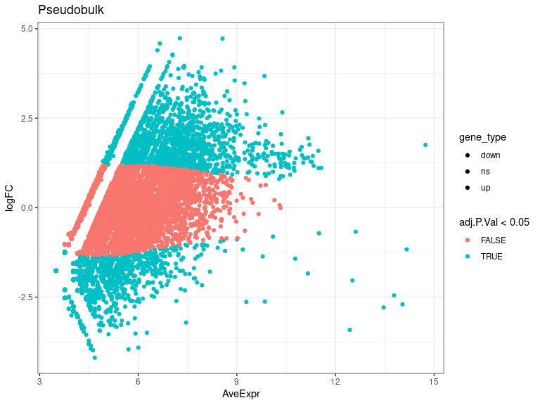
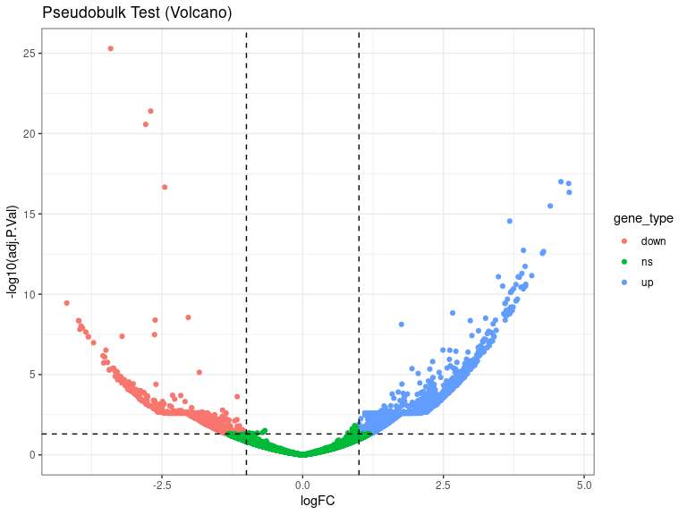
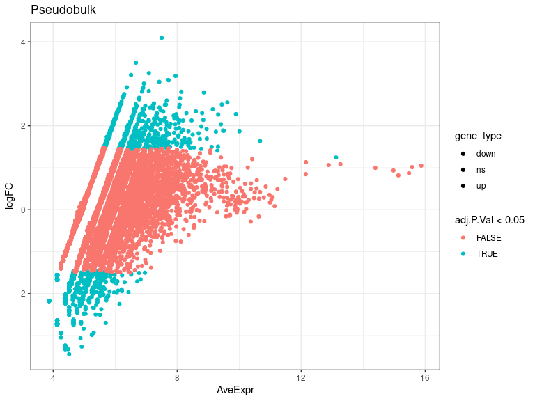
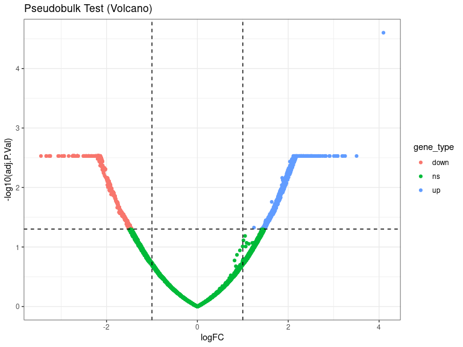
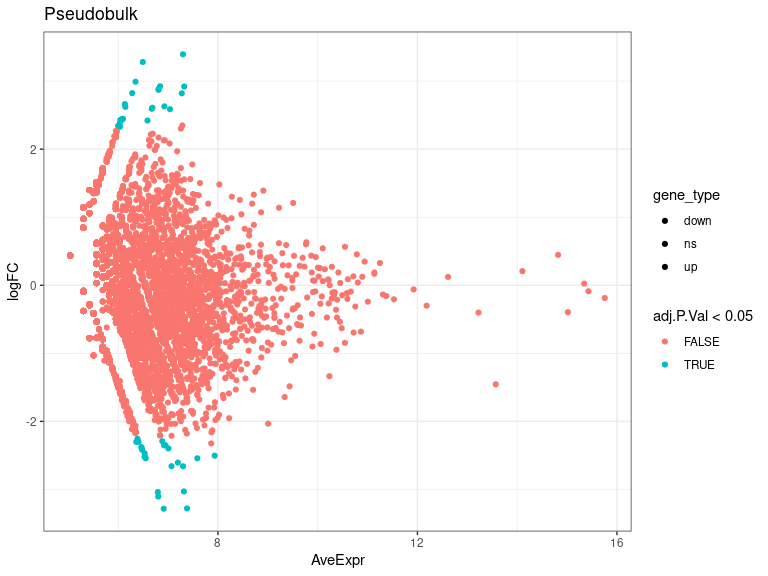
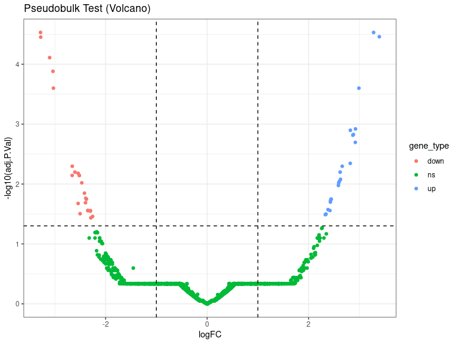
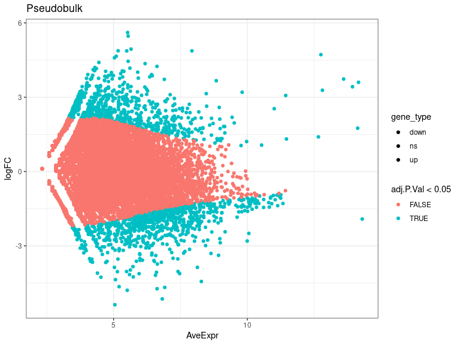
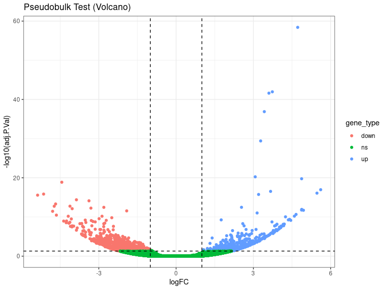

DEs
================
Laura Perlaza-Jimenez
2023-02-06

<h1 align="center">
Differential Expression Pseudobulk
</h1>

Load libraries

``` r
library(dplyr)
library(Seurat)
library(hdf5r)
library(fs)
library(scCustomize)
library(clustree)
library(SeuratDisk)
library(clustree)
library(ggplot2)
library(RColorBrewer)
library(ggforce)
library(limma)
library(edgeR)
```

Get working path and set it

``` r
path_wd<-getwd()
setwd(path_wd)
```

``` r
subset_obj<-LoadH5Seurat("../Results/kidney.combined_obj_UMAP_clustered_finalnames.h5seurat")
DefaultAssay(subset_obj) <- "RNA"
```

``` r
# functions

DE_analysis_pseudobulk <- function(cell_type,comparison1,comparison2) {
        subset_obj_tested= subset_obj[, subset_obj$cell_labels==cell_type] #change this column name for your clusters labels wherever they are
        
          replicates_lookup <- c(
        "n1_d20"="normal_d20", "n2_d20"="normal_d20", "n3_d20"="normal_d20",
        "h1_d20"="hypoxic_d20", "h2_d20"="hypoxic_d20", "h3_d20"="hypoxic_d20", 
        "n1_d25"= "normal_d25", "n2_d25"="normal_d25",  "n3_d25"="normal_d25",
        "h1_d25"="hypoxic_d25", "h2_d25"="hypoxic_d25", "h3_d25"="hypoxic_d25")
                
        replicates_lookup=replicates_lookup[replicates_lookup %in% c(comparison1,comparison2)]
        
        subset_obj_tested<-subset(subset_obj_tested, subset = orig.ident %in% c(names(replicates_lookup)))
        Idents(subset_obj_tested) <- subset_obj_tested$orig.ident

        pseudobulk_matrix <- AggregateExpression( subset_obj_tested,  slot = 'counts', assays='RNA' )[['RNA']]
        
        dge <- DGEList(pseudobulk_matrix)
        dge <- calcNormFactors(dge)
 
        condition <- factor(replicates_lookup[colnames(pseudobulk_matrix)],levels=c(comparison1,comparison2))
        condition_names<-levels(condition)
        design <- model.matrix(~condition)
        vm  <- voom(dge, design = design, plot = FALSE)
        fit <- lmFit(vm, design = design)
        fit <- eBayes(fit)
        de_result_pseudobulk <- topTable(fit, n = Inf, adjust.method = "BH")
        #> Removing intercept from test coefficients
        de_result_pseudobulk <- arrange(de_result_pseudobulk , adj.P.Val)
        
        de_result_pseudobulk <-de_result_pseudobulk %>%
          mutate(gene_type = case_when(logFC  >= log2(2) & adj.P.Val <= 0.05 ~ "up",
                               logFC  <= log2(0.5) & adj.P.Val <= 0.05 ~ "down",
                               TRUE ~ "ns"))  
        cols <- c("up" = "#ffad73", "down" = "#26b3ff", "ns" = "grey") 
        sizes <- c("up" = 2, "down" = 2, "ns" = 1) 
        alphas <- c("up" = 1, "down" = 1, "ns" = 0.5)
        
        p1 <- ggplot(de_result_pseudobulk, aes(x=AveExpr, y=logFC, col=adj.P.Val < 0.05, fill = gene_type)) +
          geom_point() +
          theme_bw() +
          ggtitle("Pseudobulk")
        p2 <- ggplot(de_result_pseudobulk, aes(x=logFC, y=-log10(adj.P.Val), col = gene_type)) +
          geom_point() +
          theme_bw() +
          ggtitle("Pseudobulk Test (Volcano)")
          
         p2<-p2+ geom_hline(yintercept = -log10(0.05),
             linetype = "dashed") + 
              geom_vline(xintercept = c(log2(0.5), log2(2)),
             linetype = "dashed")   
         
        p2<- p2+ scale_fill_manual(values = cols) + # Modify point colour
            scale_size_manual(values = sizes) + # Modify point size
          scale_alpha_manual(values = alphas)  # Modify point transparency

        return (list(p1,p2,de_result_pseudobulk,condition_names))
}
```

``` r
cat( "#", params$cluster_input)
```

# 11_Cellular_Stress

## treatment comparisons

``` r
celltype=  params$cluster_input
```

``` r
DE_treatment_pseudobulk_results=DE_analysis_pseudobulk(celltype,"normal_d20","hypoxic_d20")
cat("###",DE_treatment_pseudobulk_results[[4]][1],"vs",DE_treatment_pseudobulk_results[[4]][2],"\n")
```

### normal_d20 vs hypoxic_d20

``` r
cat("#### Reference:", DE_treatment_pseudobulk_results[[4]][1],"\n")
```

#### Reference: normal_d20

``` r
DE_treatment_pseudobulk_results[[1]]
```

<!-- -->

``` r
DE_treatment_pseudobulk_results[[2]]
```

<!-- -->

``` r
head(DE_treatment_pseudobulk_results[[3]],)
```

              logFC   AveExpr          t      P.Value    adj.P.Val        B gene_type

MT-ND3 -3.412083 12.434677 -11.497621 1.397694e-30 5.115699e-26 58.52655
down MT-CO2 -2.699476 14.038390 -10.631186 2.181687e-26 3.992596e-22
49.04874 down MT-ATP6 -2.788819 13.464682 -10.413495 2.196162e-25
2.679391e-21 46.78148 down HIF1A-AS3 4.587177 6.658498 9.570427
1.080346e-21 9.885435e-18 38.14698 up PLCG2 4.724866 8.563656 9.520728
1.744531e-21 1.277032e-17 37.63244 up MT-CO3 -2.450022 13.780895
-9.446338 3.558011e-21 2.170446e-17 37.25374 down

``` r
 DE_treatment_pseudobulk_results=DE_analysis_pseudobulk(celltype,"normal_d25","hypoxic_d25")

cat("###",DE_treatment_pseudobulk_results[[4]][1],"vs",DE_treatment_pseudobulk_results[[4]][2],"\n")
```

### normal_d25 vs hypoxic_d25

``` r
cat("#### Reference:", DE_treatment_pseudobulk_results[[4]][1],"\n")
```

#### Reference: normal_d25

``` r
 DE_treatment_pseudobulk_results[[1]]
```

<!-- -->

``` r
 DE_treatment_pseudobulk_results[[2]]
```

<!-- -->

``` r
head(DE_treatment_pseudobulk_results[[3]],10)
```

                 logFC  AveExpr         t      P.Value    adj.P.Val         B gene_type

DLGAP1 4.096030 7.499540 6.170141 6.840679e-10 2.503757e-05 11.813737 up
HES1 3.504173 6.669955 5.117770 3.095586e-07 2.954975e-03 6.248728 up
UBR7 -3.443110 4.515529 -5.051290 4.393614e-07 2.954975e-03 5.938045
down NLRX1 -3.325641 4.392701 -4.918021 8.751818e-07 2.954975e-03
5.325580 down AC007406.5 -3.325641 4.392701 -4.918021 8.751818e-07
2.954975e-03 5.325580 down GPR149 -3.325296 4.481120 -4.897237
9.729710e-07 2.954975e-03 5.228079 down BAZ2B 3.251963 7.087146 4.840334
1.297527e-06 2.954975e-03 4.976510 up KIAA2012-AS1 -3.254890 4.392701
-4.813394 1.485362e-06 2.954975e-03 4.851778 down IL17B -3.254890
4.392701 -4.813394 1.485362e-06 2.954975e-03 4.851778 down CFAP53
-3.254890 4.392701 -4.813394 1.485362e-06 2.954975e-03 4.851778 down

``` r
  DE_treatment_pseudobulk_results=DE_analysis_pseudobulk(celltype,"normal_d20","normal_d25")

cat("###",DE_treatment_pseudobulk_results[[4]][1],"vs",DE_treatment_pseudobulk_results[[4]][2],"\n")
```

### normal_d20 vs normal_d25

``` r
cat("#### Reference:", DE_treatment_pseudobulk_results[[4]][1],"\n")
```

#### Reference: normal_d20

``` r
 DE_treatment_pseudobulk_results[[1]]
```

<!-- -->

``` r
 DE_treatment_pseudobulk_results[[2]]
```

<!-- -->

``` r
 head(DE_treatment_pseudobulk_results[[3]] ,10)
```

              logFC  AveExpr         t      P.Value    adj.P.Val         B gene_type

HES1 -3.283274 6.911637 -6.069844 1.283477e-09 2.948285e-05 10.747262
down MYH3 3.280957 6.493889 6.033224 1.611040e-09 2.948285e-05 10.535426
up RYR1 3.393444 7.298625 5.940502 2.847885e-09 3.474514e-05 9.910688 up
MIR100HG -3.279243 7.379871 -5.890755 3.852706e-09 3.525322e-05 9.718855
down LINC00871 -3.103525 6.802359 -5.721157 1.060064e-08 7.759883e-05
8.903766 down BARD1 -3.038216 6.794710 -5.599554 2.152873e-08
1.313289e-04 8.288549 down MYLPF 2.991103 6.347294 5.435582 5.470479e-08
2.508869e-04 7.452907 up DLGAP1 -3.029200 7.317130 -5.435151
5.483716e-08 2.508869e-04 7.425059 down CDH15 2.924201 6.838954 5.126476
2.955907e-07 1.202102e-03 5.936537 up PDCD4 2.823032 6.280538 5.096766
3.459329e-07 1.266149e-03 5.853404 up

``` r
DE_treatment_pseudobulk_results=DE_analysis_pseudobulk(celltype,"hypoxic_d20","hypoxic_d25")

cat("###",DE_treatment_pseudobulk_results[[4]][1],"vs",DE_treatment_pseudobulk_results[[4]][2],"\n")
```

### hypoxic_d20 vs hypoxic_d25

``` r
cat("#### Reference:", DE_treatment_pseudobulk_results[[4]][1],"\n")
```

#### Reference: hypoxic_d20

``` r
  DE_treatment_pseudobulk_results[[1]]
```

<!-- -->

``` r
  DE_treatment_pseudobulk_results[[2]]
```

<!-- -->

``` r
  head(DE_treatment_pseudobulk_results[[3]],10)
```

            logFC   AveExpr         t      P.Value    adj.P.Val         B gene_type

MT-ND3 4.720214 12.748205 16.856007 1.088742e-63 3.984906e-59 133.85494
up MT-ATP6 3.735649 13.598646 14.393198 6.147421e-47 1.125009e-42
95.76270 up MT-CO2 3.602701 14.155418 14.310199 2.031297e-46
2.478250e-42 94.59546 up MT-CO3 3.424263 13.928931 13.510599
1.434261e-41 1.312384e-37 83.54950 up MT-CYB 3.282013 12.804953
12.158967 5.338470e-34 3.907867e-30 66.31799 up MT-ND1 3.071271
11.434054 10.275342 9.280267e-25 5.661118e-21 45.36582 up DLG2 4.872388
7.927943 10.150802 3.347798e-24 1.750468e-20 43.78296 up PLCG2 -4.437428
8.279917 -9.935856 2.956447e-23 1.352611e-19 41.77226 down COL19A1
5.612137 5.525747 9.474482 2.718840e-21 1.105692e-17 36.94724 up LRP1B
3.667541 8.837712 9.360219 8.064490e-21 2.951684e-17 36.42990 up
