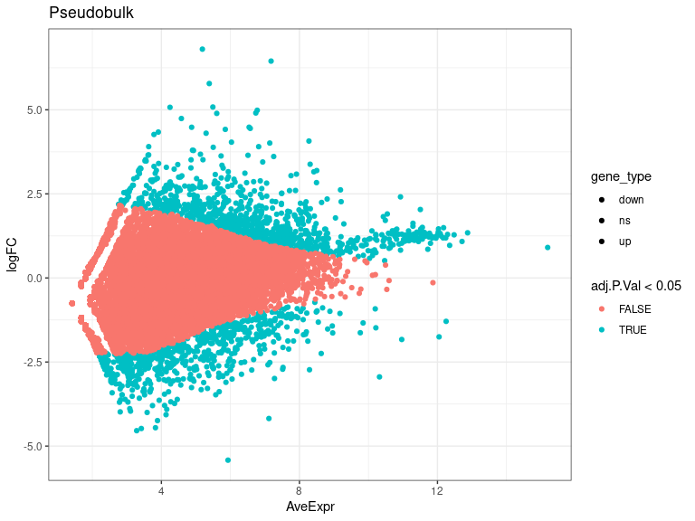
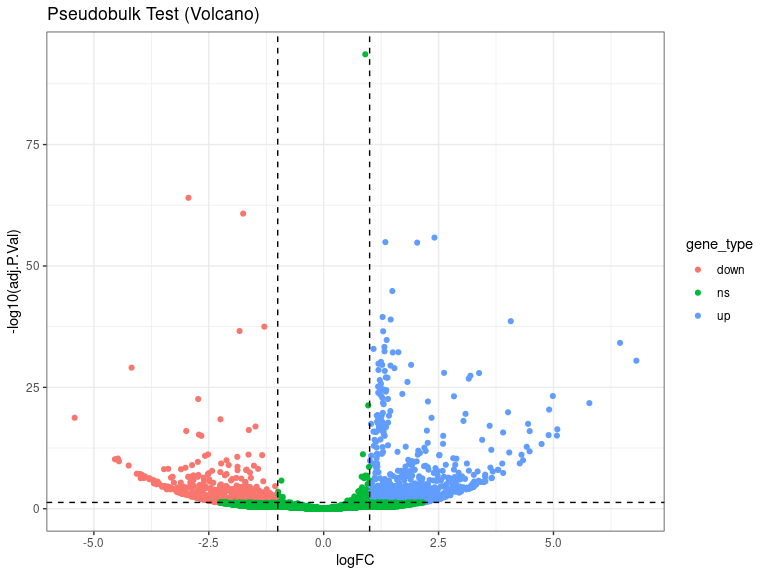
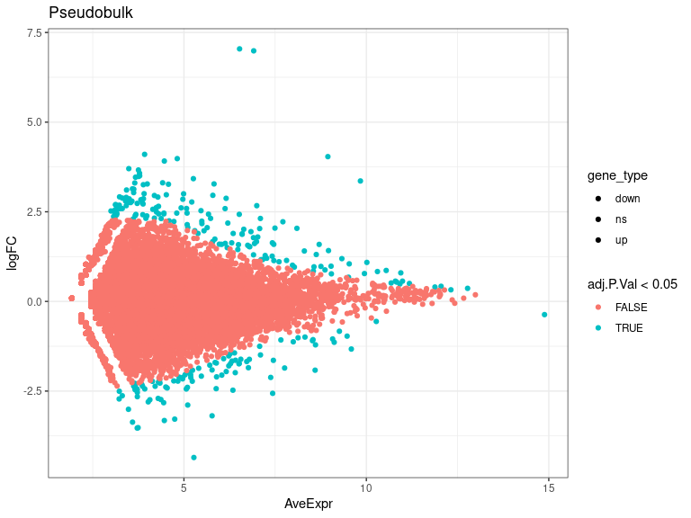
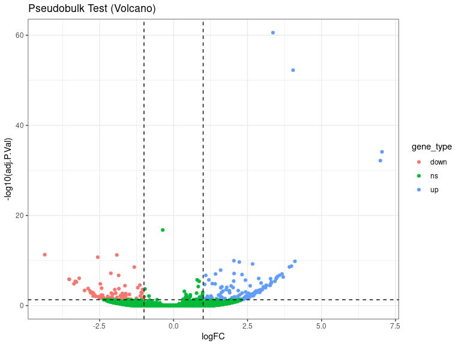
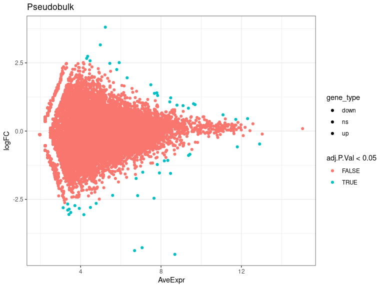
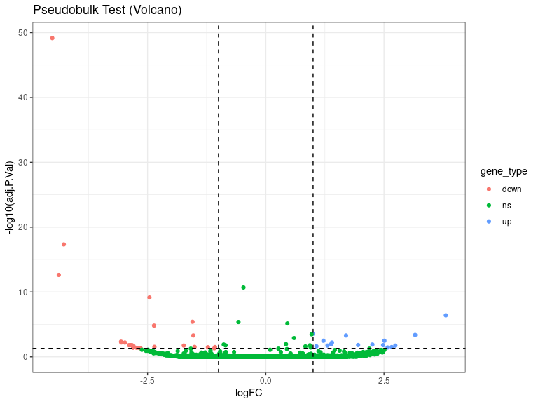
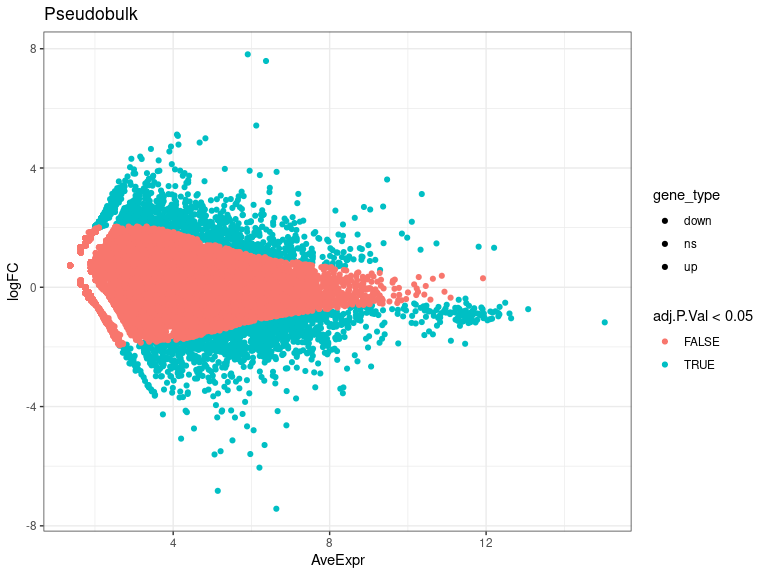
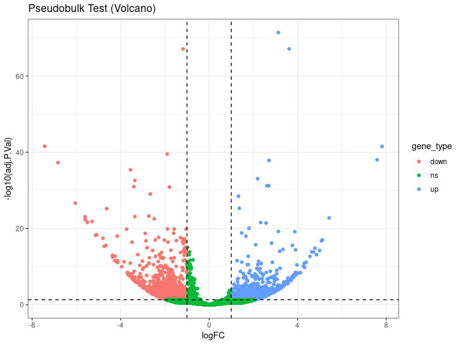

DEs
================
Laura Perlaza-Jimenez
2023-02-06

<h1 align="center">
Differential Expression Pseudobulk
</h1>

Load libraries

``` r
library(dplyr)
library(Seurat)
library(hdf5r)
library(fs)
library(scCustomize)
library(clustree)
library(SeuratDisk)
library(clustree)
library(ggplot2)
library(RColorBrewer)
library(ggforce)
library(limma)
library(edgeR)
```

Get working path and set it

``` r
path_wd<-getwd()
setwd(path_wd)
```

``` r
subset_obj<-LoadH5Seurat("../Results/kidney.combined_obj_UMAP_clustered_finalnames.h5seurat")
DefaultAssay(subset_obj) <- "RNA"
```

``` r
# functions

DE_analysis_pseudobulk <- function(cell_type,comparison1,comparison2) {
        subset_obj_tested= subset_obj[, subset_obj$cell_labels==cell_type] #change this column name for your clusters labels wherever they are
        
          replicates_lookup <- c(
        "n1_d20"="normal_d20", "n2_d20"="normal_d20", "n3_d20"="normal_d20",
        "h1_d20"="hypoxic_d20", "h2_d20"="hypoxic_d20", "h3_d20"="hypoxic_d20", 
        "n1_d25"= "normal_d25", "n2_d25"="normal_d25",  "n3_d25"="normal_d25",
        "h1_d25"="hypoxic_d25", "h2_d25"="hypoxic_d25", "h3_d25"="hypoxic_d25")
                
        replicates_lookup=replicates_lookup[replicates_lookup %in% c(comparison1,comparison2)]
        
        subset_obj_tested<-subset(subset_obj_tested, subset = orig.ident %in% c(names(replicates_lookup)))
        Idents(subset_obj_tested) <- subset_obj_tested$orig.ident

        pseudobulk_matrix <- AggregateExpression( subset_obj_tested,  slot = 'counts', assays='RNA' )[['RNA']]
        
        dge <- DGEList(pseudobulk_matrix)
        dge <- calcNormFactors(dge)
 
        condition <- factor(replicates_lookup[colnames(pseudobulk_matrix)],levels=c(comparison1,comparison2))
        condition_names<-levels(condition)
        design <- model.matrix(~condition)
        vm  <- voom(dge, design = design, plot = FALSE)
        fit <- lmFit(vm, design = design)
        fit <- eBayes(fit)
        de_result_pseudobulk <- topTable(fit, n = Inf, adjust.method = "BH")
        #> Removing intercept from test coefficients
        de_result_pseudobulk <- arrange(de_result_pseudobulk , adj.P.Val)
        
        de_result_pseudobulk <-de_result_pseudobulk %>%
          mutate(gene_type = case_when(logFC  >= log2(2) & adj.P.Val <= 0.05 ~ "up",
                               logFC  <= log2(0.5) & adj.P.Val <= 0.05 ~ "down",
                               TRUE ~ "ns"))  
        cols <- c("up" = "#ffad73", "down" = "#26b3ff", "ns" = "grey") 
        sizes <- c("up" = 2, "down" = 2, "ns" = 1) 
        alphas <- c("up" = 1, "down" = 1, "ns" = 0.5)
        
        p1 <- ggplot(de_result_pseudobulk, aes(x=AveExpr, y=logFC, col=adj.P.Val < 0.05, fill = gene_type)) +
          geom_point() +
          theme_bw() +
          ggtitle("Pseudobulk")
        p2 <- ggplot(de_result_pseudobulk, aes(x=logFC, y=-log10(adj.P.Val), col = gene_type)) +
          geom_point() +
          theme_bw() +
          ggtitle("Pseudobulk Test (Volcano)")
          
         p2<-p2+ geom_hline(yintercept = -log10(0.05),
             linetype = "dashed") + 
              geom_vline(xintercept = c(log2(0.5), log2(2)),
             linetype = "dashed")   
         
        p2<- p2+ scale_fill_manual(values = cols) + # Modify point colour
            scale_size_manual(values = sizes) + # Modify point size
          scale_alpha_manual(values = alphas)  # Modify point transparency

        return (list(p1,p2,de_result_pseudobulk,condition_names))
}
```

``` r
cat( "#", params$cluster_input)
```

# 12_Proximal_Tubule

## treatment comparisons

``` r
celltype=  params$cluster_input
```

``` r
DE_treatment_pseudobulk_results=DE_analysis_pseudobulk(celltype,"normal_d20","hypoxic_d20")
cat("###",DE_treatment_pseudobulk_results[[4]][1],"vs",DE_treatment_pseudobulk_results[[4]][2],"\n")
```

### normal_d20 vs hypoxic_d20

``` r
cat("#### Reference:", DE_treatment_pseudobulk_results[[4]][1],"\n")
```

#### Reference: normal_d20

``` r
DE_treatment_pseudobulk_results[[1]]
```

<!-- -->

``` r
DE_treatment_pseudobulk_results[[2]]
```

<!-- -->

``` r
head(DE_treatment_pseudobulk_results[[3]],)
```

           logFC  AveExpr         t      P.Value    adj.P.Val        B gene_type

MALAT1 0.905797 15.19318 21.12067 7.219916e-99 2.642562e-94 214.4211 ns
MT-ND3 -2.942785 10.31990 -17.56902 5.010215e-69 9.168944e-65 146.2750
down MT-CO3 -1.752224 12.04664 -17.11318 1.371352e-65 1.673095e-61
138.4492 down GAPDH 2.410525 10.92841 16.41912 1.581370e-60 1.446993e-56
126.8924 up RPL41 1.342594 12.87316 16.27395 1.704357e-59 1.247623e-55
124.3536 up MIF 2.034831 11.50383 16.24816 2.594485e-59 1.582679e-55
124.1118 up

``` r
 DE_treatment_pseudobulk_results=DE_analysis_pseudobulk(celltype,"normal_d25","hypoxic_d25")

cat("###",DE_treatment_pseudobulk_results[[4]][1],"vs",DE_treatment_pseudobulk_results[[4]][2],"\n")
```

### normal_d25 vs hypoxic_d25

``` r
cat("#### Reference:", DE_treatment_pseudobulk_results[[4]][1],"\n")
```

#### Reference: normal_d25

``` r
 DE_treatment_pseudobulk_results[[1]]
```

<!-- -->

``` r
 DE_treatment_pseudobulk_results[[2]]
```

<!-- -->

``` r
head(DE_treatment_pseudobulk_results[[3]],10)
```

                logFC   AveExpr         t      P.Value    adj.P.Val         B gene_type

SPP1 3.3595686 9.837050 17.149418 7.364934e-66 2.695639e-61 138.76941 up
WFDC2 4.0381769 8.945248 15.950252 3.171444e-57 5.803901e-53 118.59417
up SPINK1 7.0437188 6.524715 13.055531 6.213622e-39 7.580827e-35
73.71947 up KCNIP4 6.9886965 6.912248 12.685773 7.415571e-37
6.785433e-33 69.08130 up MALAT1 -0.3675537 14.883215 -9.492420
2.289512e-21 1.675969e-17 36.47448 ns CA12 -4.3528249 5.272348 -8.049954
8.343963e-16 5.089956e-12 24.32544 down CUBN -1.9175922 8.595332
-8.017228 1.089477e-15 5.696563e-12 24.95639 down KLHL1 -2.5629988
7.431626 -7.857817 3.935196e-15 1.800402e-11 23.66351 down AC079352.1
2.0389326 8.096282 7.614198 2.669131e-14 1.085476e-10 21.86273 up MSR1
4.1017138 3.922120 7.561313 4.013327e-14 1.468918e-10 20.75217 up

``` r
  DE_treatment_pseudobulk_results=DE_analysis_pseudobulk(celltype,"normal_d20","normal_d25")

cat("###",DE_treatment_pseudobulk_results[[4]][1],"vs",DE_treatment_pseudobulk_results[[4]][2],"\n")
```

### normal_d20 vs normal_d25

``` r
cat("#### Reference:", DE_treatment_pseudobulk_results[[4]][1],"\n")
```

#### Reference: normal_d20

``` r
 DE_treatment_pseudobulk_results[[1]]
```

<!-- -->

``` r
 DE_treatment_pseudobulk_results[[2]]
```

<!-- -->

``` r
 head(DE_treatment_pseudobulk_results[[3]] ,10)
```

             logFC   AveExpr          t      P.Value    adj.P.Val         B gene_type

MT1G -4.5148408 8.688949 -15.544498 1.916885e-54 7.015991e-50 109.45168
down MT1H -4.2710357 7.058565 -9.719676 2.524691e-22 4.620310e-18
37.04927 down XACT -4.3773140 6.685197 -8.499543 1.920895e-17
2.343556e-13 26.00977 down MT-CO3 -0.4724406 12.904962 -7.928096
2.240848e-15 2.050432e-11 23.63679 ns MT2A -2.4601176 7.651978 -7.449366
9.430198e-14 6.903094e-10 20.17687 down TRPM3 3.8064621 5.228791
6.533224 6.457846e-11 3.939394e-07 12.54000 up MT1X -1.5488603 8.473854
-6.156866 7.439045e-10 3.889664e-06 12.02873 down MT-ATP6 -0.5775943
11.794446 -6.122449 9.238111e-10 4.226551e-06 11.38052 ns FTL 0.4564913
12.306611 6.022774 1.718597e-09 6.989154e-06 10.59028 ns MT1E -2.3630111
6.837793 -5.878504 4.148829e-09 1.518513e-05 10.04636 down

``` r
DE_treatment_pseudobulk_results=DE_analysis_pseudobulk(celltype,"hypoxic_d20","hypoxic_d25")

cat("###",DE_treatment_pseudobulk_results[[4]][1],"vs",DE_treatment_pseudobulk_results[[4]][2],"\n")
```

### hypoxic_d20 vs hypoxic_d25

``` r
cat("#### Reference:", DE_treatment_pseudobulk_results[[4]][1],"\n")
```

#### Reference: hypoxic_d20

``` r
  DE_treatment_pseudobulk_results[[1]]
```

<!-- -->

``` r
  DE_treatment_pseudobulk_results[[2]]
```

<!-- -->

``` r
  head(DE_treatment_pseudobulk_results[[3]],10)
```

             logFC   AveExpr         t      P.Value    adj.P.Val         B gene_type

MT-ND3 3.126954 10.355443 18.54871 1.023242e-76 3.745167e-72 163.93567
up SPP1 3.613766 9.468878 17.94663 6.092021e-72 7.432468e-68 152.84982
up MALAT1 -1.176447 15.032856 -17.95205 5.527307e-72 7.432468e-68
152.81472 down DDIT4 -7.427152 6.636975 -14.28559 2.891305e-46
2.645617e-42 91.38962 down SPINK1 7.812050 5.906659 14.26347
3.969035e-46 2.905413e-42 90.66973 up MIF -1.894954 11.463775 -13.92168
4.990845e-44 3.044499e-40 89.12582 down KCNIP4 7.588827 6.373126
13.66370 1.776283e-42 9.287675e-39 82.59308 up WFDC2 2.707662 9.367225
13.62627 2.966068e-42 1.357013e-38 85.11803 up SERPINB9 -6.826452
5.140032 -13.52218 1.225631e-41 4.984367e-38 81.43488 down LDHA
-3.554204 8.337417 -13.18892 1.070828e-39 3.919338e-36 79.11333 down
