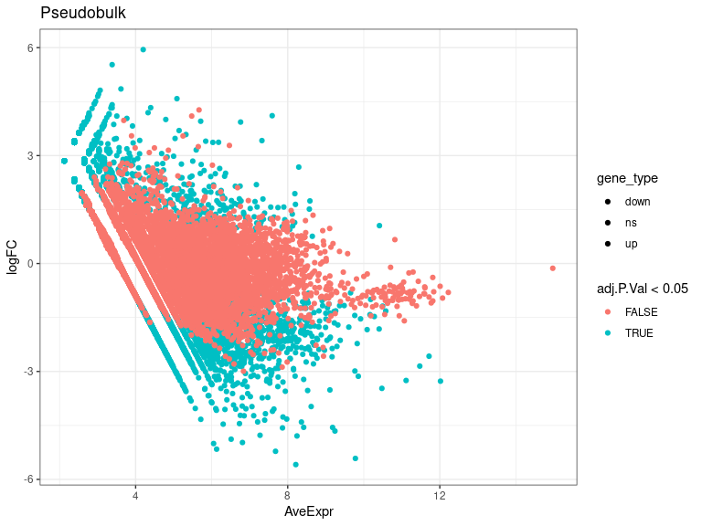
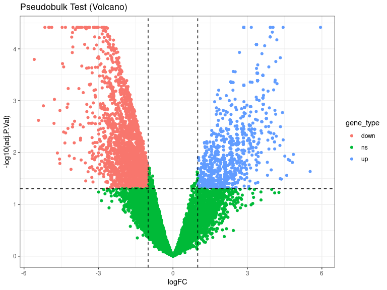
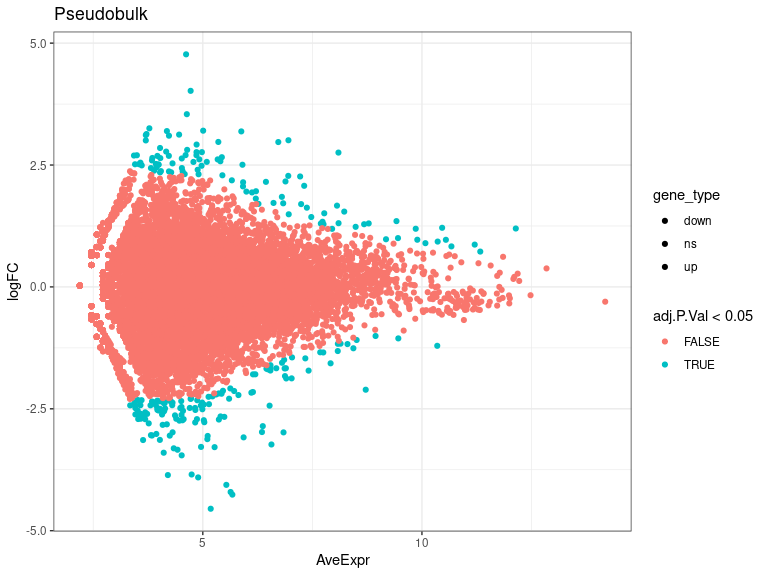
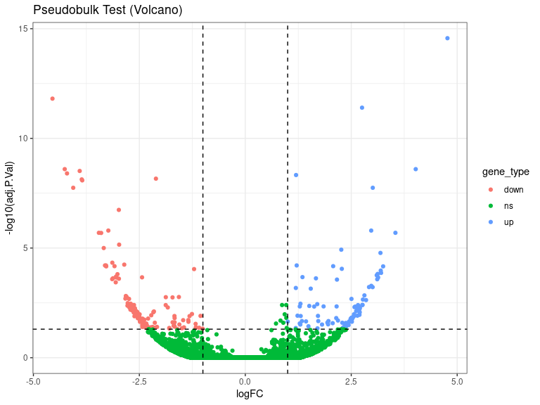
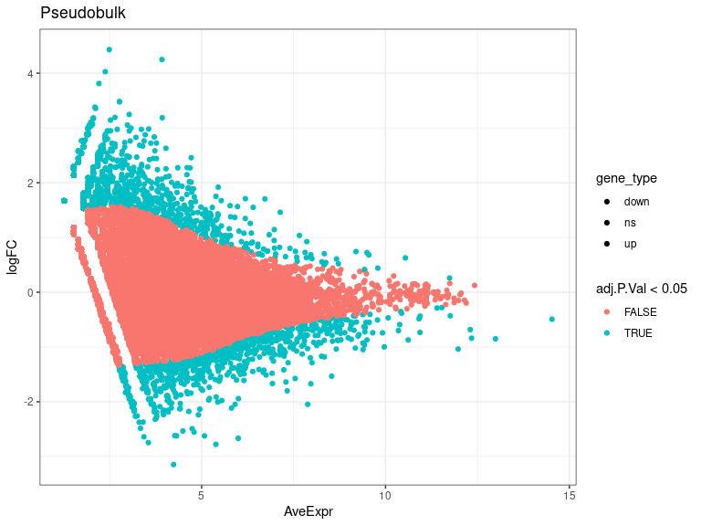
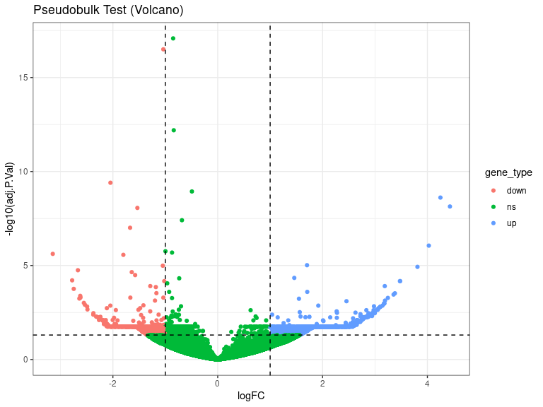
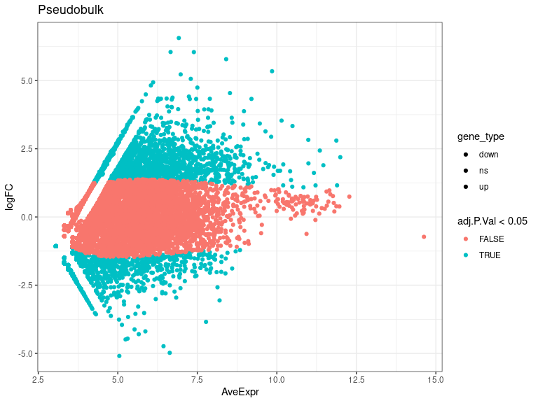
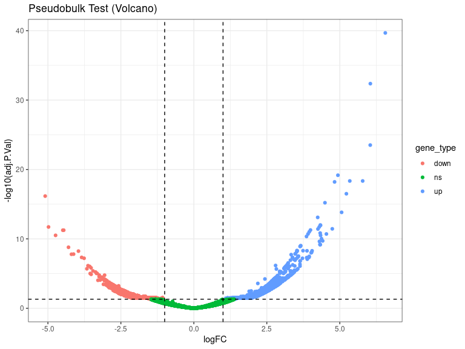

DEs
================
Laura Perlaza-Jimenez
2023-02-06

<h1 align="center">
Differential Expression Pseudobulk
</h1>

Load libraries

``` r
library(dplyr)
library(Seurat)
library(hdf5r)
library(fs)
library(scCustomize)
library(clustree)
library(SeuratDisk)
library(clustree)
library(ggplot2)
library(RColorBrewer)
library(ggforce)
library(limma)
library(edgeR)
```

Get working path and set it

``` r
path_wd<-getwd()
setwd(path_wd)
```

``` r
subset_obj<-LoadH5Seurat("../Results/kidney.combined_obj_UMAP_clustered_finalnames.h5seurat")
DefaultAssay(subset_obj) <- "RNA"
```

``` r
# functions

DE_analysis_pseudobulk <- function(cell_type,comparison1,comparison2) {
        subset_obj_tested= subset_obj[, subset_obj$cell_labels==cell_type] #change this column name for your clusters labels wherever they are
        
          replicates_lookup <- c(
        "n1_d20"="normal_d20", "n2_d20"="normal_d20", "n3_d20"="normal_d20",
        "h1_d20"="hypoxic_d20", "h2_d20"="hypoxic_d20", "h3_d20"="hypoxic_d20", 
        "n1_d25"= "normal_d25", "n2_d25"="normal_d25",  "n3_d25"="normal_d25",
        "h1_d25"="hypoxic_d25", "h2_d25"="hypoxic_d25", "h3_d25"="hypoxic_d25")
                
        replicates_lookup=replicates_lookup[replicates_lookup %in% c(comparison1,comparison2)]
        
        subset_obj_tested<-subset(subset_obj_tested, subset = orig.ident %in% c(names(replicates_lookup)))
        Idents(subset_obj_tested) <- subset_obj_tested$orig.ident

        pseudobulk_matrix <- AggregateExpression( subset_obj_tested,  slot = 'counts', assays='RNA' )[['RNA']]
        
        dge <- DGEList(pseudobulk_matrix)
        dge <- calcNormFactors(dge)
 
        condition <- factor(replicates_lookup[colnames(pseudobulk_matrix)],levels=c(comparison1,comparison2))
        condition_names<-levels(condition)
        design <- model.matrix(~condition)
        vm  <- voom(dge, design = design, plot = FALSE)
        fit <- lmFit(vm, design = design)
        fit <- eBayes(fit)
        de_result_pseudobulk <- topTable(fit, n = Inf, adjust.method = "BH")
        #> Removing intercept from test coefficients
        de_result_pseudobulk <- arrange(de_result_pseudobulk , adj.P.Val)
        
        de_result_pseudobulk <-de_result_pseudobulk %>%
          mutate(gene_type = case_when(logFC  >= log2(2) & adj.P.Val <= 0.05 ~ "up",
                               logFC  <= log2(0.5) & adj.P.Val <= 0.05 ~ "down",
                               TRUE ~ "ns"))  
        cols <- c("up" = "#ffad73", "down" = "#26b3ff", "ns" = "grey") 
        sizes <- c("up" = 2, "down" = 2, "ns" = 1) 
        alphas <- c("up" = 1, "down" = 1, "ns" = 0.5)
        
        p1 <- ggplot(de_result_pseudobulk, aes(x=AveExpr, y=logFC, col=adj.P.Val < 0.05, fill = gene_type)) +
          geom_point() +
          theme_bw() +
          ggtitle("Pseudobulk")
        p2 <- ggplot(de_result_pseudobulk, aes(x=logFC, y=-log10(adj.P.Val), col = gene_type)) +
          geom_point() +
          theme_bw() +
          ggtitle("Pseudobulk Test (Volcano)")
          
         p2<-p2+ geom_hline(yintercept = -log10(0.05),
             linetype = "dashed") + 
              geom_vline(xintercept = c(log2(0.5), log2(2)),
             linetype = "dashed")   
         
        p2<- p2+ scale_fill_manual(values = cols) + # Modify point colour
            scale_size_manual(values = sizes) + # Modify point size
          scale_alpha_manual(values = alphas)  # Modify point transparency

        return (list(p1,p2,de_result_pseudobulk,condition_names))
}
```

``` r
cat( "#", params$cluster_input)
```

# 13_Endotelial

## treatment comparisons

``` r
celltype=  params$cluster_input
```

``` r
DE_treatment_pseudobulk_results=DE_analysis_pseudobulk(celltype,"normal_d20","hypoxic_d20")
cat("###",DE_treatment_pseudobulk_results[[4]][1],"vs",DE_treatment_pseudobulk_results[[4]][2],"\n")
```

### normal_d20 vs hypoxic_d20

``` r
cat("#### Reference:", DE_treatment_pseudobulk_results[[4]][1],"\n")
```

#### Reference: normal_d20

``` r
DE_treatment_pseudobulk_results[[1]]
```

<!-- -->

``` r
DE_treatment_pseudobulk_results[[2]]
```

<!-- -->

``` r
head(DE_treatment_pseudobulk_results[[3]],)
```

               logFC  AveExpr         t      P.Value    adj.P.Val        B gene_type

IGFBP7 -5.159246 6.130018 -17.45547 9.043372e-08 3.836857e-05 7.902131
down LINGO2 -5.003100 6.050694 -16.11392 1.712356e-07 3.836857e-05
7.446165 down PLXDC2 -4.329668 5.713641 -14.51870 3.918908e-07
3.836857e-05 6.804110 down AL136115.2 4.438128 2.914253 13.92737
5.443963e-07 3.836857e-05 6.559669 up SOST -4.881987 6.511914 -12.57419
1.215884e-06 3.836857e-05 5.908253 down ULK4 -3.817650 5.457439
-12.57044 1.218730e-06 3.836857e-05 5.887419 down

``` r
 DE_treatment_pseudobulk_results=DE_analysis_pseudobulk(celltype,"normal_d25","hypoxic_d25")

cat("###",DE_treatment_pseudobulk_results[[4]][1],"vs",DE_treatment_pseudobulk_results[[4]][2],"\n")
```

### normal_d25 vs hypoxic_d25

``` r
cat("#### Reference:", DE_treatment_pseudobulk_results[[4]][1],"\n")
```

#### Reference: normal_d25

``` r
 DE_treatment_pseudobulk_results[[1]]
```

<!-- -->

``` r
 DE_treatment_pseudobulk_results[[2]]
```

<!-- -->

``` r
head(DE_treatment_pseudobulk_results[[3]],10)
```

              logFC   AveExpr         t      P.Value    adj.P.Val        B gene_type

C1R 4.770472 4.618594 9.122881 7.404406e-20 2.710087e-15 33.23982 up
LINC02672 -4.550068 5.180598 -8.326053 8.429036e-17 1.542556e-12
26.55156 down TSPAN8 2.755214 8.095000 8.164177 3.261726e-16
3.979415e-12 26.06446 up RGCC 4.021621 4.722663 7.282726 3.287752e-13
2.525861e-09 18.88415 up RMST -4.260502 5.674510 -7.276204 3.450535e-13
2.525861e-09 18.70360 down TOP2A -3.907587 4.894034 -7.225332
5.022983e-13 3.064103e-09 18.53660 down LINC02253 -4.206813 5.634742
-7.169409 7.567606e-13 3.956885e-09 17.98079 down TMSB4X 1.197879
12.141634 7.127676 1.025462e-12 4.691618e-09 18.10291 up HIST1H4C
-2.108639 8.717440 -7.058707 1.688018e-12 6.864793e-09 17.86264 down
NDUFA4L2 -3.859327 4.203228 -7.033079 2.029044e-12 7.426503e-09 17.22071
down

``` r
  DE_treatment_pseudobulk_results=DE_analysis_pseudobulk(celltype,"normal_d20","normal_d25")

cat("###",DE_treatment_pseudobulk_results[[4]][1],"vs",DE_treatment_pseudobulk_results[[4]][2],"\n")
```

### normal_d20 vs normal_d25

``` r
cat("#### Reference:", DE_treatment_pseudobulk_results[[4]][1],"\n")
```

#### Reference: normal_d20

``` r
 DE_treatment_pseudobulk_results[[1]]
```

<!-- -->

``` r
 DE_treatment_pseudobulk_results[[2]]
```

<!-- -->

``` r
 head(DE_treatment_pseudobulk_results[[3]] ,10)
```

              logFC   AveExpr         t      P.Value    adj.P.Val        B gene_type

MT-CO2 -0.8503867 12.989091 -9.731049 2.257905e-22 8.264159e-18 39.40373
ns MT-ATP6 -1.0376595 11.974416 -9.522152 1.720786e-21 3.149125e-17
37.58047 down MT-CO1 -0.8390072 12.340362 -8.382281 5.236371e-17
6.388547e-13 27.32571 ns PCDH9 -2.0466293 7.884883 -7.551762
4.318817e-14 3.951826e-10 21.38135 down MALAT1 -0.4926245 14.526612
-7.381684 1.571231e-13 1.150172e-09 19.07683 ns NDUFA4L2 4.2484880
3.921730 7.256696 3.986125e-13 2.431603e-09 18.75303 up CCN3 4.4299283
2.488693 7.085944 1.387191e-12 7.253226e-09 17.46698 up FREM1 -1.5330491
8.534948 -7.043220 1.886693e-12 8.631857e-09 17.62049 down MT-CO3
-0.6826923 12.305731 -6.813431 9.566459e-12 3.890466e-08 15.42886 ns
IL1R1 -1.6720990 7.968875 -6.663566 2.682031e-11 9.816503e-08 15.11917
down

``` r
DE_treatment_pseudobulk_results=DE_analysis_pseudobulk(celltype,"hypoxic_d20","hypoxic_d25")

cat("###",DE_treatment_pseudobulk_results[[4]][1],"vs",DE_treatment_pseudobulk_results[[4]][2],"\n")
```

### hypoxic_d20 vs hypoxic_d25

``` r
cat("#### Reference:", DE_treatment_pseudobulk_results[[4]][1],"\n")
```

#### Reference: hypoxic_d20

``` r
  DE_treatment_pseudobulk_results[[1]]
```

<!-- -->

``` r
  DE_treatment_pseudobulk_results[[2]]
```

<!-- -->

``` r
  head(DE_treatment_pseudobulk_results[[3]],10)
```

              logFC  AveExpr         t      P.Value    adj.P.Val        B gene_type

IGFBP7 6.559185 6.918519 14.075761 5.727131e-45 2.096187e-40 90.28410 up
TSPAN8 6.046561 6.659845 12.776113 2.334344e-37 4.271966e-33 73.19768 up
ANXA1 6.042813 7.391930 11.040168 2.509599e-28 3.061794e-24 52.68530 up
LINGO2 4.935058 6.111000 10.073067 7.398986e-24 6.770257e-20 43.00555 up
MAGI2 5.342058 9.850469 9.843347 7.444031e-23 4.540983e-19 40.60278 up
NPHS2 5.783967 8.406877 9.845551 7.282766e-23 4.540983e-19 40.44944 up
PLXDC2 4.821268 6.040551 9.796670 1.182411e-22 6.182488e-19 40.32355 up
AIF1 5.225444 6.977180 9.377245 6.863889e-21 3.140315e-17 36.21689 up
HNF1A-AS1 -5.093454 5.048413 -9.281972 1.685410e-20 6.854187e-17
35.38399 down XKR4 4.491738 5.880057 9.032591 1.696165e-19 6.208135e-16
33.30464 up
