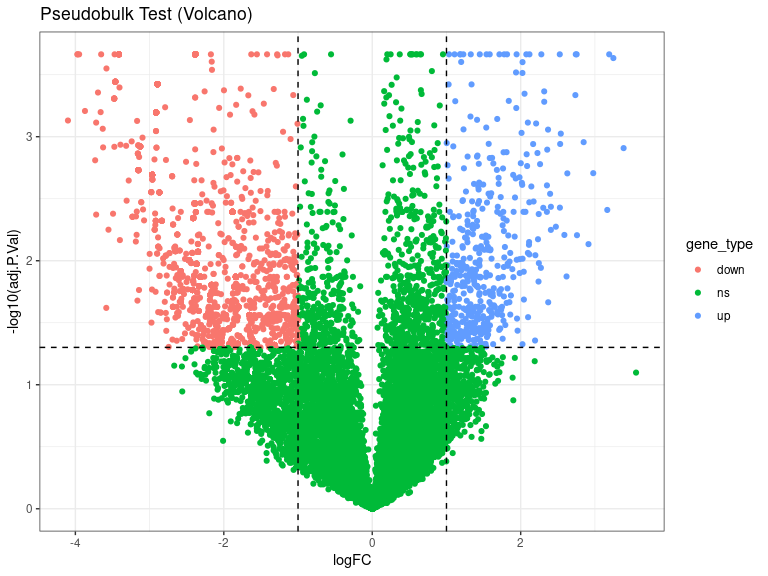

DEs
================
Laura Perlaza-Jimenez
2023-02-06

<h1 align="center">
Differential Expression Pseudobulk
</h1>

Load libraries

``` r
library(dplyr)
library(Seurat)
library(hdf5r)
library(fs)
library(scCustomize)
library(clustree)
library(SeuratDisk)
library(clustree)
library(ggplot2)
library(RColorBrewer)
library(ggforce)
library(limma)
library(edgeR)
```

Get working path and set it

``` r
path_wd<-getwd()
setwd(path_wd)
```

``` r
subset_obj<-LoadH5Seurat("../Results/kidney.combined_obj_UMAP_clustered_finalnames.h5seurat")
DefaultAssay(subset_obj) <- "RNA"
```

``` r
# functions

DE_analysis_pseudobulk <- function(cell_type,comparison1,comparison2) {
        subset_obj_tested= subset_obj[, subset_obj$cell_labels==cell_type] #change this column name for your clusters labels wherever they are
        
          replicates_lookup <- c(
        "n1_d20"="normal_d20", "n2_d20"="normal_d20", "n3_d20"="normal_d20",
        "h1_d20"="hypoxic_d20", "h2_d20"="hypoxic_d20", "h3_d20"="hypoxic_d20", 
        "n1_d25"= "normal_d25", "n2_d25"="normal_d25",  "n3_d25"="normal_d25",
        "h1_d25"="hypoxic_d25", "h2_d25"="hypoxic_d25", "h3_d25"="hypoxic_d25")
                
        replicates_lookup=replicates_lookup[replicates_lookup %in% c(comparison1,comparison2)]
        
        subset_obj_tested<-subset(subset_obj_tested, subset = orig.ident %in% c(names(replicates_lookup)))
        Idents(subset_obj_tested) <- subset_obj_tested$orig.ident

        pseudobulk_matrix <- AggregateExpression( subset_obj_tested,  slot = 'counts', assays='RNA' )[['RNA']]
        
        dge <- DGEList(pseudobulk_matrix)
        dge <- calcNormFactors(dge)
 
        condition <- factor(replicates_lookup[colnames(pseudobulk_matrix)],levels=c(comparison1,comparison2))
        condition_names<-levels(condition)
        design <- model.matrix(~condition)
        vm  <- voom(dge, design = design, plot = FALSE)
        fit <- lmFit(vm, design = design)
        fit <- eBayes(fit)
        de_result_pseudobulk <- topTable(fit, n = Inf, adjust.method = "BH")
        #> Removing intercept from test coefficients
        de_result_pseudobulk <- arrange(de_result_pseudobulk , adj.P.Val)
        
        de_result_pseudobulk <-de_result_pseudobulk %>%
          mutate(gene_type = case_when(logFC  >= log2(2) & adj.P.Val <= 0.05 ~ "up",
                               logFC  <= log2(0.5) & adj.P.Val <= 0.05 ~ "down",
                               TRUE ~ "ns"))  
        cols <- c("up" = "#ffad73", "down" = "#26b3ff", "ns" = "grey") 
        sizes <- c("up" = 2, "down" = 2, "ns" = 1) 
        alphas <- c("up" = 1, "down" = 1, "ns" = 0.5)
        
        p1 <- ggplot(de_result_pseudobulk, aes(x=AveExpr, y=logFC, col=adj.P.Val < 0.05, fill = gene_type)) +
          geom_point() +
          theme_bw() +
          ggtitle("Pseudobulk")
        p2 <- ggplot(de_result_pseudobulk, aes(x=logFC, y=-log10(adj.P.Val), col = gene_type)) +
          geom_point() +
          theme_bw() +
          ggtitle("Pseudobulk Test (Volcano)")
          
         p2<-p2+ geom_hline(yintercept = -log10(0.05),
             linetype = "dashed") + 
              geom_vline(xintercept = c(log2(0.5), log2(2)),
             linetype = "dashed")   
         
        p2<- p2+ scale_fill_manual(values = cols) + # Modify point colour
            scale_size_manual(values = sizes) + # Modify point size
          scale_alpha_manual(values = alphas)  # Modify point transparency

        return (list(p1,p2,de_result_pseudobulk,condition_names))
}
```

``` r
cat( "#", params$cluster_input)
```

# 1_Stroma

## treatment comparisons

``` r
celltype=  params$cluster_input
```

``` r
DE_treatment_pseudobulk_results=DE_analysis_pseudobulk(celltype,"normal_d20","hypoxic_d20")
cat("###",DE_treatment_pseudobulk_results[[4]][1],"vs",DE_treatment_pseudobulk_results[[4]][2],"\n")
```

### normal_d20 vs hypoxic_d20

``` r
cat("#### Reference:", DE_treatment_pseudobulk_results[[4]][1],"\n")
```

#### Reference: normal_d20

``` r
DE_treatment_pseudobulk_results[[1]]
```

<!-- -->

``` r
DE_treatment_pseudobulk_results[[2]]
```

<!-- -->

``` r
head(DE_treatment_pseudobulk_results[[3]],)
```

            logFC   AveExpr         t      P.Value    adj.P.Val        B gene_type

MALAT1 0.5694583 15.258787 73.13011 2.904303e-12 1.063004e-07 13.60448
ns MT-CO3 -2.4787331 10.685420 -33.11284 1.303399e-09 2.385285e-05
13.03087 down RPL24 0.4453545 11.572870 29.04568 3.564207e-09
3.764756e-05 11.62794 ns RPS26 0.3739404 11.868289 28.50696 4.114375e-09
3.764756e-05 11.31499 ns MT-CO2 -2.4081862 10.775718 -25.38975
9.987310e-09 6.092426e-05 10.89752 down MT-CYB -3.1630291 9.038772
-25.44043 9.836145e-09 6.092426e-05 10.89665 down

``` r
 DE_treatment_pseudobulk_results=DE_analysis_pseudobulk(celltype,"normal_d25","hypoxic_d25")

cat("###",DE_treatment_pseudobulk_results[[4]][1],"vs",DE_treatment_pseudobulk_results[[4]][2],"\n")
```

### normal_d25 vs hypoxic_d25

``` r
cat("#### Reference:", DE_treatment_pseudobulk_results[[4]][1],"\n")
```

#### Reference: normal_d25

``` r
 DE_treatment_pseudobulk_results[[1]]
```

<!-- -->

``` r
 DE_treatment_pseudobulk_results[[2]]
```

<!-- -->

``` r
head(DE_treatment_pseudobulk_results[[3]],10)
```

              logFC    AveExpr         t      P.Value    adj.P.Val        B gene_type

CADM2 -1.554143 8.6994433 -13.57348 6.723275e-07 0.0002165986 6.183062
down GNAO1 3.192506 2.3598392 12.44201 1.330703e-06 0.0002165986
5.872613 up TXNIP -1.175444 7.7572525 -12.00520 1.758629e-06
0.0002165986 5.395629 down MYO1E 1.227001 7.5708651 11.58459
2.320602e-06 0.0002165986 5.292605 up PCDH17 -1.281655 6.3047063
-11.18477 3.046228e-06 0.0002165986 5.108122 down LINC00637 -3.971069
0.3575046 -11.40652 2.616783e-06 0.0002165986 4.852642 down SLC17A9
-3.971069 0.3575046 -11.40652 2.616783e-06 0.0002165986 4.852642 down
RPS6 0.370574 11.1331093 12.45129 1.322973e-06 0.0002165986 4.742570 ns
RHOU 1.816222 6.4064486 10.35382 5.518641e-06 0.0002165986 4.621200 up
ZSWIM6 1.034624 7.8707616 10.43636 5.192750e-06 0.0002165986 4.337056 up

``` r
  DE_treatment_pseudobulk_results=DE_analysis_pseudobulk(celltype,"normal_d20","normal_d25")

cat("###",DE_treatment_pseudobulk_results[[4]][1],"vs",DE_treatment_pseudobulk_results[[4]][2],"\n")
```

### normal_d20 vs normal_d25

``` r
cat("#### Reference:", DE_treatment_pseudobulk_results[[4]][1],"\n")
```

#### Reference: normal_d20

``` r
 DE_treatment_pseudobulk_results[[1]]
```

<!-- -->

``` r
 DE_treatment_pseudobulk_results[[2]]
```

<!-- -->

``` r
 head(DE_treatment_pseudobulk_results[[3]] ,10)
```

            logFC   AveExpr         t      P.Value   adj.P.Val        B gene_type

JARID2 -1.4921658 8.764972 -23.73760 1.151250e-07 0.004213689 8.681453
down VIM 1.3188590 11.067392 19.72474 3.873179e-07 0.005483075 6.881240
up RPS12 0.2986628 12.381928 18.44939 5.992268e-07 0.005483075 5.603268
ns GRIN3A -4.3507652 3.021148 -18.89183 5.133865e-07 0.005483075
5.087577 down COL3A1 0.9428550 8.216734 16.65799 1.165075e-06
0.007168316 6.382937 ns RPL41 0.1731616 12.581099 16.63603 1.175102e-06
0.007168316 4.691400 ns LGALS1 2.0117741 9.279282 15.81932 1.629098e-06
0.008518088 5.894924 up RPL13A 0.4676731 11.208795 15.19367 2.115643e-06
0.009679329 4.875152 ns PCOLCE 1.5403269 6.598079 13.81224 3.913960e-06
0.012722126 5.164677 up RPS24 0.3406288 11.549761 13.96424 3.647644e-06
0.012722126 4.076647 ns

``` r
DE_treatment_pseudobulk_results=DE_analysis_pseudobulk(celltype,"hypoxic_d20","hypoxic_d25")

cat("###",DE_treatment_pseudobulk_results[[4]][1],"vs",DE_treatment_pseudobulk_results[[4]][2],"\n")
```

### hypoxic_d20 vs hypoxic_d25

``` r
cat("#### Reference:", DE_treatment_pseudobulk_results[[4]][1],"\n")
```

#### Reference: hypoxic_d20

``` r
  DE_treatment_pseudobulk_results[[1]]
```

<!-- -->

``` r
  DE_treatment_pseudobulk_results[[2]]
```

<!-- -->

``` r
  head(DE_treatment_pseudobulk_results[[3]],10)
```

             logFC   AveExpr          t      P.Value    adj.P.Val        B gene_type

MALAT1 -0.7386275 15.071384 -122.34215 6.041427e-16 2.211223e-11
22.55715 ns MT-CO3 3.0081317 10.838395 35.53928 4.496963e-11
8.229667e-07 16.24846 up MT-CYB 3.8704615 9.284115 32.71926 9.488970e-11
1.157686e-06 15.17131 up ROBO2 1.4425365 10.497008 30.39371 1.845358e-10
1.688548e-06 14.76512 up P4HA1 -2.7436738 7.426029 -28.49870
3.296078e-10 2.412795e-06 13.90405 down MT-CO2 3.0120943 10.961211
27.52351 4.509338e-10 2.750771e-06 13.87183 up MT-ATP6 3.3359936
10.261134 26.57819 6.175024e-10 3.228743e-06 13.63086 up SRSF3 1.5309289
8.453278 25.48259 9.014303e-10 4.092514e-06 13.20259 up PTN 2.1544092
9.543186 25.06926 1.044023e-09 4.092514e-06 13.10678 up MT-CO1 1.9771359
10.990071 24.87846 1.118143e-09 4.092514e-06 12.79627 up
