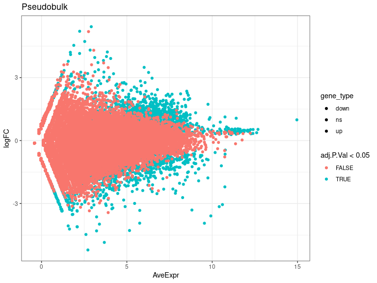
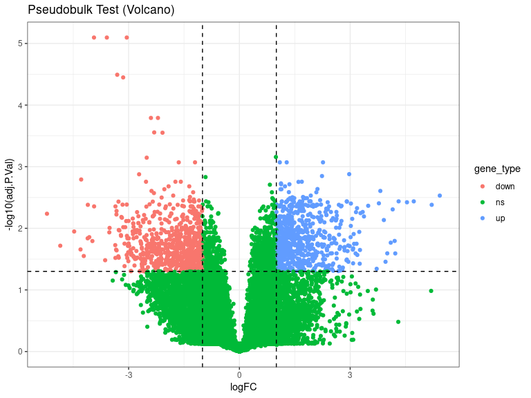
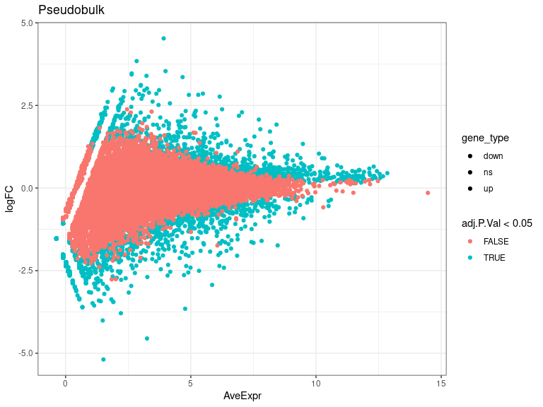
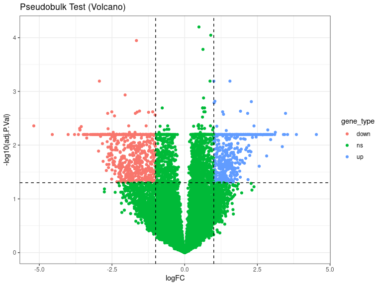
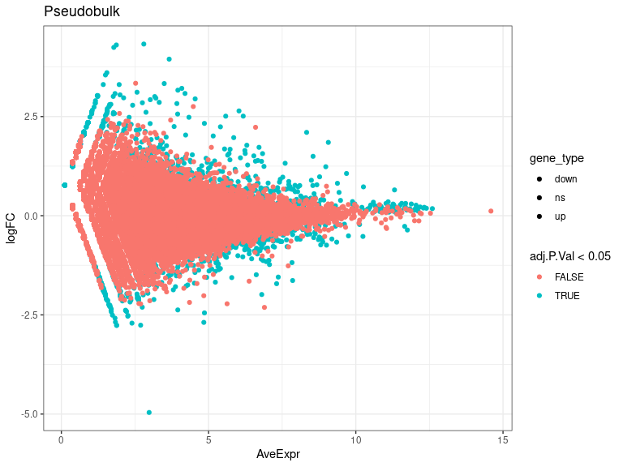
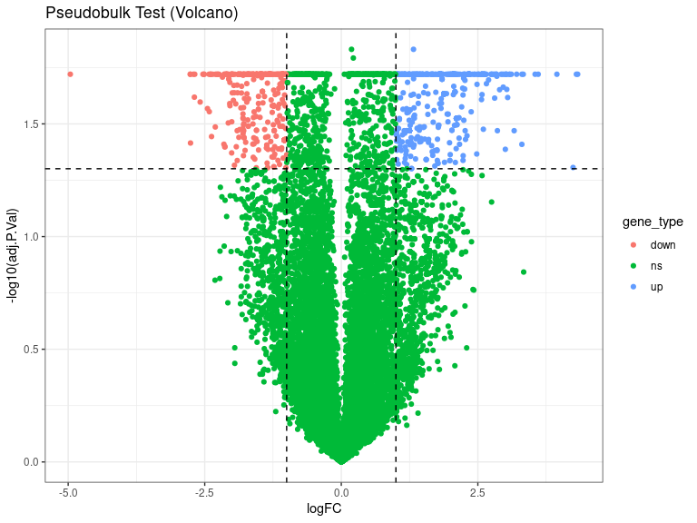
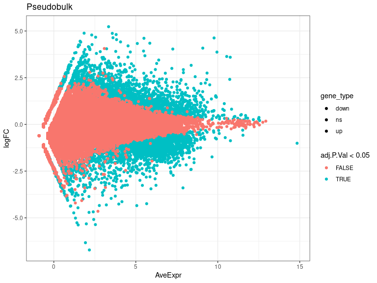
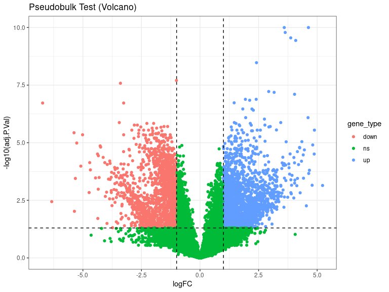

DEs
================
Laura Perlaza-Jimenez
2023-02-06

<h1 align="center">
Differential Expression Pseudobulk
</h1>

Load libraries

``` r
library(dplyr)
library(Seurat)
library(hdf5r)
library(fs)
library(scCustomize)
library(clustree)
library(SeuratDisk)
library(clustree)
library(ggplot2)
library(RColorBrewer)
library(ggforce)
library(limma)
library(edgeR)
```

Get working path and set it

``` r
path_wd<-getwd()
setwd(path_wd)
```

``` r
subset_obj<-LoadH5Seurat("../Results/kidney.combined_obj_UMAP_clustered_finalnames.h5seurat")
DefaultAssay(subset_obj) <- "RNA"
```

``` r
# functions

DE_analysis_pseudobulk <- function(cell_type,comparison1,comparison2) {
        subset_obj_tested= subset_obj[, subset_obj$cell_labels==cell_type] #change this column name for your clusters labels wherever they are
        
          replicates_lookup <- c(
        "n1_d20"="normal_d20", "n2_d20"="normal_d20", "n3_d20"="normal_d20",
        "h1_d20"="hypoxic_d20", "h2_d20"="hypoxic_d20", "h3_d20"="hypoxic_d20", 
        "n1_d25"= "normal_d25", "n2_d25"="normal_d25",  "n3_d25"="normal_d25",
        "h1_d25"="hypoxic_d25", "h2_d25"="hypoxic_d25", "h3_d25"="hypoxic_d25")
                
        replicates_lookup=replicates_lookup[replicates_lookup %in% c(comparison1,comparison2)]
        
        subset_obj_tested<-subset(subset_obj_tested, subset = orig.ident %in% c(names(replicates_lookup)))
        Idents(subset_obj_tested) <- subset_obj_tested$orig.ident

        pseudobulk_matrix <- AggregateExpression( subset_obj_tested,  slot = 'counts', assays='RNA' )[['RNA']]
        
        dge <- DGEList(pseudobulk_matrix)
        dge <- calcNormFactors(dge)
 
        condition <- factor(replicates_lookup[colnames(pseudobulk_matrix)],levels=c(comparison1,comparison2))
        condition_names<-levels(condition)
        design <- model.matrix(~condition)
        vm  <- voom(dge, design = design, plot = FALSE)
        fit <- lmFit(vm, design = design)
        fit <- eBayes(fit)
        de_result_pseudobulk <- topTable(fit, n = Inf, adjust.method = "BH")
        #> Removing intercept from test coefficients
        de_result_pseudobulk <- arrange(de_result_pseudobulk , adj.P.Val)
        
        de_result_pseudobulk <-de_result_pseudobulk %>%
          mutate(gene_type = case_when(logFC  >= log2(2) & adj.P.Val <= 0.05 ~ "up",
                               logFC  <= log2(0.5) & adj.P.Val <= 0.05 ~ "down",
                               TRUE ~ "ns"))  
        cols <- c("up" = "#ffad73", "down" = "#26b3ff", "ns" = "grey") 
        sizes <- c("up" = 2, "down" = 2, "ns" = 1) 
        alphas <- c("up" = 1, "down" = 1, "ns" = 0.5)
        
        p1 <- ggplot(de_result_pseudobulk, aes(x=AveExpr, y=logFC, col=adj.P.Val < 0.05, fill = gene_type)) +
          geom_point() +
          theme_bw() +
          ggtitle("Pseudobulk")
        p2 <- ggplot(de_result_pseudobulk, aes(x=logFC, y=-log10(adj.P.Val), col = gene_type)) +
          geom_point() +
          theme_bw() +
          ggtitle("Pseudobulk Test (Volcano)")
          
         p2<-p2+ geom_hline(yintercept = -log10(0.05),
             linetype = "dashed") + 
              geom_vline(xintercept = c(log2(0.5), log2(2)),
             linetype = "dashed")   
         
        p2<- p2+ scale_fill_manual(values = cols) + # Modify point colour
            scale_size_manual(values = sizes) + # Modify point size
          scale_alpha_manual(values = alphas)  # Modify point transparency

        return (list(p1,p2,de_result_pseudobulk,condition_names))
}
```

``` r
cat( "#", params$cluster_input)
```

# 2_Stroma

## treatment comparisons

``` r
celltype=  params$cluster_input
```

``` r
DE_treatment_pseudobulk_results=DE_analysis_pseudobulk(celltype,"normal_d20","hypoxic_d20")
cat("###",DE_treatment_pseudobulk_results[[4]][1],"vs",DE_treatment_pseudobulk_results[[4]][2],"\n")
```

### normal_d20 vs hypoxic_d20

``` r
cat("#### Reference:", DE_treatment_pseudobulk_results[[4]][1],"\n")
```

#### Reference: normal_d20

``` r
DE_treatment_pseudobulk_results[[1]]
```

<!-- -->

``` r
DE_treatment_pseudobulk_results[[2]]
```

<!-- -->

``` r
head(DE_treatment_pseudobulk_results[[3]],)
```

            logFC   AveExpr         t      P.Value    adj.P.Val         B gene_type

MT-ATP6 -3.589782 9.919337 -56.97745 2.546339e-10 8.013286e-06 13.909697
down MT-CO2 -3.050200 10.600414 -49.76436 6.344681e-10 8.013286e-06
13.612638 down MT-ND3 -3.938210 9.543860 -49.50961 6.568087e-10
8.013286e-06 13.017653 down MT-CYB -3.309284 8.811042 -38.59454
3.517432e-09 3.218538e-05 11.602000 down MT-CO3 -3.148053 10.411165
-36.78778 4.857079e-09 3.555479e-05 11.785331 down MT-CO1 -2.206012
10.742052 -27.93058 3.091640e-08 1.616530e-04 9.968264 down

``` r
 DE_treatment_pseudobulk_results=DE_analysis_pseudobulk(celltype,"normal_d25","hypoxic_d25")

cat("###",DE_treatment_pseudobulk_results[[4]][1],"vs",DE_treatment_pseudobulk_results[[4]][2],"\n")
```

### normal_d25 vs hypoxic_d25

``` r
cat("#### Reference:", DE_treatment_pseudobulk_results[[4]][1],"\n")
```

#### Reference: normal_d25

``` r
 DE_treatment_pseudobulk_results[[1]]
```

<!-- -->

``` r
 DE_treatment_pseudobulk_results[[2]]
```

<!-- -->

``` r
head(DE_treatment_pseudobulk_results[[3]],10)
```

            logFC   AveExpr         t      P.Value    adj.P.Val         B gene_type

TPT1 0.4907709 11.558709 19.93065 1.726772e-09 6.320158e-05 12.035674 ns
FTH1 0.8971848 10.329654 17.93720 4.911505e-09 8.988300e-05 11.299405 ns
TXNIP -1.6589116 7.503526 -16.81910 9.272468e-09 1.131272e-04 10.804510
down FTL 0.6295140 11.001429 15.71817 1.804089e-08 1.650787e-04 9.710547
ns B2M 1.0028381 9.248559 13.10575 1.058878e-07 6.435588e-04 8.275450 up
VMP1 1.5566263 7.538597 12.86491 1.266328e-07 6.435588e-04 8.239390 up
NDST4 -2.9328754 5.850584 -12.94029 1.196986e-07 6.435588e-04 8.069845
down IFITM3 0.8715988 8.859503 12.72531 1.406647e-07 6.435588e-04
8.035447 ns PCDH17 -2.0486808 6.848837 -11.81714 2.860298e-07
1.163219e-03 7.441467 down MT-CO2 0.6489800 12.303485 11.52942
3.617536e-07 1.324054e-03 5.948933 ns

``` r
  DE_treatment_pseudobulk_results=DE_analysis_pseudobulk(celltype,"normal_d20","normal_d25")

cat("###",DE_treatment_pseudobulk_results[[4]][1],"vs",DE_treatment_pseudobulk_results[[4]][2],"\n")
```

### normal_d20 vs normal_d25

``` r
cat("#### Reference:", DE_treatment_pseudobulk_results[[4]][1],"\n")
```

#### Reference: normal_d20

``` r
 DE_treatment_pseudobulk_results[[1]]
```

<!-- -->

``` r
 DE_treatment_pseudobulk_results[[2]]
```

<!-- -->

``` r
 head(DE_treatment_pseudobulk_results[[3]] ,10)
```

                logFC   AveExpr         t      P.Value  adj.P.Val        B gene_type

JUN 1.3221109 7.600431 21.01530 8.067202e-07 0.01476338 6.830840 up
EEF1A1 0.1876237 12.397627 22.28726 5.704478e-07 0.01476338 5.646272 ns
RPS27 0.2205168 12.184556 19.32265 1.322597e-06 0.01613612 4.834660 ns
COL3A1 0.9806718 8.770800 15.48981 4.832040e-06 0.01904184 4.883320 ns
RPS3 0.2938528 11.265580 15.06307 5.687215e-06 0.01904184 3.743459 ns
LINC02232 -4.9606138 2.980347 -13.94212 8.919081e-06 0.01904184 3.482658
down FOS 1.0642012 9.684676 12.77669 1.478975e-05 0.01904184 3.360156 up
CHCHD4 -2.7651049 1.876116 -14.46933 7.188100e-06 0.01904184 3.102158
down IKBKE -2.6826224 1.835948 -14.56505 6.917528e-06 0.01904184
3.086941 down AP001605.1 3.5481826 1.497516 16.77847 3.028622e-06
0.01904184 3.078541 up

``` r
DE_treatment_pseudobulk_results=DE_analysis_pseudobulk(celltype,"hypoxic_d20","hypoxic_d25")

cat("###",DE_treatment_pseudobulk_results[[4]][1],"vs",DE_treatment_pseudobulk_results[[4]][2],"\n")
```

### hypoxic_d20 vs hypoxic_d25

``` r
cat("#### Reference:", DE_treatment_pseudobulk_results[[4]][1],"\n")
```

#### Reference: hypoxic_d20

``` r
  DE_treatment_pseudobulk_results[[1]]
```

<!-- -->

``` r
  DE_treatment_pseudobulk_results[[2]]
```

<!-- -->

``` r
  head(DE_treatment_pseudobulk_results[[3]],10)
```

            logFC   AveExpr         t      P.Value    adj.P.Val        B gene_type

MT-CO2 3.595434 10.760587 44.12710 5.485745e-15 1.003919e-10 24.53631 up
MT-ND3 4.627563 9.773873 45.69795 3.567226e-15 1.003919e-10 24.16193 up
MT-CO3 3.636029 10.545433 41.01864 1.346772e-14 1.643106e-10 23.68176 up
MT-ATP6 3.872114 9.949400 38.35783 3.069618e-14 2.808777e-10 22.72949 up
MT-CYB 4.084614 9.085562 36.87435 4.981129e-14 3.646286e-10 21.86769 up
MT-CO1 2.410569 10.730588 30.29890 5.519999e-13 3.367291e-09 20.34522 up
MALAT1 -1.007275 14.837547 -25.86309 3.803860e-12 1.988930e-08 17.64257
down P4HA1 -3.396241 7.877283 -25.00053 5.745357e-12 2.628572e-08
17.67454 down MT-ND2 2.931643 7.899495 23.12943 1.476363e-11
6.004039e-08 16.77797 up MT-ND1 3.163677 8.377816 22.76989 1.784778e-11
6.532467e-08 16.71542 up
