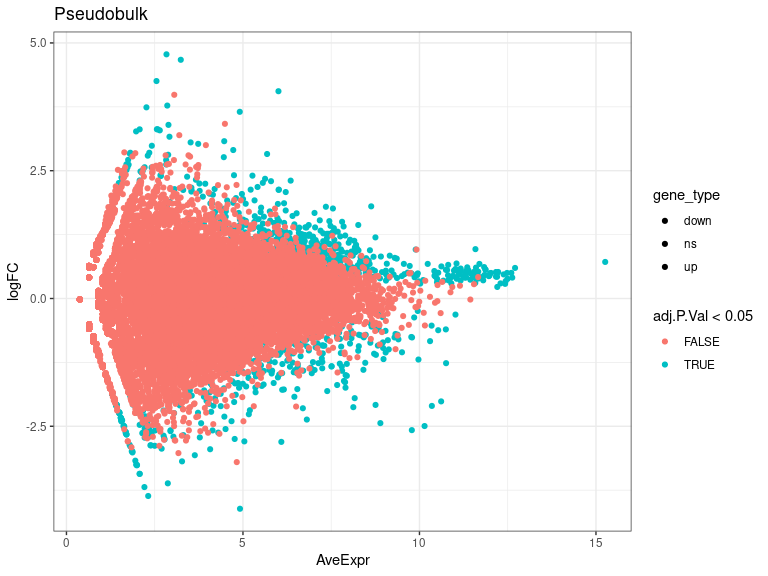
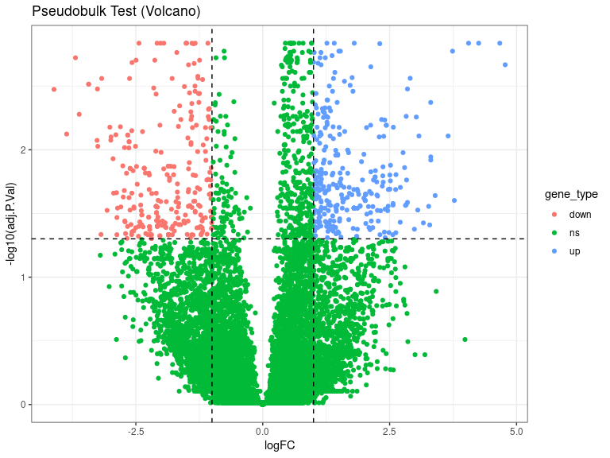
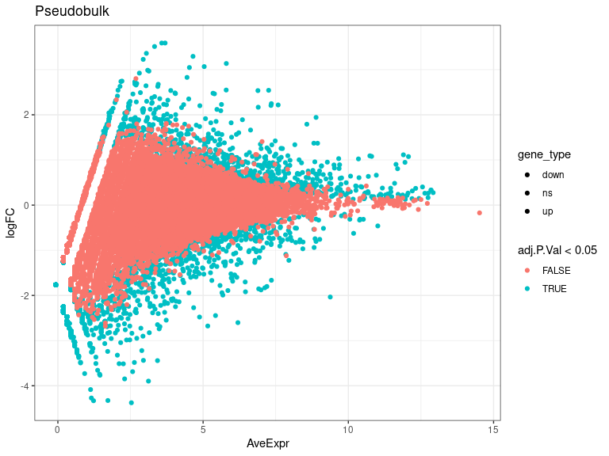
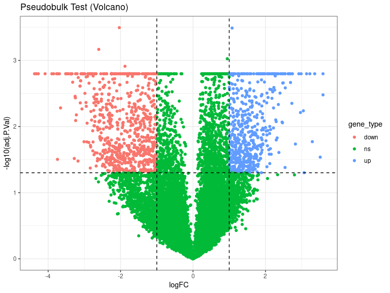
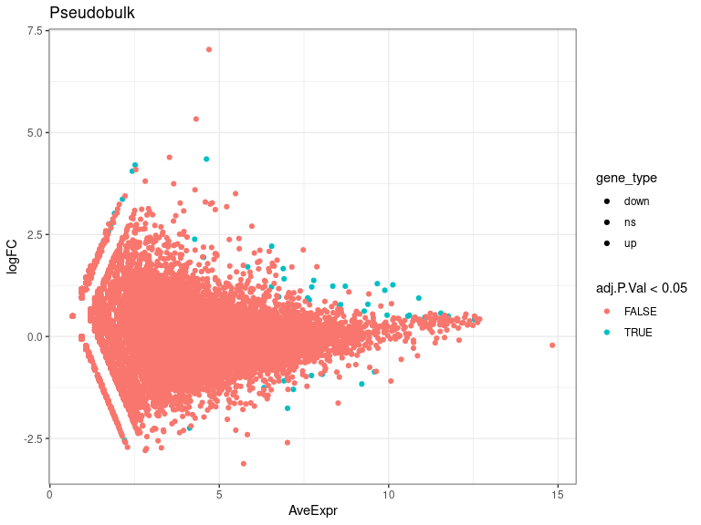
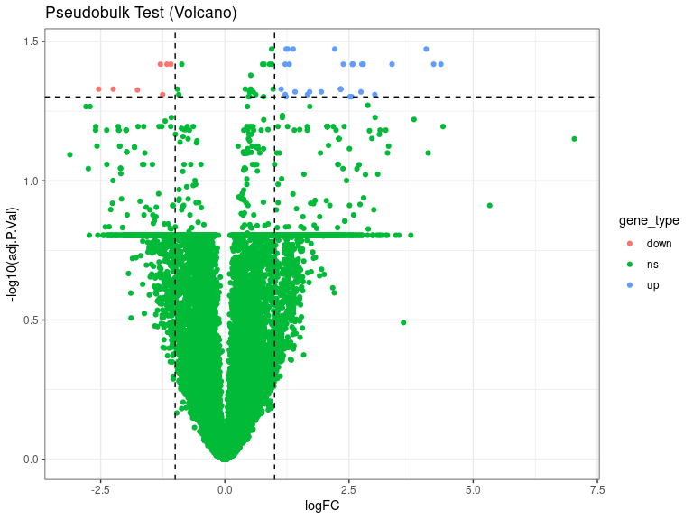
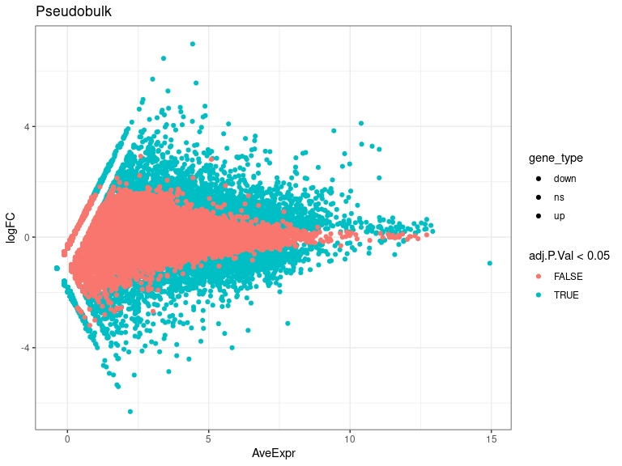
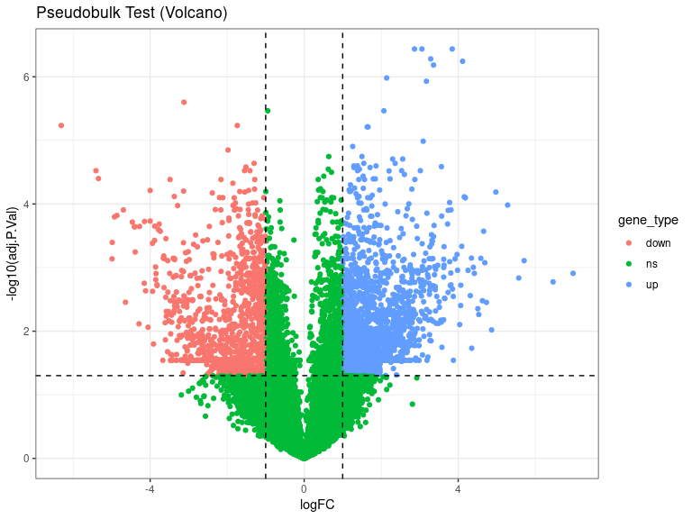

DEs
================
Laura Perlaza-Jimenez
2023-02-06

<h1 align="center">
Differential Expression Pseudobulk
</h1>

Load libraries

``` r
library(dplyr)
library(Seurat)
library(hdf5r)
library(fs)
library(scCustomize)
library(clustree)
library(SeuratDisk)
library(clustree)
library(ggplot2)
library(RColorBrewer)
library(ggforce)
library(limma)
library(edgeR)
```

Get working path and set it

``` r
path_wd<-getwd()
setwd(path_wd)
```

``` r
subset_obj<-LoadH5Seurat("../Results/kidney.combined_obj_UMAP_clustered_finalnames.h5seurat")
DefaultAssay(subset_obj) <- "RNA"
```

``` r
# functions

DE_analysis_pseudobulk <- function(cell_type,comparison1,comparison2) {
        subset_obj_tested= subset_obj[, subset_obj$cell_labels==cell_type] #change this column name for your clusters labels wherever they are
        
          replicates_lookup <- c(
        "n1_d20"="normal_d20", "n2_d20"="normal_d20", "n3_d20"="normal_d20",
        "h1_d20"="hypoxic_d20", "h2_d20"="hypoxic_d20", "h3_d20"="hypoxic_d20", 
        "n1_d25"= "normal_d25", "n2_d25"="normal_d25",  "n3_d25"="normal_d25",
        "h1_d25"="hypoxic_d25", "h2_d25"="hypoxic_d25", "h3_d25"="hypoxic_d25")
                
        replicates_lookup=replicates_lookup[replicates_lookup %in% c(comparison1,comparison2)]
        
        subset_obj_tested<-subset(subset_obj_tested, subset = orig.ident %in% c(names(replicates_lookup)))
        Idents(subset_obj_tested) <- subset_obj_tested$orig.ident

        pseudobulk_matrix <- AggregateExpression( subset_obj_tested,  slot = 'counts', assays='RNA' )[['RNA']]
        
        dge <- DGEList(pseudobulk_matrix)
        dge <- calcNormFactors(dge)
 
        condition <- factor(replicates_lookup[colnames(pseudobulk_matrix)],levels=c(comparison1,comparison2))
        condition_names<-levels(condition)
        design <- model.matrix(~condition)
        vm  <- voom(dge, design = design, plot = FALSE)
        fit <- lmFit(vm, design = design)
        fit <- eBayes(fit)
        de_result_pseudobulk <- topTable(fit, n = Inf, adjust.method = "BH")
        #> Removing intercept from test coefficients
        de_result_pseudobulk <- arrange(de_result_pseudobulk , adj.P.Val)
        
        de_result_pseudobulk <-de_result_pseudobulk %>%
          mutate(gene_type = case_when(logFC  >= log2(2) & adj.P.Val <= 0.05 ~ "up",
                               logFC  <= log2(0.5) & adj.P.Val <= 0.05 ~ "down",
                               TRUE ~ "ns"))  
        cols <- c("up" = "#ffad73", "down" = "#26b3ff", "ns" = "grey") 
        sizes <- c("up" = 2, "down" = 2, "ns" = 1) 
        alphas <- c("up" = 1, "down" = 1, "ns" = 0.5)
        
        p1 <- ggplot(de_result_pseudobulk, aes(x=AveExpr, y=logFC, col=adj.P.Val < 0.05, fill = gene_type)) +
          geom_point() +
          theme_bw() +
          ggtitle("Pseudobulk")
        p2 <- ggplot(de_result_pseudobulk, aes(x=logFC, y=-log10(adj.P.Val), col = gene_type)) +
          geom_point() +
          theme_bw() +
          ggtitle("Pseudobulk Test (Volcano)")
          
         p2<-p2+ geom_hline(yintercept = -log10(0.05),
             linetype = "dashed") + 
              geom_vline(xintercept = c(log2(0.5), log2(2)),
             linetype = "dashed")   
         
        p2<- p2+ scale_fill_manual(values = cols) + # Modify point colour
            scale_size_manual(values = sizes) + # Modify point size
          scale_alpha_manual(values = alphas)  # Modify point transparency

        return (list(p1,p2,de_result_pseudobulk,condition_names))
}
```

``` r
cat( "#", params$cluster_input)
```

# 3_Stroma

## treatment comparisons

``` r
celltype=  params$cluster_input
```

``` r
DE_treatment_pseudobulk_results=DE_analysis_pseudobulk(celltype,"normal_d20","hypoxic_d20")
cat("###",DE_treatment_pseudobulk_results[[4]][1],"vs",DE_treatment_pseudobulk_results[[4]][2],"\n")
```

### normal_d20 vs hypoxic_d20

``` r
cat("#### Reference:", DE_treatment_pseudobulk_results[[4]][1],"\n")
```

#### Reference: normal_d20

``` r
DE_treatment_pseudobulk_results[[1]]
```

<!-- -->

``` r
DE_treatment_pseudobulk_results[[2]]
```

<!-- -->

``` r
head(DE_treatment_pseudobulk_results[[3]],)
```

                  logFC   AveExpr         t      P.Value   adj.P.Val        B gene_type

P4HA1 1.8027173 8.633088 15.68287 2.065643e-07 0.001455602 7.934473 up
RPL21 0.5475776 11.335191 16.61556 1.302092e-07 0.001455602 7.849070 ns
FTL 0.9655603 11.585725 16.55067 1.343491e-07 0.001455602 7.736407 ns
ID3 -1.9499379 8.165186 -15.03314 2.893466e-07 0.001455602 7.581554 down
EPB41L4A-AS1 1.4089693 7.851164 14.86907 3.157309e-07 0.001455602
7.476177 up PLXDC2 -1.4985570 7.907810 -14.53513 3.781595e-07
0.001455602 7.311800 down

``` r
 DE_treatment_pseudobulk_results=DE_analysis_pseudobulk(celltype,"normal_d25","hypoxic_d25")

cat("###",DE_treatment_pseudobulk_results[[4]][1],"vs",DE_treatment_pseudobulk_results[[4]][2],"\n")
```

### normal_d25 vs hypoxic_d25

``` r
cat("#### Reference:", DE_treatment_pseudobulk_results[[4]][1],"\n")
```

#### Reference: normal_d25

``` r
 DE_treatment_pseudobulk_results[[1]]
```

<!-- -->

``` r
 DE_treatment_pseudobulk_results[[2]]
```

<!-- -->

``` r
head(DE_treatment_pseudobulk_results[[3]],10)
```

             logFC   AveExpr         t      P.Value    adj.P.Val         B gene_type

GALNTL6 -2.0348226 9.377451 -21.37638 8.736957e-09 0.0003197814
10.988408 down MT-CYB 1.0790614 10.801392 19.66692 1.772362e-08
0.0003243511 10.081660 up BNIP3 -2.6026030 6.197862 -17.16772
5.587351e-08 0.0006816755 9.023540 down MT-CO3 0.9465654 11.949845
15.95788 1.032634e-07 0.0009448859 7.834132 ns SPOCK3 -1.8774023
6.993570 -15.06038 1.676562e-07 0.0012272769 8.100084 down P4HA1
-1.8310597 7.124788 -13.86456 3.340487e-07 0.0015941607 7.409652 down
ENO1 -1.2226711 7.953035 -13.30938 4.688231e-07 0.0015941607 6.991291
down ARHGAP6 -1.8544061 6.913197 -13.11058 5.309949e-07 0.0015941607
6.951121 down MT-ATP6 0.9018600 11.640204 13.84114 3.387736e-07
0.0015941607 6.621666 ns MT-ATP8 1.1293814 7.504199 12.48572
7.944801e-07 0.0015941607 6.540722 up

``` r
  DE_treatment_pseudobulk_results=DE_analysis_pseudobulk(celltype,"normal_d20","normal_d25")

cat("###",DE_treatment_pseudobulk_results[[4]][1],"vs",DE_treatment_pseudobulk_results[[4]][2],"\n")
```

### normal_d20 vs normal_d25

``` r
cat("#### Reference:", DE_treatment_pseudobulk_results[[4]][1],"\n")
```

#### Reference: normal_d20

``` r
 DE_treatment_pseudobulk_results[[1]]
```

<!-- -->

``` r
 DE_treatment_pseudobulk_results[[2]]
```

<!-- -->

``` r
 head(DE_treatment_pseudobulk_results[[3]] ,10)
```

            logFC   AveExpr         t      P.Value  adj.P.Val        B gene_type

COL1A1 1.2342258 8.350994 13.64095 3.063666e-06 0.03366346 5.364940 up
CRABP1 1.2671470 10.125087 13.56900 3.173706e-06 0.03366346 5.025138 up
CADM2 2.2142647 6.546784 12.61038 5.168007e-06 0.03366346 4.822922 up
JUNB 1.3750720 7.788003 12.48631 5.518449e-06 0.03366346 4.803125 up VIM
0.9419261 10.889265 13.24897 3.721049e-06 0.03366346 4.619830 ns TLL1
4.0541396 2.429158 14.26255 2.274646e-06 0.03366346 3.931793 up FLRT3
1.2138768 6.540354 11.00841 1.267215e-05 0.03816883 3.998816 up GAS5
0.7895769 9.386792 11.18042 1.144534e-05 0.03816883 3.780252 ns HIPK2
-1.2979044 7.187767 -10.50228 1.724600e-05 0.03816883 3.689164 down
SNHG32 0.8986536 7.657563 10.51529 1.710713e-05 0.03816883 3.635348 ns

``` r
DE_treatment_pseudobulk_results=DE_analysis_pseudobulk(celltype,"hypoxic_d20","hypoxic_d25")

cat("###",DE_treatment_pseudobulk_results[[4]][1],"vs",DE_treatment_pseudobulk_results[[4]][2],"\n")
```

### hypoxic_d20 vs hypoxic_d25

``` r
cat("#### Reference:", DE_treatment_pseudobulk_results[[4]][1],"\n")
```

#### Reference: hypoxic_d20

``` r
  DE_treatment_pseudobulk_results[[1]]
```

<!-- -->

``` r
  DE_treatment_pseudobulk_results[[2]]
```

<!-- -->

``` r
  head(DE_treatment_pseudobulk_results[[3]],10)
```

            logFC   AveExpr         t      P.Value    adj.P.Val        B gene_type

MT-ND1 3.058472 8.428932 35.07362 1.101243e-11 3.650929e-07 16.84664 up
MT-CYB 3.845905 9.427857 31.66689 2.992483e-11 3.650929e-07 16.35225 up
MT-ND2 2.866491 8.084297 31.78827 2.882635e-11 3.650929e-07 15.92907 up
MT-CO3 3.286347 10.781630 29.63988 5.710738e-11 5.225468e-07 15.92954 up
MT-ND3 4.115443 10.394378 28.70858 7.798463e-11 5.708631e-07 15.61521 up
MT-ATP6 3.360878 10.411105 27.78612 1.072363e-10 6.541591e-07 15.30707
up MT-CO1 2.142836 11.032710 26.06942 1.995980e-10 1.043641e-06 14.53459
up MT-CO2 3.174832 11.034187 25.40452 2.566487e-10 1.174200e-06 14.34834
up P4HA1 -3.122187 7.796504 -23.20704 6.180596e-10 2.513511e-06 13.46344
down MT-ND4 2.069608 9.377625 22.01595 1.029928e-09 3.426946e-06
13.04074 up
