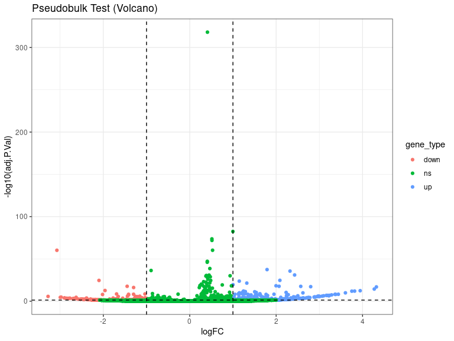

DEs
================
Laura Perlaza-Jimenez
2023-02-06

<h1 align="center">
Differential Expression Pseudobulk
</h1>

Load libraries

``` r
library(dplyr)
library(Seurat)
library(hdf5r)
library(fs)
library(scCustomize)
library(clustree)
library(SeuratDisk)
library(clustree)
library(ggplot2)
library(RColorBrewer)
library(ggforce)
library(limma)
library(edgeR)
```

Get working path and set it

``` r
path_wd<-getwd()
setwd(path_wd)
```

``` r
subset_obj<-LoadH5Seurat("../Results/kidney.combined_obj_UMAP_clustered_finalnames.h5seurat")
DefaultAssay(subset_obj) <- "RNA"
```

``` r
# functions

DE_analysis_pseudobulk <- function(cell_type,comparison1,comparison2) {
        subset_obj_tested= subset_obj[, subset_obj$cell_labels==cell_type] #change this column name for your clusters labels wherever they are
        
          replicates_lookup <- c(
        "n1_d20"="normal_d20", "n2_d20"="normal_d20", "n3_d20"="normal_d20",
        "h1_d20"="hypoxic_d20", "h2_d20"="hypoxic_d20", "h3_d20"="hypoxic_d20", 
        "n1_d25"= "normal_d25", "n2_d25"="normal_d25",  "n3_d25"="normal_d25",
        "h1_d25"="hypoxic_d25", "h2_d25"="hypoxic_d25", "h3_d25"="hypoxic_d25")
                
        replicates_lookup=replicates_lookup[replicates_lookup %in% c(comparison1,comparison2)]
        
        subset_obj_tested<-subset(subset_obj_tested, subset = orig.ident %in% c(names(replicates_lookup)))
        Idents(subset_obj_tested) <- subset_obj_tested$orig.ident

        pseudobulk_matrix <- AggregateExpression( subset_obj_tested,  slot = 'counts', assays='RNA' )[['RNA']]
        
        dge <- DGEList(pseudobulk_matrix)
        dge <- calcNormFactors(dge)
 
        condition <- factor(replicates_lookup[colnames(pseudobulk_matrix)],levels=c(comparison1,comparison2))
        condition_names<-levels(condition)
        design <- model.matrix(~condition)
        vm  <- voom(dge, design = design, plot = FALSE)
        fit <- lmFit(vm, design = design)
        fit <- eBayes(fit)
        de_result_pseudobulk <- topTable(fit, n = Inf, adjust.method = "BH")
        #> Removing intercept from test coefficients
        de_result_pseudobulk <- arrange(de_result_pseudobulk , adj.P.Val)
        
        de_result_pseudobulk <-de_result_pseudobulk %>%
          mutate(gene_type = case_when(logFC  >= log2(2) & adj.P.Val <= 0.05 ~ "up",
                               logFC  <= log2(0.5) & adj.P.Val <= 0.05 ~ "down",
                               TRUE ~ "ns"))  
        cols <- c("up" = "#ffad73", "down" = "#26b3ff", "ns" = "grey") 
        sizes <- c("up" = 2, "down" = 2, "ns" = 1) 
        alphas <- c("up" = 1, "down" = 1, "ns" = 0.5)
        
        p1 <- ggplot(de_result_pseudobulk, aes(x=AveExpr, y=logFC, col=adj.P.Val < 0.05, fill = gene_type)) +
          geom_point() +
          theme_bw() +
          ggtitle("Pseudobulk")
        p2 <- ggplot(de_result_pseudobulk, aes(x=logFC, y=-log10(adj.P.Val), col = gene_type)) +
          geom_point() +
          theme_bw() +
          ggtitle("Pseudobulk Test (Volcano)")
          
         p2<-p2+ geom_hline(yintercept = -log10(0.05),
             linetype = "dashed") + 
              geom_vline(xintercept = c(log2(0.5), log2(2)),
             linetype = "dashed")   
         
        p2<- p2+ scale_fill_manual(values = cols) + # Modify point colour
            scale_size_manual(values = sizes) + # Modify point size
          scale_alpha_manual(values = alphas)  # Modify point transparency

        return (list(p1,p2,de_result_pseudobulk,condition_names))
}
```

``` r
cat( "#", params$cluster_input)
```

# 4_Stroma

## treatment comparisons

``` r
celltype=  params$cluster_input
```

``` r
DE_treatment_pseudobulk_results=DE_analysis_pseudobulk(celltype,"normal_d20","hypoxic_d20")
cat("###",DE_treatment_pseudobulk_results[[4]][1],"vs",DE_treatment_pseudobulk_results[[4]][2],"\n")
```

### normal_d20 vs hypoxic_d20

``` r
cat("#### Reference:", DE_treatment_pseudobulk_results[[4]][1],"\n")
```

#### Reference: normal_d20

``` r
DE_treatment_pseudobulk_results[[1]]
```

<!-- -->

``` r
DE_treatment_pseudobulk_results[[2]]
```

<!-- -->

``` r
head(DE_treatment_pseudobulk_results[[3]],)
```

            logFC   AveExpr         t      P.Value    adj.P.Val        B gene_type

MALAT1 1.668827 14.718692 43.34807 1.564253e-24 5.725321e-20 45.37113 up
MT-ATP6 -3.407072 9.995677 -34.02984 5.111438e-22 9.354187e-18 40.10842
down MT-ND3 -3.424552 9.483259 -32.95106 1.100551e-21 1.342709e-17
39.09412 down MT-CO3 -2.778182 10.469270 -31.69341 2.775515e-21
2.539665e-17 38.74866 down MT-CO2 -2.830136 10.692151 -30.03979
9.893841e-21 7.242489e-17 37.53825 down MT-CO1 -1.717729 10.746734
-24.95140 7.847079e-19 4.497294e-15 33.17041 down

``` r
 DE_treatment_pseudobulk_results=DE_analysis_pseudobulk(celltype,"normal_d25","hypoxic_d25")

cat("###",DE_treatment_pseudobulk_results[[4]][1],"vs",DE_treatment_pseudobulk_results[[4]][2],"\n")
```

### normal_d25 vs hypoxic_d25

``` r
cat("#### Reference:", DE_treatment_pseudobulk_results[[4]][1],"\n")
```

#### Reference: normal_d25

``` r
 DE_treatment_pseudobulk_results[[1]]
```

<!-- -->

``` r
 DE_treatment_pseudobulk_results[[2]]
```

<!-- -->

``` r
head(DE_treatment_pseudobulk_results[[3]],10)
```

            logFC   AveExpr         t      P.Value    adj.P.Val         B gene_type

MT-ND3 0.5586908 11.774191 23.39722 1.585350e-10 5.802539e-06 14.027103
ns RPLP1 0.3857470 12.665029 19.69589 9.610936e-10 1.758849e-05
11.428661 ns TXNIP -1.7801518 7.166974 -16.66733 5.435054e-09
4.973210e-05 11.292063 down MT-CO3 0.6035198 12.132538 16.84673
4.866145e-09 4.973210e-05 10.098049 ns ACTB 0.4788234 10.608980 15.56710
1.098133e-08 8.038557e-05 9.992025 ns MT-CYB 0.6457437 10.789514
14.69908 1.977153e-08 9.619473e-05 9.293527 ns HMGA2 -0.6954668
10.791140 -14.55372 2.188521e-08 9.619473e-05 9.126504 ns RPL12
0.3518324 11.677529 15.01847 1.586713e-08 9.619473e-05 9.055494 ns RPL35
0.2786247 11.321583 14.44339 2.365380e-08 9.619473e-05 8.812901 ns P4HA1
-1.6404742 6.815747 -14.16397 2.886925e-08 1.056644e-04 9.656016 down

``` r
  DE_treatment_pseudobulk_results=DE_analysis_pseudobulk(celltype,"normal_d20","normal_d25")

cat("###",DE_treatment_pseudobulk_results[[4]][1],"vs",DE_treatment_pseudobulk_results[[4]][2],"\n")
```

### normal_d20 vs normal_d25

``` r
cat("#### Reference:", DE_treatment_pseudobulk_results[[4]][1],"\n")
```

#### Reference: normal_d20

``` r
 DE_treatment_pseudobulk_results[[1]]
```

<!-- -->

``` r
 DE_treatment_pseudobulk_results[[2]]
```

<!-- -->

``` r
 head(DE_treatment_pseudobulk_results[[3]] ,10)
```

                logFC   AveExpr         t       P.Value     adj.P.Val         B gene_type

MALAT1 0.4101364 14.263519 38.54880 1.976263e-323 7.233319e-319
733.36234 ns VIM 0.9991187 11.353650 19.83341 1.998363e-87 3.657104e-83
188.43233 ns RPL10 0.5131248 12.607454 18.76460 1.819282e-78
2.219585e-74 167.33782 ns RPS27 0.5145756 12.577657 18.53309
1.367334e-76 1.251145e-72 163.03525 ns RPL39 0.5288038 12.359225
17.01042 7.937569e-65 5.810459e-61 136.08481 ns AC015522.1 -3.0741715
7.466013 -16.99484 1.034907e-64 6.313106e-61 135.81268 down RPS12
0.4069950 12.613660 15.11264 1.462225e-51 7.645556e-48 105.48235 ns
EEF1A1 0.4052456 12.605296 14.94561 1.812877e-50 8.294137e-47 102.97902
ns RPS15A 0.4655310 12.163043 13.74119 6.116926e-43 2.487618e-39
85.91601 ns COL3A1 1.7898611 8.539478 13.52609 1.162238e-41 4.253909e-38
83.76550 up

``` r
DE_treatment_pseudobulk_results=DE_analysis_pseudobulk(celltype,"hypoxic_d20","hypoxic_d25")

cat("###",DE_treatment_pseudobulk_results[[4]][1],"vs",DE_treatment_pseudobulk_results[[4]][2],"\n")
```

### hypoxic_d20 vs hypoxic_d25

``` r
cat("#### Reference:", DE_treatment_pseudobulk_results[[4]][1],"\n")
```

#### Reference: hypoxic_d20

``` r
  DE_treatment_pseudobulk_results[[1]]
```

<!-- -->

``` r
  DE_treatment_pseudobulk_results[[2]]
```

<!-- -->

``` r
  head(DE_treatment_pseudobulk_results[[3]],10)
```

                 logFC   AveExpr         t      P.Value    adj.P.Val         B gene_type

MT-ND3 4.265291 9.761595 61.61682 2.556635e-10 9.357540e-06 14.275061 up
MT-CO3 3.348034 10.605352 39.73562 4.522831e-09 6.339460e-05 11.920697
up MT-CYB 3.854776 9.007253 38.90140 5.196137e-09 6.339460e-05 11.635845
up EPB41L4A-AS1 -2.147465 7.852885 -32.86627 1.563755e-08 1.430875e-04
10.571107 down TNRC6B -1.808278 8.215025 -31.20945 2.191905e-08
1.604519e-04 10.338439 down MT-ND2 2.233402 7.674413 28.57991
3.891844e-08 1.701177e-04 9.686675 up GSTP1 1.260479 8.779822 27.15016
5.437481e-08 1.701177e-04 9.439647 up KMT2E -2.934382 8.306533 -26.70004
6.062979e-08 1.701177e-04 9.344513 down WAC -2.714455 8.483814 -26.66998
6.107620e-08 1.701177e-04 9.342337 down MARCKSL1 1.804271 8.277860
26.47144 6.412142e-08 1.701177e-04 9.293504 up
