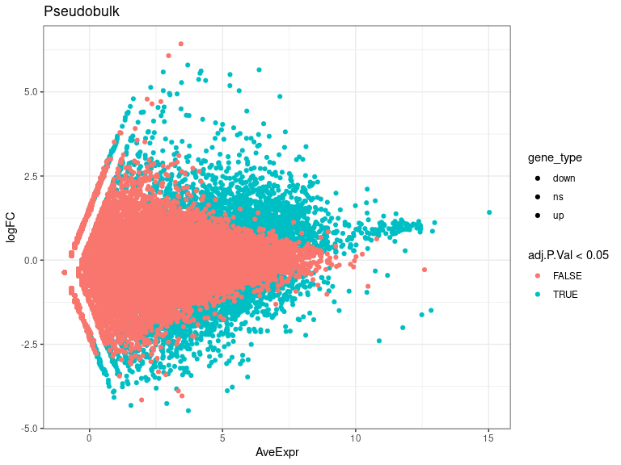
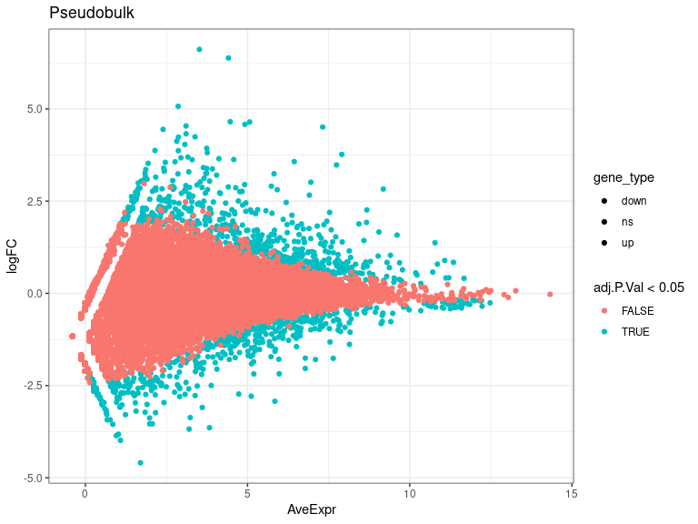
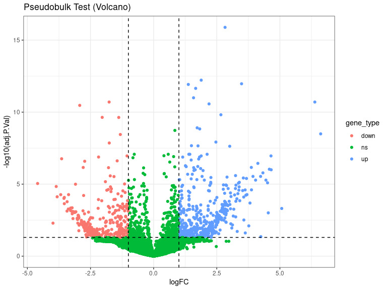
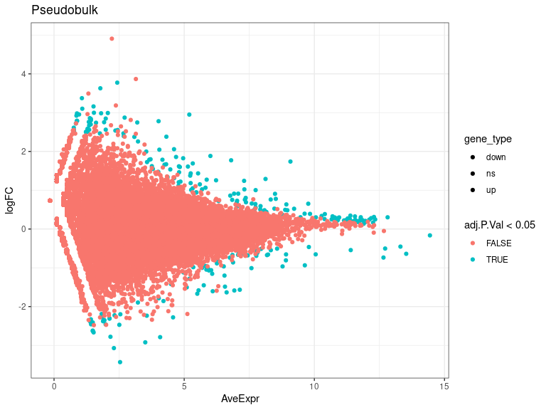
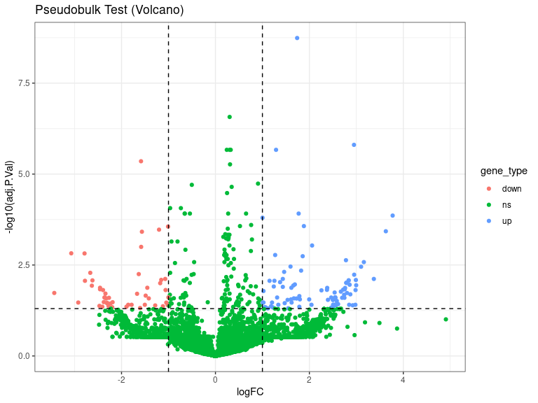
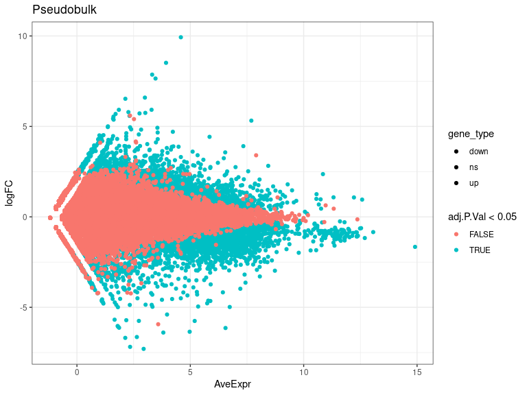
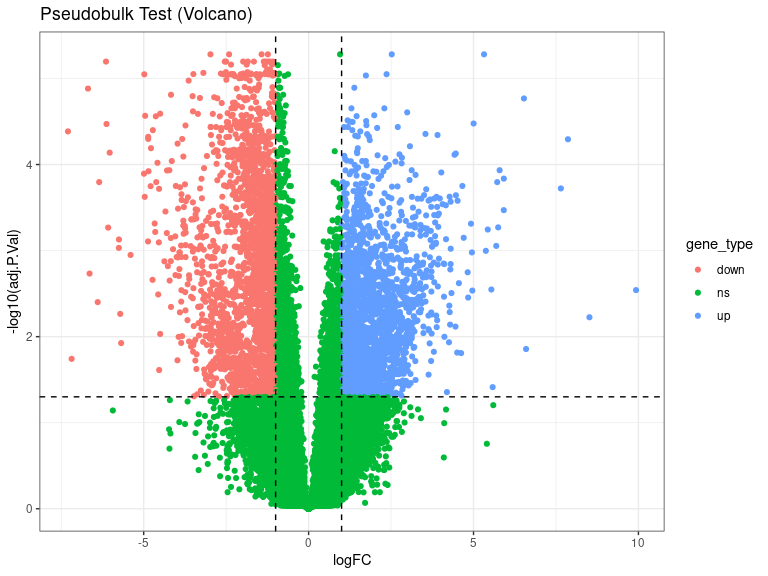

DEs
================
Laura Perlaza-Jimenez
2023-02-06

<h1 align="center">
Differential Expression Pseudobulk
</h1>

Load libraries

``` r
library(dplyr)
library(Seurat)
library(hdf5r)
library(fs)
library(scCustomize)
library(clustree)
library(SeuratDisk)
library(clustree)
library(ggplot2)
library(RColorBrewer)
library(ggforce)
library(limma)
library(edgeR)
```

Get working path and set it

``` r
path_wd<-getwd()
setwd(path_wd)
```

``` r
subset_obj<-LoadH5Seurat("../Results/kidney.combined_obj_UMAP_clustered_finalnames.h5seurat")
DefaultAssay(subset_obj) <- "RNA"
```

``` r
# functions

DE_analysis_pseudobulk <- function(cell_type,comparison1,comparison2) {
        subset_obj_tested= subset_obj[, subset_obj$cell_labels==cell_type] #change this column name for your clusters labels wherever they are
        
          replicates_lookup <- c(
        "n1_d20"="normal_d20", "n2_d20"="normal_d20", "n3_d20"="normal_d20",
        "h1_d20"="hypoxic_d20", "h2_d20"="hypoxic_d20", "h3_d20"="hypoxic_d20", 
        "n1_d25"= "normal_d25", "n2_d25"="normal_d25",  "n3_d25"="normal_d25",
        "h1_d25"="hypoxic_d25", "h2_d25"="hypoxic_d25", "h3_d25"="hypoxic_d25")
                
        replicates_lookup=replicates_lookup[replicates_lookup %in% c(comparison1,comparison2)]
        
        subset_obj_tested<-subset(subset_obj_tested, subset = orig.ident %in% c(names(replicates_lookup)))
        Idents(subset_obj_tested) <- subset_obj_tested$orig.ident

        pseudobulk_matrix <- AggregateExpression( subset_obj_tested,  slot = 'counts', assays='RNA' )[['RNA']]
        
        dge <- DGEList(pseudobulk_matrix)
        dge <- calcNormFactors(dge)
 
        condition <- factor(replicates_lookup[colnames(pseudobulk_matrix)],levels=c(comparison1,comparison2))
        condition_names<-levels(condition)
        design <- model.matrix(~condition)
        vm  <- voom(dge, design = design, plot = FALSE)
        fit <- lmFit(vm, design = design)
        fit <- eBayes(fit)
        de_result_pseudobulk <- topTable(fit, n = Inf, adjust.method = "BH")
        #> Removing intercept from test coefficients
        de_result_pseudobulk <- arrange(de_result_pseudobulk , adj.P.Val)
        
        de_result_pseudobulk <-de_result_pseudobulk %>%
          mutate(gene_type = case_when(logFC  >= log2(2) & adj.P.Val <= 0.05 ~ "up",
                               logFC  <= log2(0.5) & adj.P.Val <= 0.05 ~ "down",
                               TRUE ~ "ns"))  
        cols <- c("up" = "#ffad73", "down" = "#26b3ff", "ns" = "grey") 
        sizes <- c("up" = 2, "down" = 2, "ns" = 1) 
        alphas <- c("up" = 1, "down" = 1, "ns" = 0.5)
        
        p1 <- ggplot(de_result_pseudobulk, aes(x=AveExpr, y=logFC, col=adj.P.Val < 0.05, fill = gene_type)) +
          geom_point() +
          theme_bw() +
          ggtitle("Pseudobulk")
        p2 <- ggplot(de_result_pseudobulk, aes(x=logFC, y=-log10(adj.P.Val), col = gene_type)) +
          geom_point() +
          theme_bw() +
          ggtitle("Pseudobulk Test (Volcano)")
          
         p2<-p2+ geom_hline(yintercept = -log10(0.05),
             linetype = "dashed") + 
              geom_vline(xintercept = c(log2(0.5), log2(2)),
             linetype = "dashed")   
         
        p2<- p2+ scale_fill_manual(values = cols) + # Modify point colour
            scale_size_manual(values = sizes) + # Modify point size
          scale_alpha_manual(values = alphas)  # Modify point transparency

        return (list(p1,p2,de_result_pseudobulk,condition_names))
}
```

``` r
cat( "#", params$cluster_input)
```

# 5_Distal_Tubule

## treatment comparisons

``` r
celltype=  params$cluster_input
```

``` r
DE_treatment_pseudobulk_results=DE_analysis_pseudobulk(celltype,"normal_d20","hypoxic_d20")
cat("###",DE_treatment_pseudobulk_results[[4]][1],"vs",DE_treatment_pseudobulk_results[[4]][2],"\n")
```

### normal_d20 vs hypoxic_d20

``` r
cat("#### Reference:", DE_treatment_pseudobulk_results[[4]][1],"\n")
```

#### Reference: normal_d20

``` r
DE_treatment_pseudobulk_results[[1]]
```

<!-- -->

``` r
DE_treatment_pseudobulk_results[[2]]
```

<!-- -->

``` r
head(DE_treatment_pseudobulk_results[[3]],)
```

          logFC   AveExpr        t      P.Value    adj.P.Val        B gene_type

RPS2 0.9141261 11.942891 40.18046 1.822740e-09 6.671410e-05 12.57500 ns
RPLP2 0.7889057 11.138921 35.48646 4.293714e-09 7.392726e-05 11.85613 ns
RPS11 0.7217763 10.853430 31.02811 1.082603e-08 7.392726e-05 10.92437 ns
RPL5 1.0528476 11.478930 30.98376 1.093312e-08 7.392726e-05 10.77148 up
RPS15 0.8169948 11.504719 30.86326 1.123032e-08 7.392726e-05 10.71759 ns
JUND 1.8154663 8.691954 28.77641 1.817834e-08 7.392726e-05 10.35568 up

``` r
 DE_treatment_pseudobulk_results=DE_analysis_pseudobulk(celltype,"normal_d25","hypoxic_d25")

cat("###",DE_treatment_pseudobulk_results[[4]][1],"vs",DE_treatment_pseudobulk_results[[4]][2],"\n")
```

### normal_d25 vs hypoxic_d25

``` r
cat("#### Reference:", DE_treatment_pseudobulk_results[[4]][1],"\n")
```

#### Reference: normal_d25

``` r
 DE_treatment_pseudobulk_results[[1]]
```

<!-- -->

``` r
 DE_treatment_pseudobulk_results[[2]]
```

<!-- -->

``` r
head(DE_treatment_pseudobulk_results[[3]],10)
```

              logFC   AveExpr         t      P.Value    adj.P.Val        B gene_type

KCNIP4 2.827884 9.185117 19.89083 3.559484e-21 1.302807e-16 38.21128 up
VMP1 1.883578 8.433823 15.02800 3.302483e-17 6.043709e-13 29.16333 up
SPP1 3.481774 7.743112 14.56514 8.822366e-17 1.076358e-12 28.06104 up
WFDC2 1.373060 10.778932 14.38164 1.310583e-16 1.199216e-12 27.47775 up
TPM1 1.663925 9.051327 13.99349 3.063346e-16 2.242431e-12 26.90416 up
S100A11 1.580079 9.609487 13.24227 1.661140e-15 1.013323e-11 25.13322 up
LINC02672 -1.762472 7.641091 -12.82602 4.358379e-15 1.994013e-11
24.32261 down CXCL1 6.382851 4.411702 12.86514 3.977152e-15 1.994013e-11
21.49855 up NCOA7 2.193289 7.530579 12.64853 6.616724e-15 2.690874e-11
23.90775 up FGF8 -2.926840 5.842072 -12.50478 9.304329e-15 3.405478e-11
23.36282 down

``` r
  DE_treatment_pseudobulk_results=DE_analysis_pseudobulk(celltype,"normal_d20","normal_d25")

cat("###",DE_treatment_pseudobulk_results[[4]][1],"vs",DE_treatment_pseudobulk_results[[4]][2],"\n")
```

### normal_d20 vs normal_d25

``` r
cat("#### Reference:", DE_treatment_pseudobulk_results[[4]][1],"\n")
```

#### Reference: normal_d20

``` r
 DE_treatment_pseudobulk_results[[1]]
```

<!-- -->

``` r
 DE_treatment_pseudobulk_results[[2]]
```

<!-- -->

``` r
 head(DE_treatment_pseudobulk_results[[3]] ,10)
```

            logFC   AveExpr         t      P.Value    adj.P.Val        B gene_type

FOS 1.7393768 9.080786 15.525859 4.959437e-14 1.815203e-09 22.16879 up
RPL41 0.3018550 12.813903 11.894249 1.467652e-11 2.685877e-07 14.94259
ns FOSB 2.9499998 5.195956 10.690750 1.287739e-10 1.571085e-06 13.87519
up JUN 1.2902270 8.124314 10.095598 4.008769e-10 2.152959e-06 13.21467
up RPS29 0.3248276 11.559290 10.216857 3.169762e-10 2.152959e-06
12.45114 ns RPS12 0.2414511 12.110558 10.334498 2.528284e-10
2.152959e-06 12.41775 ns RPL37A 0.3033373 11.783717 10.081828
4.117569e-10 2.152959e-06 12.07674 ns MT-ND6 -1.5851201 6.925675
-9.647649 9.695804e-10 4.435952e-06 12.45282 down RPL39 0.3104296
12.290153 9.490924 1.328509e-09 5.402751e-06 10.60647 ns JUND 0.9065838
8.489300 8.848145 4.996605e-09 1.828807e-05 10.59768 ns

``` r
DE_treatment_pseudobulk_results=DE_analysis_pseudobulk(celltype,"hypoxic_d20","hypoxic_d25")

cat("###",DE_treatment_pseudobulk_results[[4]][1],"vs",DE_treatment_pseudobulk_results[[4]][2],"\n")
```

### hypoxic_d20 vs hypoxic_d25

``` r
cat("#### Reference:", DE_treatment_pseudobulk_results[[4]][1],"\n")
```

#### Reference: hypoxic_d20

``` r
  DE_treatment_pseudobulk_results[[1]]
```

<!-- -->

``` r
  DE_treatment_pseudobulk_results[[2]]
```

<!-- -->

``` r
  head(DE_treatment_pseudobulk_results[[3]],10)
```

            logFC   AveExpr         t      P.Value    adj.P.Val        B gene_type

MT-CO2 0.9545339 12.577207 31.69419 2.118997e-10 5.241165e-06 14.32829
ns RPL5 -1.2351592 11.354312 -30.47788 2.984848e-10 5.241165e-06
14.25998 down RPL24 -1.4259376 11.313208 -28.16404 5.954198e-10
5.241165e-06 13.53954 down HES4 -2.9760802 8.730831 -26.79429
9.203662e-10 5.241165e-06 13.18188 down MBNL2 -2.4106558 7.534631
-26.99881 8.612456e-10 5.241165e-06 12.96893 down WWOX 2.5209140
7.552584 26.53355 1.002381e-09 5.241165e-06 12.82192 up KCNIP4 5.3197155
7.691838 27.74083 6.796448e-10 5.241165e-06 12.66025 up H3F3B -1.3588393
10.421585 -24.60218 1.937590e-09 6.363258e-06 12.43436 down LDHA
-2.5038893 8.400288 -23.89736 2.495765e-09 6.363258e-06 12.22214 down
GAS5 -1.9847425 9.781626 -23.71495 2.667908e-09 6.363258e-06 12.17886
down
