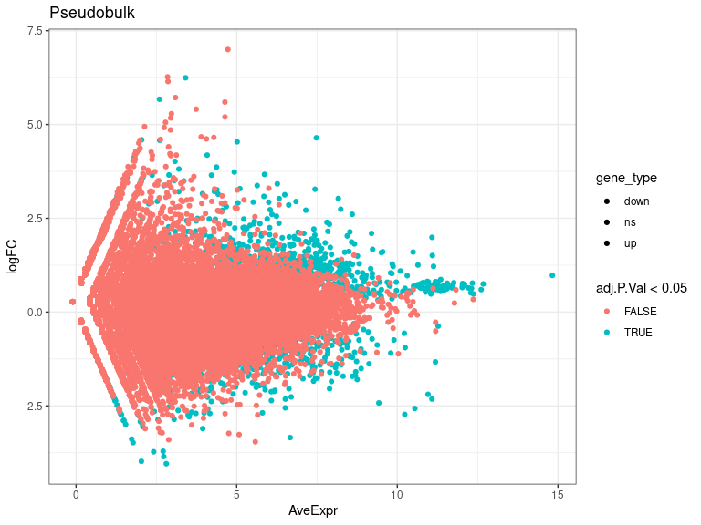
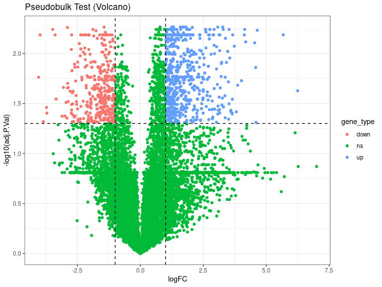
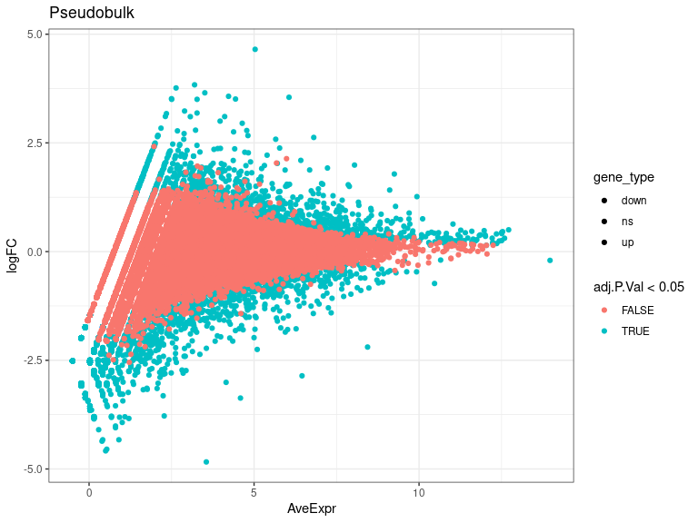
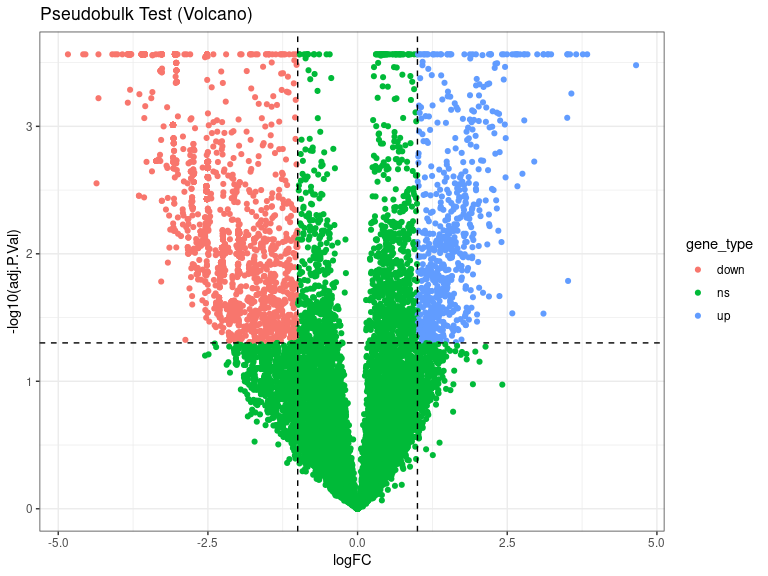
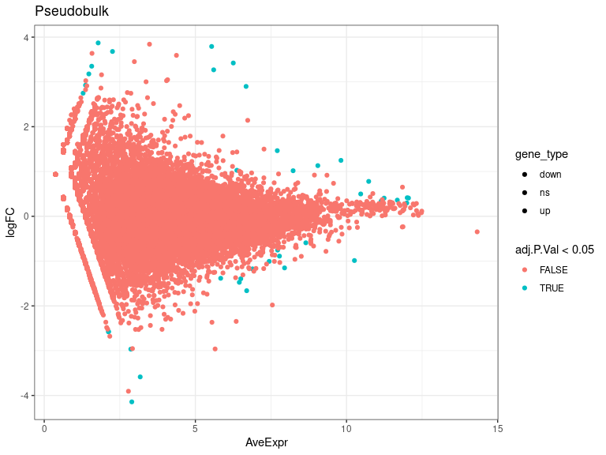
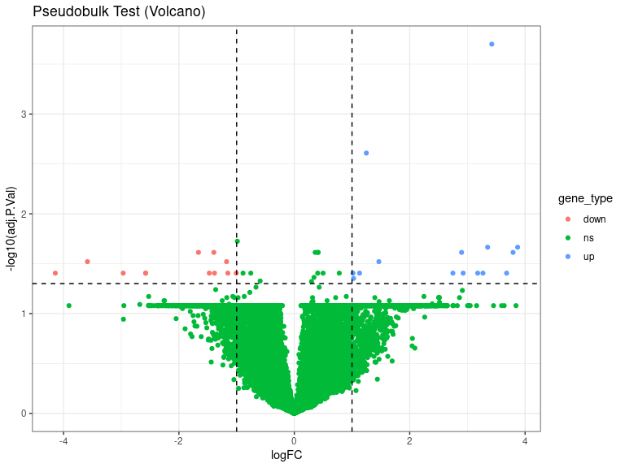
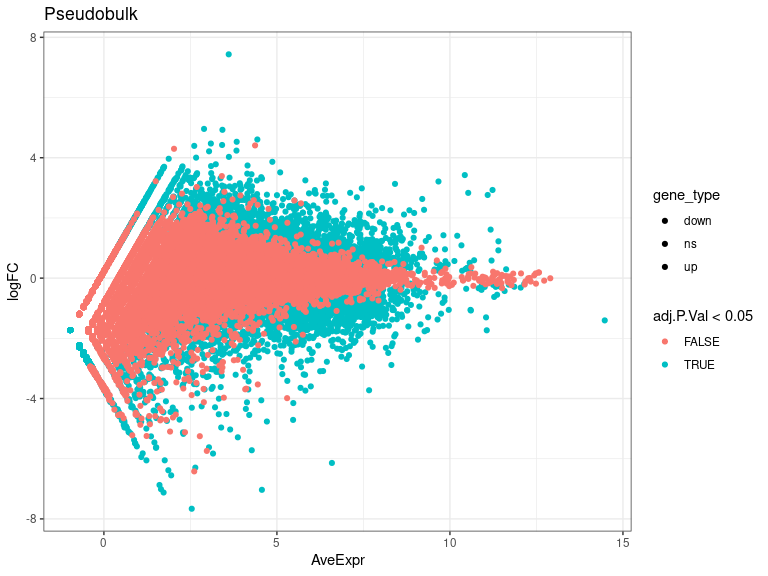
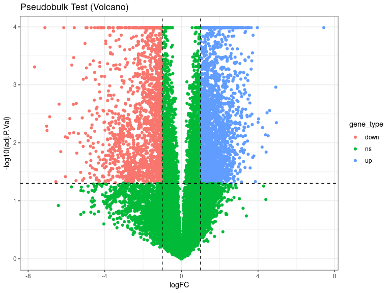

DEs
================
Laura Perlaza-Jimenez
2023-02-06

<h1 align="center">
Differential Expression Pseudobulk
</h1>

Load libraries

``` r
library(dplyr)
library(Seurat)
library(hdf5r)
library(fs)
library(scCustomize)
library(clustree)
library(SeuratDisk)
library(clustree)
library(ggplot2)
library(RColorBrewer)
library(ggforce)
library(limma)
library(edgeR)
```

Get working path and set it

``` r
path_wd<-getwd()
setwd(path_wd)
```

``` r
subset_obj<-LoadH5Seurat("../Results/kidney.combined_obj_UMAP_clustered_finalnames.h5seurat")
DefaultAssay(subset_obj) <- "RNA"
```

``` r
# functions

DE_analysis_pseudobulk <- function(cell_type,comparison1,comparison2) {
        subset_obj_tested= subset_obj[, subset_obj$cell_labels==cell_type] #change this column name for your clusters labels wherever they are
        
          replicates_lookup <- c(
        "n1_d20"="normal_d20", "n2_d20"="normal_d20", "n3_d20"="normal_d20",
        "h1_d20"="hypoxic_d20", "h2_d20"="hypoxic_d20", "h3_d20"="hypoxic_d20", 
        "n1_d25"= "normal_d25", "n2_d25"="normal_d25",  "n3_d25"="normal_d25",
        "h1_d25"="hypoxic_d25", "h2_d25"="hypoxic_d25", "h3_d25"="hypoxic_d25")
                
        replicates_lookup=replicates_lookup[replicates_lookup %in% c(comparison1,comparison2)]
        
        subset_obj_tested<-subset(subset_obj_tested, subset = orig.ident %in% c(names(replicates_lookup)))
        Idents(subset_obj_tested) <- subset_obj_tested$orig.ident

        pseudobulk_matrix <- AggregateExpression( subset_obj_tested,  slot = 'counts', assays='RNA' )[['RNA']]
        
        dge <- DGEList(pseudobulk_matrix)
        dge <- calcNormFactors(dge)
 
        condition <- factor(replicates_lookup[colnames(pseudobulk_matrix)],levels=c(comparison1,comparison2))
        condition_names<-levels(condition)
        design <- model.matrix(~condition)
        vm  <- voom(dge, design = design, plot = FALSE)
        fit <- lmFit(vm, design = design)
        fit <- eBayes(fit)
        de_result_pseudobulk <- topTable(fit, n = Inf, adjust.method = "BH")
        #> Removing intercept from test coefficients
        de_result_pseudobulk <- arrange(de_result_pseudobulk , adj.P.Val)
        
        de_result_pseudobulk <-de_result_pseudobulk %>%
          mutate(gene_type = case_when(logFC  >= log2(2) & adj.P.Val <= 0.05 ~ "up",
                               logFC  <= log2(0.5) & adj.P.Val <= 0.05 ~ "down",
                               TRUE ~ "ns"))  
        cols <- c("up" = "#ffad73", "down" = "#26b3ff", "ns" = "grey") 
        sizes <- c("up" = 2, "down" = 2, "ns" = 1) 
        alphas <- c("up" = 1, "down" = 1, "ns" = 0.5)
        
        p1 <- ggplot(de_result_pseudobulk, aes(x=AveExpr, y=logFC, col=adj.P.Val < 0.05, fill = gene_type)) +
          geom_point() +
          theme_bw() +
          ggtitle("Pseudobulk")
        p2 <- ggplot(de_result_pseudobulk, aes(x=logFC, y=-log10(adj.P.Val), col = gene_type)) +
          geom_point() +
          theme_bw() +
          ggtitle("Pseudobulk Test (Volcano)")
          
         p2<-p2+ geom_hline(yintercept = -log10(0.05),
             linetype = "dashed") + 
              geom_vline(xintercept = c(log2(0.5), log2(2)),
             linetype = "dashed")   
         
        p2<- p2+ scale_fill_manual(values = cols) + # Modify point colour
            scale_size_manual(values = sizes) + # Modify point size
          scale_alpha_manual(values = alphas)  # Modify point transparency

        return (list(p1,p2,de_result_pseudobulk,condition_names))
}
```

``` r
cat( "#", params$cluster_input)
```

# 6_Proliferating

## treatment comparisons

``` r
celltype=  params$cluster_input
```

``` r
DE_treatment_pseudobulk_results=DE_analysis_pseudobulk(celltype,"normal_d20","hypoxic_d20")
cat("###",DE_treatment_pseudobulk_results[[4]][1],"vs",DE_treatment_pseudobulk_results[[4]][2],"\n")
```

### normal_d20 vs hypoxic_d20

``` r
cat("#### Reference:", DE_treatment_pseudobulk_results[[4]][1],"\n")
```

#### Reference: normal_d20

``` r
DE_treatment_pseudobulk_results[[1]]
```

<!-- -->

``` r
DE_treatment_pseudobulk_results[[2]]
```

<!-- -->

``` r
head(DE_treatment_pseudobulk_results[[3]],)
```

           logFC  AveExpr         t      P.Value   adj.P.Val        B gene_type

FXR1 1.816535 8.665810 34.07477 1.869087e-07 0.005434119 8.360644 up
ZNF519 -1.440689 6.014796 -28.81498 4.557340e-07 0.005434119 7.424537
down ASXL1 1.724146 7.911474 28.39224 4.929494e-07 0.005434119 7.400433
up AFF4 1.318414 7.564973 27.18366 6.210195e-07 0.005434119 7.180443 up
PJA2 1.246689 7.535364 25.08807 9.504756e-07 0.005434119 6.730629 up
H1F0 3.273756 7.438592 24.09140 1.178313e-06 0.005434119 6.553951 up

``` r
 DE_treatment_pseudobulk_results=DE_analysis_pseudobulk(celltype,"normal_d25","hypoxic_d25")

cat("###",DE_treatment_pseudobulk_results[[4]][1],"vs",DE_treatment_pseudobulk_results[[4]][2],"\n")
```

### normal_d25 vs hypoxic_d25

``` r
cat("#### Reference:", DE_treatment_pseudobulk_results[[4]][1],"\n")
```

#### Reference: normal_d25

``` r
 DE_treatment_pseudobulk_results[[1]]
```

<!-- -->

``` r
 DE_treatment_pseudobulk_results[[2]]
```

<!-- -->

``` r
head(DE_treatment_pseudobulk_results[[3]],10)
```

               logFC   AveExpr          t      P.Value    adj.P.Val         B gene_type

GALNTL6 -2.195974 8.4402886 -14.064480 1.109510e-08 0.0002724153
10.228900 down NRG3 3.548997 6.0593759 11.330567 1.180794e-07
0.0002724153 8.177478 up LUM -2.857395 6.4534981 -11.065983 1.522677e-07
0.0002724153 7.809338 down AL356124.1 -3.368982 4.5880854 -10.888091
1.811800e-07 0.0002724153 7.787406 down DLG2 -1.293521 7.2522488
-10.981972 1.652483e-07 0.0002724153 7.606537 down WFDC2 1.548382
7.0801994 10.469616 2.753321e-07 0.0002724153 7.241279 up CCN1 1.499319
7.8876266 10.025343 4.359760e-07 0.0002724153 6.617655 up AC117834.2
-4.328416 0.4139069 -9.558604 7.194649e-07 0.0002724153 6.024484 down
H19 2.625248 6.8090049 9.140016 1.146533e-06 0.0002724153 5.871533 up
STAT3 1.877274 6.6846701 9.159989 1.120901e-06 0.0002724153 5.868151 up

``` r
  DE_treatment_pseudobulk_results=DE_analysis_pseudobulk(celltype,"normal_d20","normal_d25")

cat("###",DE_treatment_pseudobulk_results[[4]][1],"vs",DE_treatment_pseudobulk_results[[4]][2],"\n")
```

### normal_d20 vs normal_d25

``` r
cat("#### Reference:", DE_treatment_pseudobulk_results[[4]][1],"\n")
```

#### Reference: normal_d20

``` r
 DE_treatment_pseudobulk_results[[1]]
```

<!-- -->

``` r
 DE_treatment_pseudobulk_results[[2]]
```

<!-- -->

``` r
 head(DE_treatment_pseudobulk_results[[3]] ,10)
```

              logFC   AveExpr         t      P.Value    adj.P.Val         B gene_type

LUM 3.4224631 6.254235 15.154357 5.444855e-09 0.0001992871 10.198949 up
LGALS1 1.2483317 9.815793 11.288441 1.344750e-07 0.0024609593 7.921981
up GPC5 -0.9879294 10.261774 -8.940707 1.542841e-06 0.0188231722
5.310329 ns ACTC1 3.8706586 1.783872 8.386302 2.952679e-06 0.0216142028
3.458386 up CACNA2D3 3.3506611 1.570520 8.428957 2.805686e-06
0.0216142028 3.291446 up SGCZ 2.8993015 6.677307 7.931880 5.149556e-06
0.0243619687 4.518208 up DCN 3.7917705 5.538235 7.852028 5.691693e-06
0.0243619687 4.203021 up NRP1 -1.3951887 6.502611 -7.640180 7.449179e-06
0.0243619687 4.156507 down EDIL3 -1.6616052 6.697017 -7.615789
7.686158e-06 0.0243619687 4.130041 down RPL39 0.4076104 12.049508
7.692197 6.969544e-06 0.0243619687 3.088208 ns

``` r
DE_treatment_pseudobulk_results=DE_analysis_pseudobulk(celltype,"hypoxic_d20","hypoxic_d25")

cat("###",DE_treatment_pseudobulk_results[[4]][1],"vs",DE_treatment_pseudobulk_results[[4]][2],"\n")
```

### hypoxic_d20 vs hypoxic_d25

``` r
cat("#### Reference:", DE_treatment_pseudobulk_results[[4]][1],"\n")
```

#### Reference: hypoxic_d20

``` r
  DE_treatment_pseudobulk_results[[1]]
```

<!-- -->

``` r
  DE_treatment_pseudobulk_results[[2]]
```

<!-- -->

``` r
  head(DE_treatment_pseudobulk_results[[3]],10)
```

            logFC  AveExpr         t      P.Value    adj.P.Val         B gene_type

FXR1 -2.165565 8.343144 -49.99979 2.469404e-08 0.0001030991 10.411605
down ASXL1 -1.680289 7.787097 -35.93375 1.431762e-07 0.0001030991
8.675372 down HIF1A -1.512558 7.776690 -32.24894 2.543987e-07
0.0001030991 8.085658 down PJA2 -1.171738 7.425528 -31.80271
2.739361e-07 0.0001030991 8.024874 down KDM5B -1.496479 7.685917
-29.97494 3.750670e-07 0.0001030991 7.684958 down HBP1 -1.925326
5.946302 -29.45754 4.113734e-07 0.0001030991 7.573288 down RAPGEF6
-1.321364 6.436055 -29.01161 4.460497e-07 0.0001030991 7.535565 down
CENPC -2.089084 7.270061 -28.48671 4.914129e-07 0.0001030991 7.428947
down KLHL24 -2.355992 5.937685 -27.50683 5.916462e-07 0.0001030991
7.233933 down DDIT4 -6.140749 6.589495 -27.08032 6.427490e-07
0.0001030991 7.106321 down
