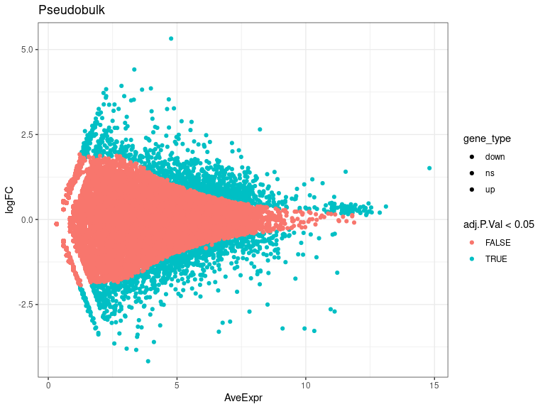
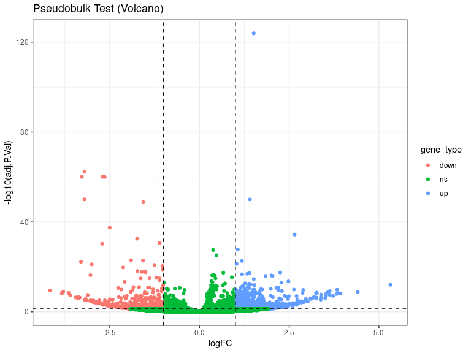
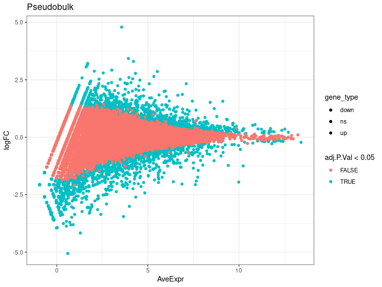
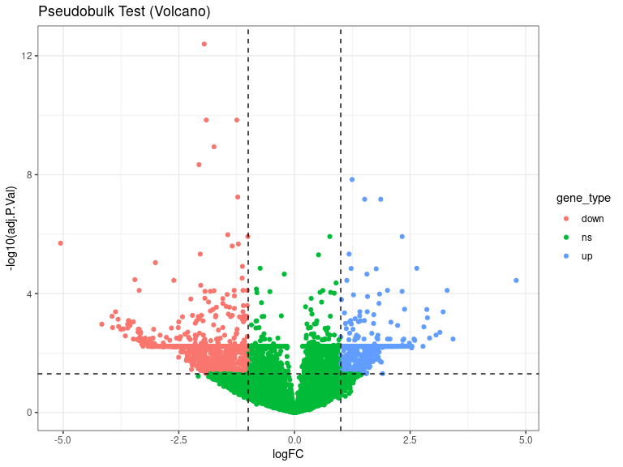
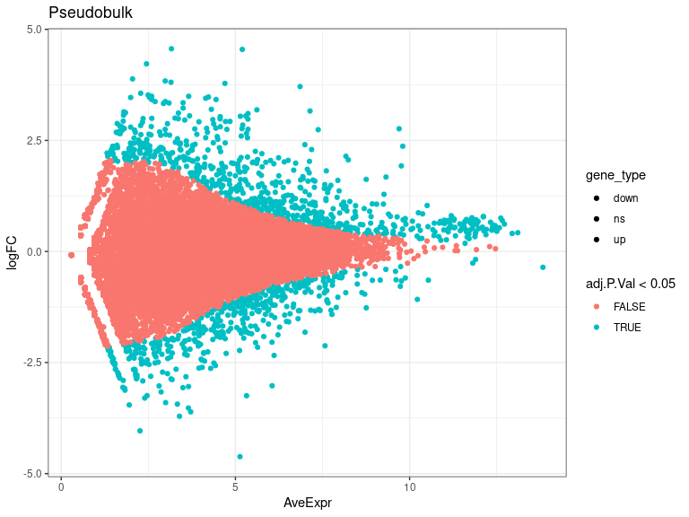
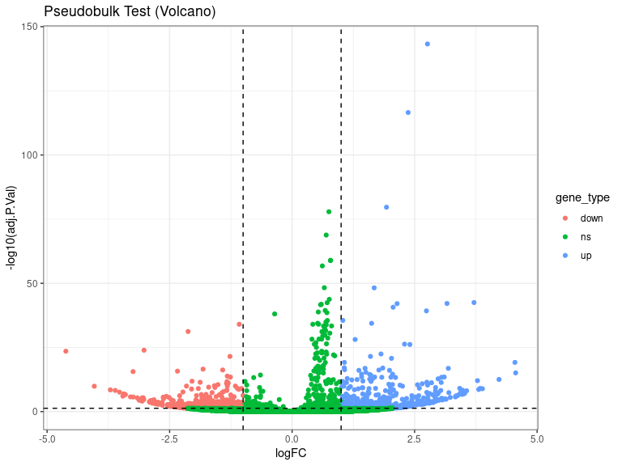
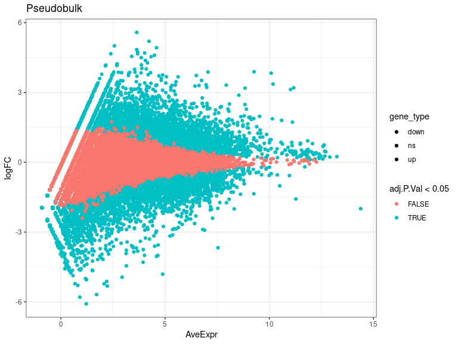

DEs
================
Laura Perlaza-Jimenez
2023-02-06

<h1 align="center">
Differential Expression Pseudobulk
</h1>

Load libraries

``` r
library(dplyr)
library(Seurat)
library(hdf5r)
library(fs)
library(scCustomize)
library(clustree)
library(SeuratDisk)
library(clustree)
library(ggplot2)
library(RColorBrewer)
library(ggforce)
library(limma)
library(edgeR)
```

Get working path and set it

``` r
path_wd<-getwd()
setwd(path_wd)
```

``` r
subset_obj<-LoadH5Seurat("../Results/kidney.combined_obj_UMAP_clustered_finalnames.h5seurat")
DefaultAssay(subset_obj) <- "RNA"
```

``` r
# functions

DE_analysis_pseudobulk <- function(cell_type,comparison1,comparison2) {
        subset_obj_tested= subset_obj[, subset_obj$cell_labels==cell_type] #change this column name for your clusters labels wherever they are
        
          replicates_lookup <- c(
        "n1_d20"="normal_d20", "n2_d20"="normal_d20", "n3_d20"="normal_d20",
        "h1_d20"="hypoxic_d20", "h2_d20"="hypoxic_d20", "h3_d20"="hypoxic_d20", 
        "n1_d25"= "normal_d25", "n2_d25"="normal_d25",  "n3_d25"="normal_d25",
        "h1_d25"="hypoxic_d25", "h2_d25"="hypoxic_d25", "h3_d25"="hypoxic_d25")
                
        replicates_lookup=replicates_lookup[replicates_lookup %in% c(comparison1,comparison2)]
        
        subset_obj_tested<-subset(subset_obj_tested, subset = orig.ident %in% c(names(replicates_lookup)))
        Idents(subset_obj_tested) <- subset_obj_tested$orig.ident

        pseudobulk_matrix <- AggregateExpression( subset_obj_tested,  slot = 'counts', assays='RNA' )[['RNA']]
        
        dge <- DGEList(pseudobulk_matrix)
        dge <- calcNormFactors(dge)
 
        condition <- factor(replicates_lookup[colnames(pseudobulk_matrix)],levels=c(comparison1,comparison2))
        condition_names<-levels(condition)
        design <- model.matrix(~condition)
        vm  <- voom(dge, design = design, plot = FALSE)
        fit <- lmFit(vm, design = design)
        fit <- eBayes(fit)
        de_result_pseudobulk <- topTable(fit, n = Inf, adjust.method = "BH")
        #> Removing intercept from test coefficients
        de_result_pseudobulk <- arrange(de_result_pseudobulk , adj.P.Val)
        
        de_result_pseudobulk <-de_result_pseudobulk %>%
          mutate(gene_type = case_when(logFC  >= log2(2) & adj.P.Val <= 0.05 ~ "up",
                               logFC  <= log2(0.5) & adj.P.Val <= 0.05 ~ "down",
                               TRUE ~ "ns"))  
        cols <- c("up" = "#ffad73", "down" = "#26b3ff", "ns" = "grey") 
        sizes <- c("up" = 2, "down" = 2, "ns" = 1) 
        alphas <- c("up" = 1, "down" = 1, "ns" = 0.5)
        
        p1 <- ggplot(de_result_pseudobulk, aes(x=AveExpr, y=logFC, col=adj.P.Val < 0.05, fill = gene_type)) +
          geom_point() +
          theme_bw() +
          ggtitle("Pseudobulk")
        p2 <- ggplot(de_result_pseudobulk, aes(x=logFC, y=-log10(adj.P.Val), col = gene_type)) +
          geom_point() +
          theme_bw() +
          ggtitle("Pseudobulk Test (Volcano)")
          
         p2<-p2+ geom_hline(yintercept = -log10(0.05),
             linetype = "dashed") + 
              geom_vline(xintercept = c(log2(0.5), log2(2)),
             linetype = "dashed")   
         
        p2<- p2+ scale_fill_manual(values = cols) + # Modify point colour
            scale_size_manual(values = sizes) + # Modify point size
          scale_alpha_manual(values = alphas)  # Modify point transparency

        return (list(p1,p2,de_result_pseudobulk,condition_names))
}
```

``` r
cat( "#", params$cluster_input)
```

# 7_Myocyte

## treatment comparisons

``` r
celltype=  params$cluster_input
```

``` r
DE_treatment_pseudobulk_results=DE_analysis_pseudobulk(celltype,"normal_d20","hypoxic_d20")
cat("###",DE_treatment_pseudobulk_results[[4]][1],"vs",DE_treatment_pseudobulk_results[[4]][2],"\n")
```

### normal_d20 vs hypoxic_d20

``` r
cat("#### Reference:", DE_treatment_pseudobulk_results[[4]][1],"\n")
```

#### Reference: normal_d20

``` r
DE_treatment_pseudobulk_results[[1]]
```

<!-- -->

``` r
DE_treatment_pseudobulk_results[[2]]
```

<!-- -->

``` r
head(DE_treatment_pseudobulk_results[[3]],)
```

            logFC   AveExpr         t       P.Value     adj.P.Val        B gene_type

MALAT1 1.511514 14.803833 82.12340 3.143254e-129 1.150462e-124 285.3092
up MT-ND3 -3.206729 9.953029 -30.57403 2.335909e-67 4.274830e-63
142.8129 down MT-ATP6 -3.277475 10.331116 -29.27515 7.114596e-65
8.680044e-61 137.3124 down MT-CO2 -2.705893 11.120606 -29.20434
9.767078e-65 8.937121e-61 137.1832 down MT-CO3 -2.639583 10.966712
-29.13532 1.330868e-64 9.742218e-61 136.8656 down MT-CYB -3.205076
9.099090 -24.27081 1.511441e-54 9.220044e-51 113.3733 down

``` r
 DE_treatment_pseudobulk_results=DE_analysis_pseudobulk(celltype,"normal_d25","hypoxic_d25")

cat("###",DE_treatment_pseudobulk_results[[4]][1],"vs",DE_treatment_pseudobulk_results[[4]][2],"\n")
```

### normal_d25 vs hypoxic_d25

``` r
cat("#### Reference:", DE_treatment_pseudobulk_results[[4]][1],"\n")
```

#### Reference: normal_d25

``` r
 DE_treatment_pseudobulk_results[[1]]
```

<!-- -->

``` r
 DE_treatment_pseudobulk_results[[2]]
```

<!-- -->

``` r
head(DE_treatment_pseudobulk_results[[3]],10)
```

          logFC   AveExpr          t      P.Value    adj.P.Val        B gene_type

MYLPF -1.950759 9.987326 -19.579013 1.096678e-17 4.013953e-13 30.31705
down TNNC2 -1.906897 7.658400 -14.837892 1.184426e-14 1.445039e-10
23.50511 down ACTC1 -1.246364 10.228592 -14.880728 1.103445e-14
1.445039e-10 23.21926 down MYH3 -1.739452 7.734819 -13.462609
1.257843e-13 1.150958e-09 21.12674 down TTN -2.063901 7.607344
-12.584065 6.266950e-13 4.587533e-09 19.52175 down TENM3 1.245408
8.643483 11.884533 2.386647e-12 1.455895e-08 18.11339 up MYL1 -1.226097
9.412677 -11.129378 1.075510e-11 5.623532e-08 16.35829 down CCN1
1.864113 6.890895 10.921115 1.648380e-11 6.703594e-08 16.37383 up LRP1B
1.516801 8.419883 10.970715 1.488287e-11 6.703594e-08 16.31143 up ROBO2
-1.441440 7.762507 -9.590284 2.864923e-10 1.048590e-06 13.31543 down

``` r
  DE_treatment_pseudobulk_results=DE_analysis_pseudobulk(celltype,"normal_d20","normal_d25")

cat("###",DE_treatment_pseudobulk_results[[4]][1],"vs",DE_treatment_pseudobulk_results[[4]][2],"\n")
```

### normal_d20 vs normal_d25

``` r
cat("#### Reference:", DE_treatment_pseudobulk_results[[4]][1],"\n")
```

#### Reference: normal_d20

``` r
 DE_treatment_pseudobulk_results[[1]]
```

<!-- -->

``` r
 DE_treatment_pseudobulk_results[[2]]
```

<!-- -->

``` r
 head(DE_treatment_pseudobulk_results[[3]] ,10)
```

           logFC   AveExpr        t       P.Value     adj.P.Val        B gene_type

MYLPF 2.7620396 9.698330 25.98834 1.461585e-148 5.349549e-144 328.9213
up ACTC1 2.3684524 9.802658 23.46647 1.507371e-121 2.758564e-117
266.8960 up DLG2 1.9258190 9.762011 19.48693 1.814555e-84 2.213818e-80
181.7709 up RPS12 0.7508503 12.616243 19.26163 1.427676e-82 1.306359e-78
177.0784 ns EEF1A1 0.6956549 12.660559 18.13154 2.162428e-73
1.582941e-69 155.9490 ns RPS2 0.7851655 12.112819 16.82604 1.804829e-63
1.100976e-59 133.3006 ns RPL37A 0.7818555 12.121079 16.80056
2.771945e-63 1.449371e-59 132.8705 ns RPS18 0.6169329 12.721690 16.50635
3.751808e-61 1.716499e-57 127.7960 ns RPL13 0.6575060 12.322573 15.26906
1.349760e-52 5.489173e-49 108.2700 ns MYL1 1.6751064 9.322364 15.25578
1.654005e-52 6.053823e-49 108.5481 up

``` r
DE_treatment_pseudobulk_results=DE_analysis_pseudobulk(celltype,"hypoxic_d20","hypoxic_d25")

cat("###",DE_treatment_pseudobulk_results[[4]][1],"vs",DE_treatment_pseudobulk_results[[4]][2],"\n")
```

### hypoxic_d20 vs hypoxic_d25

``` r
cat("#### Reference:", DE_treatment_pseudobulk_results[[4]][1],"\n")
```

#### Reference: hypoxic_d20

``` r
  DE_treatment_pseudobulk_results[[1]]
```

<!-- -->

``` r
  DE_treatment_pseudobulk_results[[2]]
```

<!-- -->

``` r
  head(DE_treatment_pseudobulk_results[[3]],10)
```

            logFC   AveExpr         t      P.Value    adj.P.Val        B gene_type

MALAT1 -1.997432 14.382599 -85.21150 2.111522e-25 7.728381e-21 48.22134
down MT-ND3 3.830109 10.089517 30.89582 2.434209e-17 4.454724e-13
29.77344 up MT-CO3 3.127060 11.020417 30.07424 3.964723e-17 4.837094e-13
29.51646 up HMGB1 1.798311 10.589542 27.35922 2.188463e-16 1.915854e-12
27.81657 up MT-CO2 3.199397 11.169951 27.08885 2.617215e-16 1.915854e-12
27.63816 up MT-ATP6 3.360343 10.181756 25.75646 6.484494e-16
3.390557e-12 26.70344 up FTL -1.580648 11.272912 -25.91862 5.792948e-16
3.390557e-12 26.62172 down P4HA1 -3.675331 7.538919 -24.78539
1.292527e-15 5.913470e-12 25.69344 down MT-CYB 3.889198 9.270130
22.88638 5.378930e-15 2.102597e-11 24.45774 up S100A11 2.479074 8.831486
22.80216 5.744644e-15 2.102597e-11 24.45226 up
