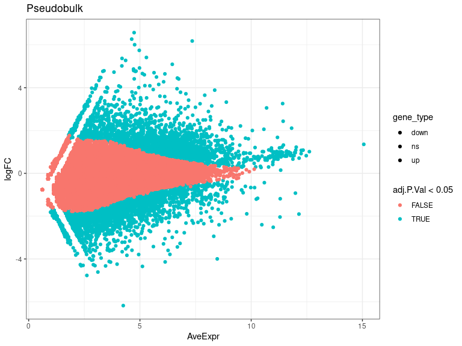
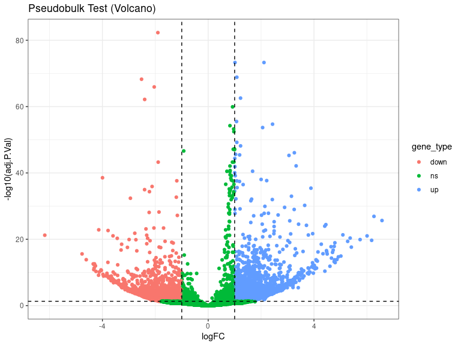
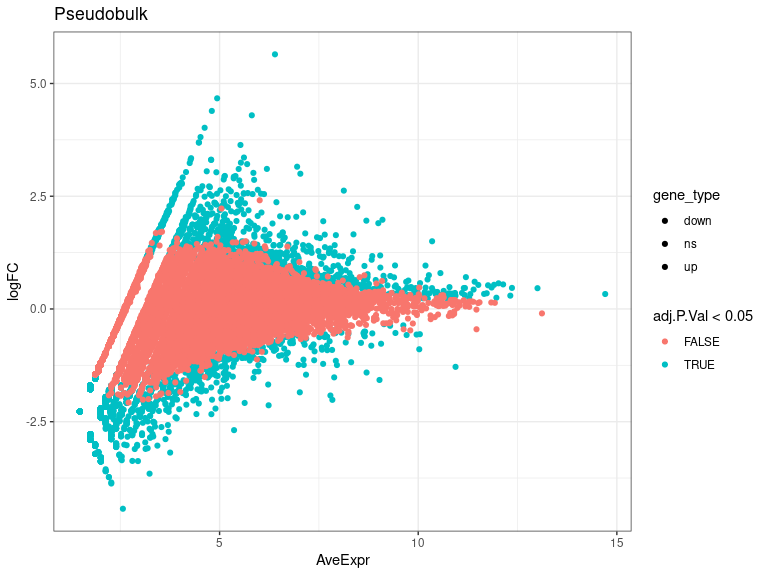
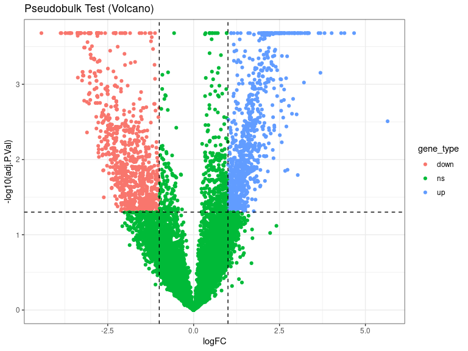
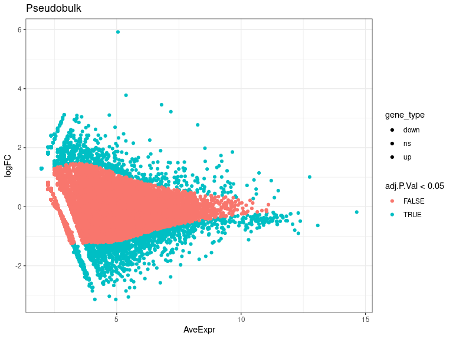
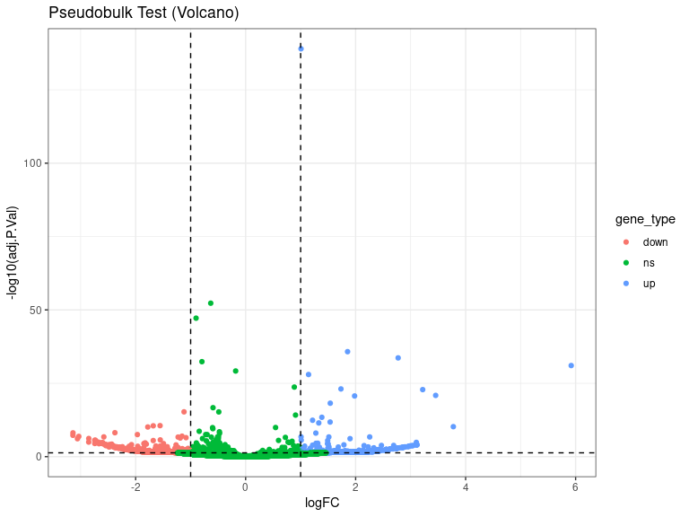
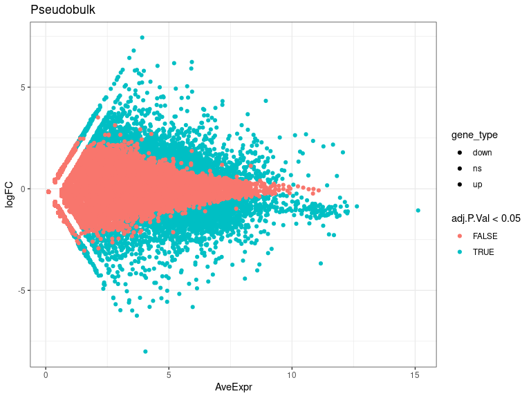
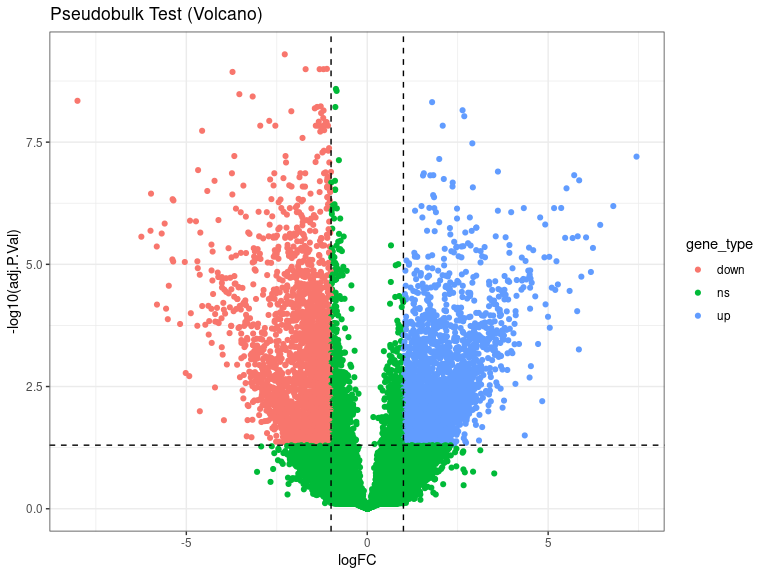

DEs
================
Laura Perlaza-Jimenez
2023-02-06

<h1 align="center">
Differential Expression Pseudobulk
</h1>

Load libraries

``` r
library(dplyr)
library(Seurat)
library(hdf5r)
library(fs)
library(scCustomize)
library(clustree)
library(SeuratDisk)
library(clustree)
library(ggplot2)
library(RColorBrewer)
library(ggforce)
library(limma)
library(edgeR)
```

Get working path and set it

``` r
path_wd<-getwd()
setwd(path_wd)
```

``` r
subset_obj<-LoadH5Seurat("../Results/kidney.combined_obj_UMAP_clustered_finalnames.h5seurat")
DefaultAssay(subset_obj) <- "RNA"
```

``` r
# functions

DE_analysis_pseudobulk <- function(cell_type,comparison1,comparison2) {
        subset_obj_tested= subset_obj[, subset_obj$cell_labels==cell_type] #change this column name for your clusters labels wherever they are
        
          replicates_lookup <- c(
        "n1_d20"="normal_d20", "n2_d20"="normal_d20", "n3_d20"="normal_d20",
        "h1_d20"="hypoxic_d20", "h2_d20"="hypoxic_d20", "h3_d20"="hypoxic_d20", 
        "n1_d25"= "normal_d25", "n2_d25"="normal_d25",  "n3_d25"="normal_d25",
        "h1_d25"="hypoxic_d25", "h2_d25"="hypoxic_d25", "h3_d25"="hypoxic_d25")
                
        replicates_lookup=replicates_lookup[replicates_lookup %in% c(comparison1,comparison2)]
        
        subset_obj_tested<-subset(subset_obj_tested, subset = orig.ident %in% c(names(replicates_lookup)))
        Idents(subset_obj_tested) <- subset_obj_tested$orig.ident

        pseudobulk_matrix <- AggregateExpression( subset_obj_tested,  slot = 'counts', assays='RNA' )[['RNA']]
        
        dge <- DGEList(pseudobulk_matrix)
        dge <- calcNormFactors(dge)
 
        condition <- factor(replicates_lookup[colnames(pseudobulk_matrix)],levels=c(comparison1,comparison2))
        condition_names<-levels(condition)
        design <- model.matrix(~condition)
        vm  <- voom(dge, design = design, plot = FALSE)
        fit <- lmFit(vm, design = design)
        fit <- eBayes(fit)
        de_result_pseudobulk <- topTable(fit, n = Inf, adjust.method = "BH")
        #> Removing intercept from test coefficients
        de_result_pseudobulk <- arrange(de_result_pseudobulk , adj.P.Val)
        
        de_result_pseudobulk <-de_result_pseudobulk %>%
          mutate(gene_type = case_when(logFC  >= log2(2) & adj.P.Val <= 0.05 ~ "up",
                               logFC  <= log2(0.5) & adj.P.Val <= 0.05 ~ "down",
                               TRUE ~ "ns"))  
        cols <- c("up" = "#ffad73", "down" = "#26b3ff", "ns" = "grey") 
        sizes <- c("up" = 2, "down" = 2, "ns" = 1) 
        alphas <- c("up" = 1, "down" = 1, "ns" = 0.5)
        
        p1 <- ggplot(de_result_pseudobulk, aes(x=AveExpr, y=logFC, col=adj.P.Val < 0.05, fill = gene_type)) +
          geom_point() +
          theme_bw() +
          ggtitle("Pseudobulk")
        p2 <- ggplot(de_result_pseudobulk, aes(x=logFC, y=-log10(adj.P.Val), col = gene_type)) +
          geom_point() +
          theme_bw() +
          ggtitle("Pseudobulk Test (Volcano)")
          
         p2<-p2+ geom_hline(yintercept = -log10(0.05),
             linetype = "dashed") + 
              geom_vline(xintercept = c(log2(0.5), log2(2)),
             linetype = "dashed")   
         
        p2<- p2+ scale_fill_manual(values = cols) + # Modify point colour
            scale_size_manual(values = sizes) + # Modify point size
          scale_alpha_manual(values = alphas)  # Modify point transparency

        return (list(p1,p2,de_result_pseudobulk,condition_names))
}
```

``` r
cat( "#", params$cluster_input)
```

# 8_Podocyte

## treatment comparisons

``` r
celltype=  params$cluster_input
```

``` r
DE_treatment_pseudobulk_results=DE_analysis_pseudobulk(celltype,"normal_d20","hypoxic_d20")
cat("###",DE_treatment_pseudobulk_results[[4]][1],"vs",DE_treatment_pseudobulk_results[[4]][2],"\n")
```

### normal_d20 vs hypoxic_d20

``` r
cat("#### Reference:", DE_treatment_pseudobulk_results[[4]][1],"\n")
```

#### Reference: normal_d20

``` r
DE_treatment_pseudobulk_results[[1]]
```

<!-- -->

``` r
DE_treatment_pseudobulk_results[[2]]
```

<!-- -->

``` r
head(DE_treatment_pseudobulk_results[[3]],)
```

            logFC  AveExpr         t      P.Value    adj.P.Val        B gene_type

MT-CO2 -1.903216 12.14686 -51.09711 1.355828e-87 4.962466e-83 189.7323
down MIF 2.109671 11.81738 42.72519 4.150908e-78 5.064246e-74 168.0507
up RPL41 1.013108 12.61508 42.79513 3.406705e-78 5.064246e-74 167.8770
up RPS27 1.082792 12.33353 39.14765 1.505425e-73 1.377501e-69 157.2691
up MT-ATP6 -2.520668 10.99075 -38.62339 7.505715e-73 5.494334e-69
155.9681 down MT-CO3 -2.041173 11.29558 -36.85813 1.926319e-70
1.175087e-66 150.3646 down

``` r
 DE_treatment_pseudobulk_results=DE_analysis_pseudobulk(celltype,"normal_d25","hypoxic_d25")

cat("###",DE_treatment_pseudobulk_results[[4]][1],"vs",DE_treatment_pseudobulk_results[[4]][2],"\n")
```

### normal_d25 vs hypoxic_d25

``` r
cat("#### Reference:", DE_treatment_pseudobulk_results[[4]][1],"\n")
```

#### Reference: normal_d25

``` r
 DE_treatment_pseudobulk_results[[1]]
```

<!-- -->

``` r
 DE_treatment_pseudobulk_results[[2]]
```

<!-- -->

``` r
head(DE_treatment_pseudobulk_results[[3]],10)
```

             logFC  AveExpr         t      P.Value    adj.P.Val         B gene_type

SNCAIP 4.017988 4.623575 11.942768 1.199070e-08 0.0002089455 10.036729
up PIM1 3.811507 4.520369 11.369164 2.226657e-08 0.0002089455 9.482688
up A2M 4.671105 4.938696 11.003552 3.348643e-08 0.0002089455 9.147481 up
C1R 4.294263 5.811219 10.700905 4.733822e-08 0.0002089455 8.747725 up
USP18 3.690776 4.476048 10.004796 1.082166e-07 0.0002089455 8.056352 up
ADAM12 3.154289 6.952040 9.746762 1.487164e-07 0.0002089455 7.798772 up
TXNIP -1.575158 9.025353 -9.421915 2.239748e-07 0.0002089455 7.148637
down HES4 -1.410062 8.699951 -9.282812 2.677730e-07 0.0002089455
7.028161 down FOXCUT 3.235695 4.247710 9.064138 3.560153e-07
0.0002089455 6.945214 up Z83745.1 -3.847834 2.273788 -8.699501
5.790034e-07 0.0002089455 6.217088 down

``` r
  DE_treatment_pseudobulk_results=DE_analysis_pseudobulk(celltype,"normal_d20","normal_d25")

cat("###",DE_treatment_pseudobulk_results[[4]][1],"vs",DE_treatment_pseudobulk_results[[4]][2],"\n")
```

### normal_d20 vs normal_d25

``` r
cat("#### Reference:", DE_treatment_pseudobulk_results[[4]][1],"\n")
```

#### Reference: normal_d20

``` r
 DE_treatment_pseudobulk_results[[1]]
```

<!-- -->

``` r
 DE_treatment_pseudobulk_results[[2]]
```

<!-- -->

``` r
 head(DE_treatment_pseudobulk_results[[3]] ,10)
```

             logFC   AveExpr         t       P.Value     adj.P.Val         B gene_type

MAGI2 1.0070109 12.755593 25.60505 2.792633e-144 1.022131e-139 319.22079
up MT-CO2 -0.6348635 13.083502 -15.95810 2.797353e-57 5.119296e-53
118.84435 ns MT-CO1 -0.9013846 12.303386 -15.17911 5.328209e-52
6.500593e-48 107.05611 ns THSD7A 1.8535393 9.651749 13.32090
1.847427e-40 1.690442e-36 81.03874 up ANXA1 2.7729998 8.257568 12.93273
3.087457e-38 2.260080e-34 75.75200 up MT-ATP6 -0.7949003 12.157045
-12.68897 7.119085e-37 4.342761e-33 72.43862 ns MME 5.9197445 5.052546
12.43562 1.745038e-35 9.124304e-32 66.46636 up MALAT1 -0.1815495
14.648094 -12.07793 1.433315e-33 6.557597e-30 63.53393 ns NPHS2
1.1441453 10.720756 11.83859 2.550774e-32 1.037343e-28 62.34231 up DLG2
0.8849900 11.213612 10.97088 5.409843e-28 1.980056e-24 52.34381 ns

``` r
DE_treatment_pseudobulk_results=DE_analysis_pseudobulk(celltype,"hypoxic_d20","hypoxic_d25")

cat("###",DE_treatment_pseudobulk_results[[4]][1],"vs",DE_treatment_pseudobulk_results[[4]][2],"\n")
```

### hypoxic_d20 vs hypoxic_d25

``` r
cat("#### Reference:", DE_treatment_pseudobulk_results[[4]][1],"\n")
```

#### Reference: hypoxic_d20

``` r
  DE_treatment_pseudobulk_results[[1]]
```

<!-- -->

``` r
  DE_treatment_pseudobulk_results[[2]]
```

<!-- -->

``` r
  head(DE_treatment_pseudobulk_results[[3]],10)
```

             logFC   AveExpr         t      P.Value    adj.P.Val        B gene_type

MIF -2.2794189 11.702280 -40.51166 1.380862e-14 5.054092e-10 23.94469
down RPS27 -1.1144331 12.265993 -36.23031 5.479721e-14 1.002816e-09
22.20351 down RPS13 -1.2082385 11.236532 -34.69786 9.334251e-14
1.016816e-09 21.99483 down EIF1 -1.7031861 10.703657 -33.59578
1.389055e-13 1.016816e-09 21.69926 down RPL10 -1.3160818 11.930277
-33.92177 1.233335e-13 1.016816e-09 21.49456 down LDHA -3.7233356
8.675035 -32.75500 1.897580e-13 1.157555e-09 20.93366 down RPL41
-0.8652886 12.634128 -30.30705 4.931066e-13 2.578314e-09 19.64853 ns
EEF1A1 -0.8459794 12.228571 -29.75237 6.186641e-13 2.830466e-09 19.61001
ns FAM162A -3.5344466 8.010343 -29.10034 8.120326e-13 3.302356e-09
19.37979 down ENO1 -3.1663860 9.028092 -28.59595 1.006295e-12
3.683139e-09 19.65083 down
