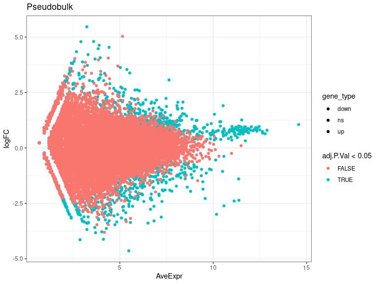

DEs
================
Laura Perlaza-Jimenez
2023-02-06

<h1 align="center">
Differential Expression Pseudobulk
</h1>

Load libraries

``` r
library(dplyr)
library(Seurat)
library(hdf5r)
library(fs)
library(scCustomize)
library(clustree)
library(SeuratDisk)
library(clustree)
library(ggplot2)
library(RColorBrewer)
library(ggforce)
library(limma)
library(edgeR)
```

Get working path and set it

``` r
path_wd<-getwd()
setwd(path_wd)
```

``` r
subset_obj<-LoadH5Seurat("../Results/kidney.combined_obj_UMAP_clustered_finalnames.h5seurat")
DefaultAssay(subset_obj) <- "RNA"
```

``` r
# functions

DE_analysis_pseudobulk <- function(cell_type,comparison1,comparison2) {
        subset_obj_tested= subset_obj[, subset_obj$cell_labels==cell_type] #change this column name for your clusters labels wherever they are
        
          replicates_lookup <- c(
        "n1_d20"="normal_d20", "n2_d20"="normal_d20", "n3_d20"="normal_d20",
        "h1_d20"="hypoxic_d20", "h2_d20"="hypoxic_d20", "h3_d20"="hypoxic_d20", 
        "n1_d25"= "normal_d25", "n2_d25"="normal_d25",  "n3_d25"="normal_d25",
        "h1_d25"="hypoxic_d25", "h2_d25"="hypoxic_d25", "h3_d25"="hypoxic_d25")
                
        replicates_lookup=replicates_lookup[replicates_lookup %in% c(comparison1,comparison2)]
        
        subset_obj_tested<-subset(subset_obj_tested, subset = orig.ident %in% c(names(replicates_lookup)))
        Idents(subset_obj_tested) <- subset_obj_tested$orig.ident

        pseudobulk_matrix <- AggregateExpression( subset_obj_tested,  slot = 'counts', assays='RNA' )[['RNA']]
        
        dge <- DGEList(pseudobulk_matrix)
        dge <- calcNormFactors(dge)
 
        condition <- factor(replicates_lookup[colnames(pseudobulk_matrix)],levels=c(comparison1,comparison2))
        condition_names<-levels(condition)
        design <- model.matrix(~condition)
        vm  <- voom(dge, design = design, plot = FALSE)
        fit <- lmFit(vm, design = design)
        fit <- eBayes(fit)
        de_result_pseudobulk <- topTable(fit, n = Inf, adjust.method = "BH")
        #> Removing intercept from test coefficients
        de_result_pseudobulk <- arrange(de_result_pseudobulk , adj.P.Val)
        
        de_result_pseudobulk <-de_result_pseudobulk %>%
          mutate(gene_type = case_when(logFC  >= log2(2) & adj.P.Val <= 0.05 ~ "up",
                               logFC  <= log2(0.5) & adj.P.Val <= 0.05 ~ "down",
                               TRUE ~ "ns"))  
        cols <- c("up" = "#ffad73", "down" = "#26b3ff", "ns" = "grey") 
        sizes <- c("up" = 2, "down" = 2, "ns" = 1) 
        alphas <- c("up" = 1, "down" = 1, "ns" = 0.5)
        
        p1 <- ggplot(de_result_pseudobulk, aes(x=AveExpr, y=logFC, col=adj.P.Val < 0.05, fill = gene_type)) +
          geom_point() +
          theme_bw() +
          ggtitle("Pseudobulk")
        p2 <- ggplot(de_result_pseudobulk, aes(x=logFC, y=-log10(adj.P.Val), col = gene_type)) +
          geom_point() +
          theme_bw() +
          ggtitle("Pseudobulk Test (Volcano)")
          
         p2<-p2+ geom_hline(yintercept = -log10(0.05),
             linetype = "dashed") + 
              geom_vline(xintercept = c(log2(0.5), log2(2)),
             linetype = "dashed")   
         
        p2<- p2+ scale_fill_manual(values = cols) + # Modify point colour
            scale_size_manual(values = sizes) + # Modify point size
          scale_alpha_manual(values = alphas)  # Modify point transparency

        return (list(p1,p2,de_result_pseudobulk,condition_names))
}
```

``` r
cat( "#", params$cluster_input)
```

# 9_Neural

## treatment comparisons

``` r
celltype=  params$cluster_input
```

``` r
DE_treatment_pseudobulk_results=DE_analysis_pseudobulk(celltype,"normal_d20","hypoxic_d20")
cat("###",DE_treatment_pseudobulk_results[[4]][1],"vs",DE_treatment_pseudobulk_results[[4]][2],"\n")
```

### normal_d20 vs hypoxic_d20

``` r
cat("#### Reference:", DE_treatment_pseudobulk_results[[4]][1],"\n")
```

#### Reference: normal_d20

``` r
DE_treatment_pseudobulk_results[[1]]
```

<!-- -->

``` r
DE_treatment_pseudobulk_results[[2]]
```

<!-- -->

``` r
head(DE_treatment_pseudobulk_results[[3]],)
```

            logFC  AveExpr         t      P.Value    adj.P.Val         B gene_type

FTL 1.2602913 11.52539 24.22491 2.153922e-09 7.883569e-05 12.254510 up
RPS27 0.9663269 12.45865 20.48464 9.271598e-09 1.422698e-04 10.325853 ns
RPS24 0.8124919 11.76650 19.48368 1.431557e-08 1.422698e-04 10.123877 ns
MT-ND3 -2.9942645 10.17533 -18.27448 2.491769e-08 1.422698e-04 9.969091
down RPL13A 0.7605706 11.02695 18.08924 2.720933e-08 1.422698e-04
9.656429 ns RPL36 0.9431983 11.50014 18.20845 2.570900e-08 1.422698e-04
9.583515 ns

``` r
 DE_treatment_pseudobulk_results=DE_analysis_pseudobulk(celltype,"normal_d25","hypoxic_d25")

cat("###",DE_treatment_pseudobulk_results[[4]][1],"vs",DE_treatment_pseudobulk_results[[4]][2],"\n")
```

### normal_d25 vs hypoxic_d25

``` r
cat("#### Reference:", DE_treatment_pseudobulk_results[[4]][1],"\n")
```

#### Reference: normal_d25

``` r
 DE_treatment_pseudobulk_results[[1]]
```

<!-- -->

``` r
 DE_treatment_pseudobulk_results[[2]]
```

<!-- -->

``` r
head(DE_treatment_pseudobulk_results[[3]],10)
```

                logFC   AveExpr         t       P.Value     adj.P.Val         B gene_type

MT-CO2 0.8213588 12.699603 27.45377 1.651115e-165 6.043247e-161
368.11887 ns MALAT1 -0.3448851 13.969840 -23.11289 5.595677e-118
1.024037e-113 257.77175 ns MT-CO3 0.6745996 12.467295 20.50318
2.729427e-93 3.329992e-89 201.58896 ns MT-CO1 0.6179597 12.054496
15.72484 1.135389e-55 1.038909e-51 115.22482 ns MT-ATP6 0.6468262
11.875512 15.23649 2.221361e-52 1.626081e-48 107.73539 ns MT-ND3
0.5461701 12.000475 13.64854 2.186680e-42 1.333911e-38 84.76401 ns
MT-CYB 0.7963567 11.074859 13.60888 3.762258e-42 1.967177e-38 84.54277
ns AC092957.1 -2.6637291 6.636321 -12.39243 2.991750e-35 1.368763e-31
68.87650 down IFITM3 1.1778475 9.377360 11.49470 1.445705e-30
5.879362e-27 58.42987 up TXNIP -2.3342098 6.781566 -11.33036
9.550699e-30 3.177865e-26 56.52817 down

``` r
  DE_treatment_pseudobulk_results=DE_analysis_pseudobulk(celltype,"normal_d20","normal_d25")

cat("###",DE_treatment_pseudobulk_results[[4]][1],"vs",DE_treatment_pseudobulk_results[[4]][2],"\n")
```

### normal_d20 vs normal_d25

``` r
cat("#### Reference:", DE_treatment_pseudobulk_results[[4]][1],"\n")
```

#### Reference: normal_d20

``` r
 DE_treatment_pseudobulk_results[[1]]
```

<!-- -->

``` r
 DE_treatment_pseudobulk_results[[2]]
```

<!-- -->

``` r
 head(DE_treatment_pseudobulk_results[[3]] ,10)
```

                logFC   AveExpr          t      P.Value    adj.P.Val        B gene_type

AC015522.1 -3.1376170 7.036952 -12.978271 1.706651e-38 6.246513e-34
76.02032 down AC092957.1 4.0138517 6.065711 11.412473 3.730856e-30
6.827653e-26 56.30796 up AC109466.1 1.8177713 8.129762 10.876779
1.523821e-27 1.859113e-23 51.66782 up MT-CO2 -0.3517462 12.492268
-10.607093 2.823491e-26 2.583565e-22 47.68979 ns CTNNA2 -2.3263512
6.922011 -10.000967 1.535677e-23 1.124146e-19 42.50697 down EEF1A1
0.3232528 12.549660 9.823080 9.102865e-23 5.552899e-19 39.67659 ns CDH6
-1.4658371 8.308002 -9.670005 4.105674e-22 1.908147e-18 39.36609 down
GRID2 -1.0410220 9.462000 -9.668396 4.170699e-22 1.908147e-18 39.18809
down VIM 0.8060626 10.302707 9.647637 5.106709e-22 2.076785e-18 38.80754
ns SPOCK3 2.5884868 6.461502 9.262935 2.014626e-20 7.373733e-17 35.37291
up

``` r
DE_treatment_pseudobulk_results=DE_analysis_pseudobulk(celltype,"hypoxic_d20","hypoxic_d25")

cat("###",DE_treatment_pseudobulk_results[[4]][1],"vs",DE_treatment_pseudobulk_results[[4]][2],"\n")
```

### hypoxic_d20 vs hypoxic_d25

``` r
cat("#### Reference:", DE_treatment_pseudobulk_results[[4]][1],"\n")
```

#### Reference: hypoxic_d20

``` r
  DE_treatment_pseudobulk_results[[1]]
```

<!-- -->

``` r
  DE_treatment_pseudobulk_results[[2]]
```

<!-- -->

``` r
  head(DE_treatment_pseudobulk_results[[3]],10)
```

            logFC   AveExpr         t      P.Value    adj.P.Val        B gene_type

FOS 2.0707967 9.128928 21.98500 2.840563e-08 0.0002088172 9.919192 up
RPL24 -1.0036857 11.584164 -22.62411 2.280908e-08 0.0002088172 9.818195
down RPL22 -0.9174507 10.944777 -21.96864 2.856801e-08 0.0002088172
9.753932 ns MT-ND4 1.3251119 9.925239 20.66736 4.556944e-08 0.0002088172
9.468502 up RPL30 -0.8454132 12.018613 -21.52092 3.344305e-08
0.0002088172 9.240731 ns AFF3 2.3396406 8.295305 20.41818 4.999358e-08
0.0002088172 9.237717 up CFL1 1.5920685 9.282405 19.76894 6.397846e-08
0.0002088172 9.148790 up RPL14 -0.7669792 11.236220 -20.08517
5.668136e-08 0.0002088172 8.930648 ns RPLP1 -0.4685239 12.677488
-21.17897 3.780111e-08 0.0002088172 8.824740 ns RPS24 -0.7819915
11.710676 -19.61078 6.802107e-08 0.0002088172 8.572157 ns
