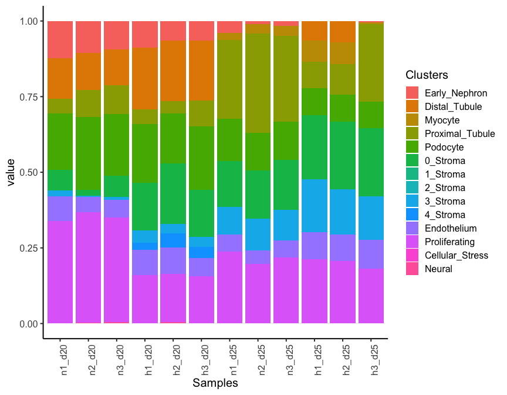
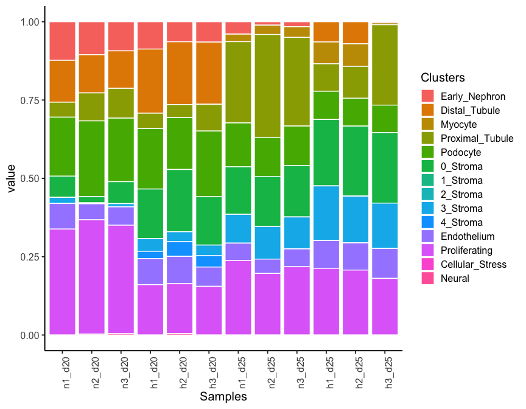
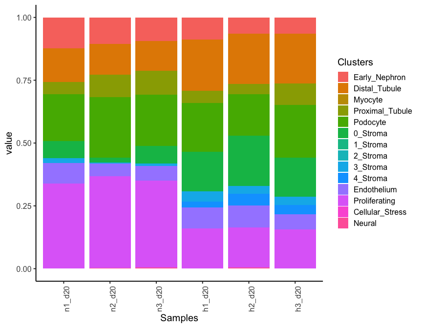
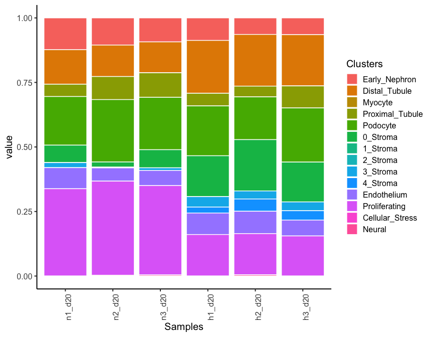
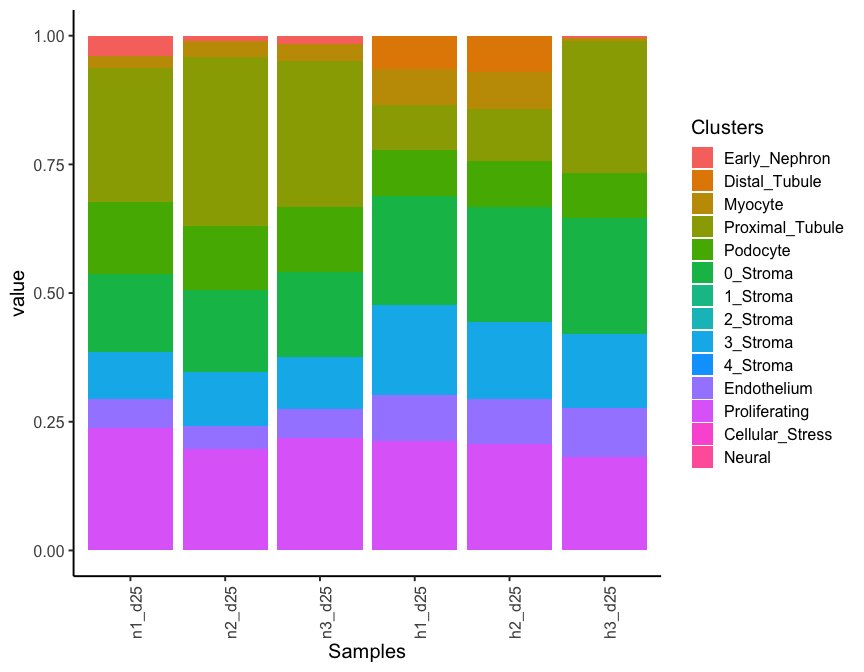

Deconvolution Analysis
================
Mehran Piran, Laura Perlaza-Jimenez
05/08/2023

<h1 align="center">
Deconvolution Analysis
</h1>

## Data preprocessing

A reference count gene expression matrix was created by selecting the
top 5,000 most variable genes and randomly choosing 50 cells for each
cell type from the original single-cell RNA-seq data. This reference
matrix was then provided to an online tool called CIBERSORTx.
Additionally, the complete bulk RNA-seq count matrix was also provided
to the software in order to generate the signature matrix and produce
deconvolution results. These results display the percentage of each cell
type in all bulk samples in a tabular format.

## Plotting deconvolution results

``` r
rm(list=ls());
```

Load libraries

``` r
library(reshape2)
library(ggplot2)
library(tidyverse)
library(Seurat)
```

Get working path and set it

``` r
path_wd<-getwd()
setwd(path_wd)
```

read file

``` r
mat <- read.csv("../Data/complete_dataset.csv")
```

Melting the matrix

``` r
deconv<-melt(mat)
```

Correcting names for samples

``` r
deconv$Samples[ deconv$Mixture=="d20_Hyp1_S4_R1_001"]="h1_d20"
deconv$Samples[ deconv$Mixture=="d20_Hyp2_S5_R1_001"]="h2_d20"
deconv$Samples[ deconv$Mixture=="d20_Hyp3_S6_R1_001"]="h3_d20"
deconv$Samples[ deconv$Mixture=="d20_Norm1_S1_R1_001"]="n1_d20"
deconv$Samples[ deconv$Mixture=="d20_Norm2_S2_R1_001"]="n2_d20"
deconv$Samples[ deconv$Mixture=="d20_Norm3_S3_R1_001"]="n3_d20"
deconv$Samples[ deconv$Mixture=="d25_Hyp1_S10_R1_001"]="h1_d25"
deconv$Samples[ deconv$Mixture=="d25_Hyp2_S11_R1_001"]="h2_d25"
deconv$Samples[ deconv$Mixture=="d25_Hyp3_S12_R1_001"]="h3_d25"
deconv$Samples[ deconv$Mixture=="d25_Norm1_S7_R1_001"]="n1_d25"
deconv$Samples[ deconv$Mixture=="d25_Norm2_S8_R1_001"]="n2_d25"
deconv$Samples[ deconv$Mixture=="d25_Norm3_S9_R1_001"]="n3_d25"


# order Sampless
deconv$Samples=factor(deconv$Samples,
                     levels= c("n1_d20","n2_d20","n3_d20","h1_d20","h2_d20","h3_d20",
                          "n1_d25","n2_d25","n3_d25","h1_d25","h2_d25","h3_d25"))

# fix cell labels 
deconv$cell_label<-factor(gsub("X","",deconv$variable))

# order cell labels
deconv$cell_label <- factor(deconv$cell_label,levels = deconv$cell_label %>% unique())
```

### Plot proportions

``` r
ggplot(deconv,aes(Samples,value,fill=cell_label))+
  geom_bar(stat = "identity")+
  theme_classic(base_size = 15)+theme(axis.text.x = element_text(angle = 90))+
  labs(fill = "Clusters")
```

<!-- -->

``` r
ggplot(deconv,aes(Samples,value,fill=cell_label))+
  geom_bar(stat = "identity")+
  theme_classic(base_size = 15)+geom_col(color = "white")+theme(axis.text.x = element_text(angle = 90))+
  labs(fill = "Clusters")
```

<!-- -->

### Plot proportions day 20

``` r
deconv_subset<-deconv[ deconv$Samples %in% c("n1_d20","n2_d20","n3_d20","h1_d20","h2_d20","h3_d20"),]

ggplot(deconv_subset,aes(Samples,value,fill=cell_label))+
  geom_bar(stat = "identity")+
  theme_classic(base_size = 15)+theme(axis.text.x = element_text(angle = 90))+
  labs(fill = "Clusters")
```

<!-- -->

``` r
ggplot(deconv_subset,aes(Samples,value,fill=cell_label))+
  geom_bar(stat = "identity")+
  theme_classic(base_size = 15)+geom_col(color = "white")+theme(axis.text.x = element_text(angle = 90))+
  labs(fill = "Clusters")
```

<!-- -->

### Plot proportions day 25

``` r
deconv_subset<-deconv[ deconv$Samples %in% c("n1_d25","n2_d25","n3_d25","h1_d25","h2_d25","h3_d25"),]

ggplot(deconv_subset,aes(Samples,value,fill=cell_label))+
  geom_bar(stat = "identity")+
  theme_classic(base_size = 15)+theme(axis.text.x = element_text(angle = 90))+
  labs(fill = "Clusters")
```

<!-- -->

``` r
ggplot(deconv_subset,aes(Samples,value,fill=cell_label))+
  geom_bar(stat = "identity")+
  theme_classic(base_size = 15)+geom_col(color = "white")+theme(axis.text.x = element_text(angle = 90))+
  labs(fill = "Clusters")
```

<!-- -->
