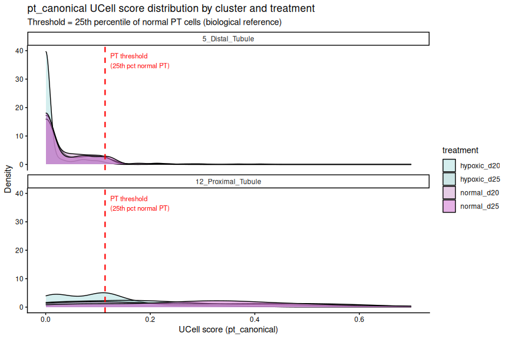
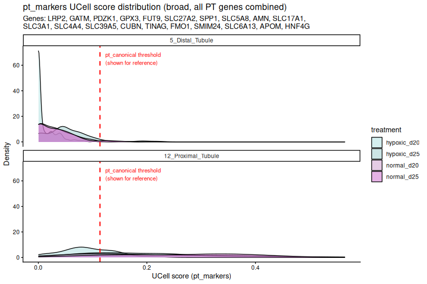
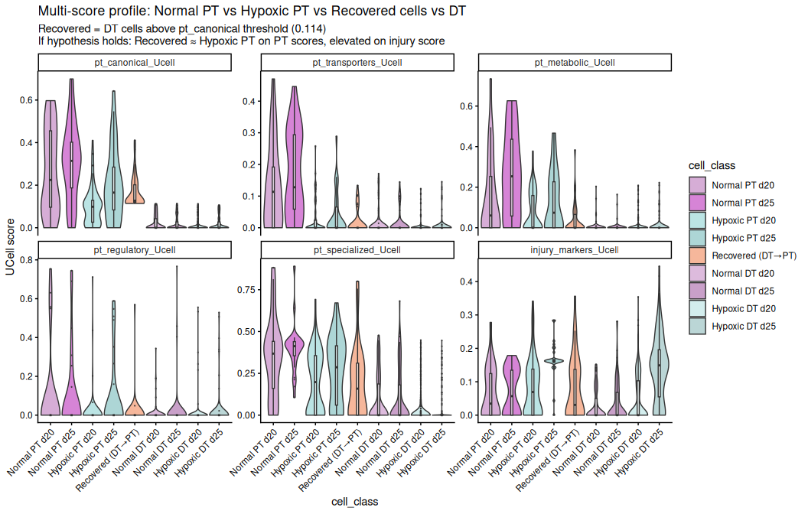
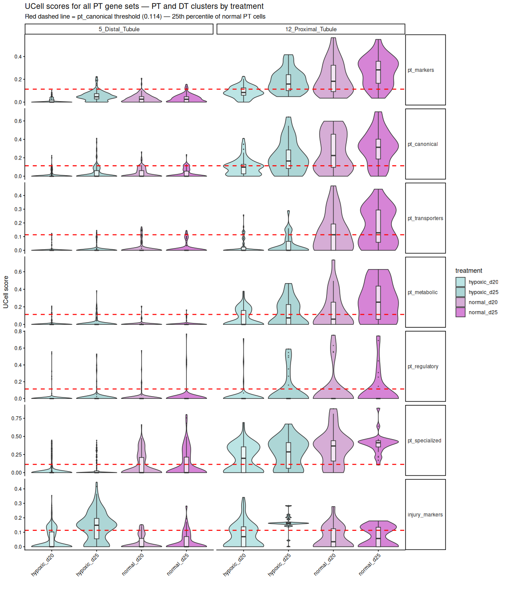

# 1. Load Libraries and data

    setwd("~/data/tasks/alex.combes/www/revisions_2026/")
    seu <- readRDS("seu_withPTscores.rds")

------------------------------------------------------------------------

# 2. Define Marker Gene Lists

**`pt_canonical`**: Very reliable PT markers — structural and functional
core identity

<table>
<colgroup>
<col style="width: 50%" />
<col style="width: 50%" />
</colgroup>
<thead>
<tr>
<th>Gene</th>
<th>Function</th>
</tr>
</thead>
<tbody>
<tr>
<td><strong>LRP2</strong></td>
<td>Megalin, classic PT brush border receptor</td>
</tr>
<tr>
<td><strong>CUBN</strong></td>
<td>Cubilin, PT endocytosis</td>
</tr>
<tr>
<td><strong>PDZK1</strong></td>
<td>Scaffold protein for PT transporters</td>
</tr>
<tr>
<td><strong>SLC4A4</strong></td>
<td>Sodium bicarbonate transporter (basolateral PT)</td>
</tr>
<tr>
<td><strong>SLC3A1</strong></td>
<td>Amino acid transporter</td>
</tr>
<tr>
<td><strong>AMN</strong></td>
<td>Cubilin receptor complex</td>
</tr>
<tr>
<td><strong>TINAG</strong></td>
<td>Tubulointerstitial nephritis antigen, PT basement membrane</td>
</tr>
</tbody>
</table>

**`pt_transporters`**: Transporters enriched in proximal tubule

<table>
<thead>
<tr>
<th>Gene</th>
<th>Function</th>
</tr>
</thead>
<tbody>
<tr>
<td><strong>SLC17A1</strong></td>
<td>Phosphate transporter</td>
</tr>
<tr>
<td><strong>SLC27A2</strong></td>
<td>Fatty acid transport</td>
</tr>
<tr>
<td><strong>SLC6A13</strong></td>
<td>GABA transporter</td>
</tr>
<tr>
<td><strong>SLC5A8</strong></td>
<td>Monocarboxylate transporter</td>
</tr>
<tr>
<td><strong>SLC39A5</strong></td>
<td>Zinc transporter</td>
</tr>
</tbody>
</table>

**`pt_metabolic`**: Metabolic proximal tubule genes

<table>
<thead>
<tr>
<th>Gene</th>
<th>Function</th>
</tr>
</thead>
<tbody>
<tr>
<td><strong>GATM</strong></td>
<td>Creatine synthesis (classic PT metabolic marker)</td>
</tr>
<tr>
<td><strong>FMO1</strong></td>
<td>Xenobiotic metabolism</td>
</tr>
<tr>
<td><strong>APOM</strong></td>
<td>Lipid metabolism</td>
</tr>
<tr>
<td><strong>GPX3</strong></td>
<td>Antioxidant enzyme</td>
</tr>
</tbody>
</table>

**`pt_regulatory`**: Regulatory / transcriptional markers

<table>
<colgroup>
<col style="width: 50%" />
<col style="width: 50%" />
</colgroup>
<thead>
<tr>
<th>Gene</th>
<th>Function</th>
</tr>
</thead>
<tbody>
<tr>
<td><strong>HNF4G</strong></td>
<td>Transcription factor related to epithelial metabolism</td>
</tr>
</tbody>
</table>

**`pt_specialized`**: Genes suggesting PT subsegments or specialization

<table>
<thead>
<tr>
<th>Gene</th>
<th>Function</th>
</tr>
</thead>
<tbody>
<tr>
<td><strong>FUT9</strong></td>
<td>Glycosylation enzyme</td>
</tr>
<tr>
<td><strong>SMIM24</strong></td>
<td>Poorly characterized membrane protein</td>
</tr>
</tbody>
</table>

**`injury_markers`**: Injury-associated markers used to confirm injured
state

<table>
<colgroup>
<col style="width: 50%" />
<col style="width: 50%" />
</colgroup>
<thead>
<tr>
<th>Gene</th>
<th>Function</th>
</tr>
</thead>
<tbody>
<tr>
<td><strong>SOX9</strong></td>
<td>Dedifferentiation / injury response transcription factor</td>
</tr>
<tr>
<td><strong>CDKN1A</strong></td>
<td>Cell cycle arrest (p21), DNA damage response</td>
</tr>
<tr>
<td><strong>VCAM1</strong></td>
<td>Adhesion molecule upregulated in injured PT</td>
</tr>
<tr>
<td><strong>SPP1</strong></td>
<td>Osteopontin, injury and inflammation</td>
</tr>
<tr>
<td><strong>PROM1</strong></td>
<td>CD133, progenitor/injury marker</td>
</tr>
<tr>
<td><strong>ICAM1</strong></td>
<td>Inflammatory adhesion molecule</td>
</tr>
</tbody>
</table>

## Gene Set Strategy

The marker gene sets are used in layers to test the hypothesis that
hypoxic injury caused PT cells to downregulate PT marker genes and shift
toward a DT-like state.

<table>
<colgroup>
<col style="width: 50%" />
<col style="width: 50%" />
</colgroup>
<thead>
<tr>
<th>Gene set</th>
<th>Role in the analysis</th>
</tr>
</thead>
<tbody>
<tr>
<td><code>pt_canonical</code></td>
<td><strong>Primary threshold</strong> — defines PT identity
(structural/functional core)</td>
</tr>
<tr>
<td><code>pt_transporters</code> + <code>pt_metabolic</code></td>
<td><strong>Confirmation</strong> — do recovered cells retain PT
function?</td>
</tr>
<tr>
<td><code>pt_regulatory</code> + <code>pt_specialized</code></td>
<td><strong>Fine-grained</strong> — do they retain PT
specialization?</td>
</tr>
<tr>
<td><code>injury_markers</code></td>
<td><strong>Injury axis</strong> — are recovered cells in an injured
state?</td>
</tr>
</tbody>
</table>

The threshold is defined using **normal condition PT cells only** (25th
percentile of `pt_canonical_Ucell` in `12_Proximal_Tubule` normal
cells). This anchors the cutoff to biology rather than the whole-dataset
distribution, and avoids circular logic: the threshold is set on
uninjured reference cells, then applied to hypoxic DT cells as an
independent prediction.

**What we want to show:** “Cells recovered by canonical PT score also
retain transporter and metabolic PT identity (confirming they are PT),
but co-express injury markers (confirming they are injured PT, not
healthy PT or DT).”

    pt_markers_all <- list(
      pt_markers      = c("LRP2", "GATM", "PDZK1", "GPX3", "FUT9", "SLC27A2", "SPP1",
                          "SLC5A8", "AMN", "SLC17A1", "SLC3A1", "SLC4A4", "SLC39A5",
                          "CUBN", "TINAG", "FMO1", "SMIM24", "SLC6A13", "APOM", "HNF4G"),
      pt_canonical    = c("LRP2", "CUBN", "PDZK1", "SLC4A4", "SLC3A1", "AMN", "TINAG"),
      pt_transporters = c("SLC17A1", "SLC27A2", "SLC6A13", "SLC5A8", "SLC39A5"),
      pt_metabolic    = c("GATM", "FMO1", "APOM", "GPX3"),
      pt_regulatory   = c("HNF4G"),
      pt_specialized  = c("FUT9", "SMIM24"),
      injury_markers  = c("SOX9", "CDKN1A", "VCAM1", "SPP1", "PROM1", "ICAM1")
    )

------------------------------------------------------------------------

# 3. Compute UCell Module Scores

We use UCell (rank-based scoring) rather than Seurat’s `AddModuleScore`
for three reasons relevant to this dataset: (1) UCell scores are fully
reproducible because they do not rely on random control gene sampling;
(2) the 0–1 output range is interpretable and directly comparable across
gene sets and conditions; and (3) the rank-based approach is more robust
to the global transcriptional downregulation caused by hypoxia, which
would otherwise deflate Seurat scores in a condition-specific way and
confound the comparison.

Each gene set is scored independently. The resulting columns in
`seu@meta.data` follow the naming convention `<geneset_name>_Ucell`
(e.g. `pt_canonical_Ucell`, `injury_markers_Ucell`).

    for (i in seq_along(pt_markers_all)) {
      seu <- AddModuleScore_UCell(
        seu,
        features = pt_markers_all[i],
        name     = "_Ucell"
      )
    }

------------------------------------------------------------------------

# 4. Define Threshold from Normal PT Cells Only

A key methodological decision is how to define “PT-like” for the
reclassification step. Using a threshold derived from the whole dataset
(e.g. mean ± SD across all cells) is dominated by non-PT cells and
produces an artificially low cutoff that would over-classify cells as
PT. Instead, we anchor the threshold to **normal-condition PT cells** —
the cleanest biological reference for what a PT cell looks like in the
absence of hypoxic injury.

Specifically, we take the **25 percentile** of `pt_canonical_Ucell`
scores among cells that are already annotated as `12_Proximal_Tubule`
and come from normal conditions. This means: *“we classified a DT cell
as PT if its canonical marker score exceeded the 25th percentile of
normal PT cells, i.e. it retained more PT-marker expression than the
lowest quartile of healthy PT cells.”* The threshold is then applied to
DT cluster cells to identify those likely displaced by hypoxia-driven
downregulation — it is never re-estimated from the cells being
classified.

    df_metadata <- seu@meta.data

    normal_pt_scores <- df_metadata %>%
      filter(
        cell_labels == "12_Proximal_Tubule",
        treatment %in% c("normal_d20", "normal_d25")
      ) %>%
      pull(pt_canonical_Ucell)

    normal_dt_scores <- df_metadata %>%
      filter(
        cell_labels == "5_Distal_Tubule",
        treatment %in% c("normal_d20", "normal_d25")
      ) %>%
      pull(pt_canonical_Ucell)

    pt_threshold <- quantile(normal_pt_scores, 0.25)

    cat("PT threshold (25% percentile of normal PT cells):", round(pt_threshold, 4), "\n")

    ## PT threshold (25% percentile of normal PT cells): 0.1136

    cat("Any cell scoring above", round(pt_threshold, 4),
        "has PT-canonical expression at least as high as the bottom 25% of healthy PT cells.\n")

    ## Any cell scoring above 0.1136 has PT-canonical expression at least as high as the bottom 25% of healthy PT cells.

------------------------------------------------------------------------

# 5. Threshold Visualisation — Does It Make Biological Sense?

This plot shows the `pt_canonical_Ucell` score distribution for the PT
and DT clusters, broken down by treatment, with the threshold marked as
a red dashed line. Its purpose is to verify that the threshold sits in a
biologically meaningful position before using it for reclassification.

**Expectation:**

- *Normal PT cells (purple):* should sit mostly above the threshold —
  expected by construction since the threshold is derived from these
  cells.
- *Hypoxic PT cells (teal):* the distribution should shift left relative
  to normal PT, reflecting hypoxia-driven downregulation. Some cells may
  fall below threshold, which is the misclassification problem this
  analysis addresses.
- *Normal DT cells:* should sit mostly below threshold. A large overlap
  would indicate the threshold is too permissive or the canonical gene
  set is not sufficiently specific.
- *Hypoxic DT cells:* the critical group. If the hypothesis holds, there
  should be a visible subpopulation with elevated PT scores — cells that
  were PT but shifted into the DT cluster due to expression
  downregulation.

**What to look for:** a bimodal or right-shifted distribution in hypoxic
DT cells compared to normal DT cells, with a subpopulation crossing the
threshold.

    treatment_colors <- c(
      "normal_d20"  = "#CC99CC",
      "normal_d25"  = "#CC66CC",
      "hypoxic_d20" = "#AADDDD",
      "hypoxic_d25" = "#99CCCC"
    )

    df_metadata %>%
      filter(cell_labels %in% c("12_Proximal_Tubule", "5_Distal_Tubule")) %>%
      ggplot(aes(x = pt_canonical_Ucell, fill = treatment)) +
      geom_density(alpha = 0.5) +
      geom_vline(xintercept = pt_threshold, color = "red",
                 linetype = "dashed", linewidth = 0.8) +
      annotate("text", x = pt_threshold + 0.01, y = Inf,
               label = "PT threshold\n(25th pct normal PT)",
               vjust = 1.5, hjust = 0, color = "red", size = 3) +
      facet_wrap(~cell_labels, ncol = 1) +
      scale_fill_manual(values = treatment_colors) +
      labs(
        title    = "pt_canonical UCell score distribution by cluster and treatment",
        subtitle = "Threshold = 25th percentile of normal PT cells (biological reference)",
        x        = "UCell score (pt_canonical)",
        y        = "Density"
      ) +
      theme_classic()

------------------------------------------------------------------------

# 6. Broad `pt_markers` Score — Comparison with Previous Approach

Before moving to the layered gene set analysis, this plot shows the
`pt_markers_Ucell` score, which uses all PT marker genes in a single
combined list. This corresponds to the original approach of scoring
cells with a broad, undifferentiated PT signature.

Comparing this plot to Section 5 (`pt_canonical_Ucell`) illustrates why
splitting the gene sets matters. The broad `pt_markers` score mixes
structural identity genes with metabolic and specialization genes, some
of which may be more variable across conditions or expressed in other
cell types. This can dilute the signal and make the threshold less
sharp. The `pt_canonical_Ucell` score, by contrast, uses only the most
reliable identity markers and should give a cleaner separation between
PT and DT cells.

**What to look for:** whether the `pt_markers_Ucell` distribution is
less discriminating (more overlap between PT and DT) compared to
`pt_canonical_Ucell`, which would justify the move to the layered
approach.

    df_metadata %>%
      filter(cell_labels %in% c("12_Proximal_Tubule", "5_Distal_Tubule")) %>%
      ggplot(aes(x = pt_markers_Ucell, fill = treatment)) +
      geom_density(alpha = 0.5) +
      geom_vline(xintercept = pt_threshold, color = "red",
                 linetype = "dashed", linewidth = 0.8) +
      annotate("text", x = pt_threshold + 0.01, y = Inf,
               label = "pt_canonical threshold\n(shown for reference)",
               vjust = 1.5, hjust = 0, color = "red", size = 3) +
      facet_wrap(~cell_labels, ncol = 1) +
      scale_fill_manual(values = treatment_colors) +
      labs(
        title    = "pt_markers UCell score distribution (broad, all PT genes combined)",
        subtitle = paste0(
          "Genes: LRP2, GATM, PDZK1, GPX3, FUT9, SLC27A2, SPP1, SLC5A8, AMN, SLC17A1,\n",
          "SLC3A1, SLC4A4, SLC39A5, CUBN, TINAG, FMO1, SMIM24, SLC6A13, APOM, HNF4G"
        ),
        x = "UCell score (pt_markers)",
        y = "Density"
      ) +
      theme_classic()

------------------------------------------------------------------------

# 7. Multi-Score Profile — Testing the Hypothesis

This is the central diagnostic plot. All six UCell scores are shown side
by side for four cell classes defined by cluster identity, treatment,
and whether the cell crosses the PT threshold:

- **Normal PT:** cells in `12_Proximal_Tubule` from normal conditions —
  the uninjured ground truth.
- **Hypoxic PT:** cells in `12_Proximal_Tubule` from hypoxic conditions
  — injured cells retained in the PT cluster by the original clustering.
- **Recovered (DT→PT):** cells in `5_Distal_Tubule` scoring above
  `pt_threshold` on `pt_canonical_Ucell` — candidates for
  reclassification.
- **DT (not recovered):** cells in `5_Distal_Tubule` below threshold —
  presumed true DT cells.

If the reclassification is valid, recovered cells should not resemble DT
cells. They should resemble hypoxic PT cells — because the hypothesis
states they *are* PT cells displaced by hypoxia, not DT cells that
happen to express a few PT genes. The injury score is the key
discriminator: it should be elevated in recovered cells relative to
normal PT, confirming an injured-PT rather than a healthy-PT or DT
identity. Critically, the transporter and metabolic scores provide
independent confirmation of PT functional identity — these gene sets
were not used to set the threshold and therefore constitute a genuine
validation layer.

**Expected pattern by score:**

<table>
<colgroup>
<col style="width: 33%" />
<col style="width: 33%" />
<col style="width: 33%" />
</colgroup>
<thead>
<tr>
<th>Score</th>
<th>Expected pattern</th>
<th>Interpretation</th>
</tr>
</thead>
<tbody>
<tr>
<td><code>pt_canonical</code></td>
<td>Recovered ≈ Hypoxic PT &gt; DT</td>
<td>By design of threshold</td>
</tr>
<tr>
<td><code>pt_transporters</code></td>
<td>Recovered ≈ Hypoxic PT &gt; DT</td>
<td>Confirms functional PT identity</td>
</tr>
<tr>
<td><code>pt_metabolic</code></td>
<td>Recovered ≈ Hypoxic PT &gt; DT</td>
<td>Confirms metabolic PT identity</td>
</tr>
<tr>
<td><code>pt_regulatory</code></td>
<td>Recovered ≈ Hypoxic PT &gt; DT</td>
<td>Confirms transcriptional PT identity</td>
</tr>
<tr>
<td><code>pt_specialized</code></td>
<td>Recovered ≈ Hypoxic PT &gt; DT</td>
<td>Confirms PT specialization</td>
</tr>
<tr>
<td><code>injury_markers</code></td>
<td>Recovered ≈ Hypoxic PT &gt;&gt; Normal PT</td>
<td>Confirms injured state</td>
</tr>
</tbody>
</table>

A result where recovered cells score high on injury but **low** on
transporter/metabolic scores would suggest genuine identity loss rather
than simple misclassification, and would need to be interpreted
differently.

    score_cols <- c(
      "pt_canonical"    = "pt_canonical_Ucell",
      "pt_transporters" = "pt_transporters_Ucell",
      "pt_metabolic"    = "pt_metabolic_Ucell",
      "pt_regulatory"   = "pt_regulatory_Ucell",
      "pt_specialized"  = "pt_specialized_Ucell",
      "injury"          = "injury_markers_Ucell"
    )
    df_long <- df_metadata %>%
      filter(cell_labels %in% c("12_Proximal_Tubule", "5_Distal_Tubule")) %>%
      mutate(cell_class = case_when(
        cell_labels == "12_Proximal_Tubule" & treatment == "normal_d20"  ~ "Normal PT d20",
        cell_labels == "12_Proximal_Tubule" & treatment == "normal_d25"  ~ "Normal PT d25",
        cell_labels == "12_Proximal_Tubule" & treatment == "hypoxic_d20" ~ "Hypoxic PT d20",
        cell_labels == "12_Proximal_Tubule" & treatment == "hypoxic_d25" ~ "Hypoxic PT d25",
        cell_labels == "5_Distal_Tubule"    & pt_canonical_Ucell >= pt_threshold ~ "Recovered (DT\u2192PT)",
        cell_labels == "5_Distal_Tubule"    & treatment == "normal_d20"  ~ "Normal DT d20",
        cell_labels == "5_Distal_Tubule"    & treatment == "normal_d25"  ~ "Normal DT d25",
        cell_labels == "5_Distal_Tubule"    & treatment == "hypoxic_d20" ~ "Hypoxic DT d20",
        cell_labels == "5_Distal_Tubule"    & treatment == "hypoxic_d25" ~ "Hypoxic DT d25"
      )) %>%
      mutate(cell_class = factor(cell_class, levels = c(
        "Normal PT d20",  "Normal PT d25",
        "Hypoxic PT d20", "Hypoxic PT d25",
        "Recovered (DT\u2192PT)",
        "Normal DT d20",  "Normal DT d25",
        "Hypoxic DT d20", "Hypoxic DT d25"
      ))) %>%
      pivot_longer(
        cols      = all_of(unname(score_cols)),
        names_to  = "score_type",
        values_to = "score"
      ) %>%
      mutate(score_type = factor(score_type, levels = unname(score_cols)))

    ggplot(df_long, aes(x = cell_class, y = score, fill = cell_class)) +
      geom_violin(scale = "width", alpha = 0.8) +
      geom_boxplot(width = 0.1, fill = "white", alpha = 0.7, outlier.size = 0.2) +
      facet_wrap(~score_type, scales = "free_y", ncol = 3) +
      scale_fill_manual(values = c(
        "Normal PT d20"          = "#CC99CC",
        "Normal PT d25"          = "#CC66CC",
        "Hypoxic PT d20"         = "#AADDDD",
        "Hypoxic PT d25"         = "#99CCCC",
        "Recovered (DT\u2192PT)" = "#F4A582",
        "Normal DT d20"          = "#D4AAD4",
        "Normal DT d25"          = "#BB88BB",
        "Hypoxic DT d20"         = "#C8E8E8",
        "Hypoxic DT d25"         = "#AACCCC"
      )) +
      labs(
        title    = "Multi-score profile: Normal PT vs Hypoxic PT vs Recovered cells vs DT",
        subtitle = paste0(
          "Recovered = DT cells above pt_canonical threshold (", round(pt_threshold, 3), ")\n",
          "If hypothesis holds: Recovered \u2248 Hypoxic PT on PT scores, elevated on injury score"
        ),
      #  x    = "",
        y    = "UCell score",
      #  fill = ""
      ) +
      theme_classic() +
      theme(
         axis.text.x    = element_text(angle = 45, hjust = 1),
        strip.text.y   = element_text(angle = 0, hjust = 0),
        strip.text      = element_text(size = 9),
        legend.position = "right"
      )

Figure legend: UCell scores for six PT functional gene sets
(pt\_canonical, pt\_transporters, pt\_metabolic, pt\_regulatory,
pt\_specialized, and injury\_markers) are shown for cells classified as
Normal PT, Hypoxic PT, Recovered (DT→PT), and Distal Tubule (DT), split
by timepoint (d20 and d25). Recovered cells are defined as cells
originally clustered in the 5\_Distal\_Tubule cluster that score above
the PT identity threshold (25th percentile of pt\_canonical\_Ucell in
normoxic PT cells, threshold = 0.114). The threshold was anchored to
normoxic PT cells as the biological reference to avoid circular
classification. Recovered cells show UCell scores comparable to Hypoxic
PT cells across canonical, transporter, and metabolic gene sets,
confirming retention of PT functional identity, while also displaying
elevated injury marker scores relative to Normal PT cells, consistent
with an injured PT rather than a DT identity. DT cells score near zero
across all PT gene sets regardless of condition or timepoint, confirming
the specificity of the threshold. Violins show the full score
distribution per group; boxplots show median and interquartile range.

------------------------------------------------------------------------

# 8. How Many Cells Were Recovered?

This table reports the number and percentage of DT cluster cells that
cross the PT threshold per treatment group. It serves as a quantitative
summary of the reclassification and as a sanity check on the threshold
specificity.

Recovery should be enriched in hypoxic conditions relative to normal. A
high recovery rate in normal DT cells would be a red flag — it would
indicate the threshold is too permissive, or that the canonical gene set
is not specific enough to distinguish PT from DT under baseline
conditions.

    recovery_summary <- df_metadata %>%
      filter(cell_labels == "5_Distal_Tubule") %>%
      mutate(recovered = pt_canonical_Ucell >= pt_threshold) %>%
      group_by(treatment, recovered) %>%
      summarise(n = n(), .groups = "drop") %>%
      group_by(treatment) %>%
      mutate(pct = round(100 * n / sum(n), 1)) %>%
      filter(recovered == TRUE) %>%
      select(treatment, n_recovered = n, pct_recovered = pct)

    knitr::kable(recovery_summary,
                 caption = paste0(
                   "DT cells reclassified as PT (above threshold = ",
                   round(pt_threshold, 4), ")"
                 ))

<table>
<caption>DT cells reclassified as PT (above threshold =
0.1136)</caption>
<thead>
<tr>
<th style="text-align: left;">treatment</th>
<th style="text-align: right;">n_recovered</th>
<th style="text-align: right;">pct_recovered</th>
</tr>
</thead>
<tbody>
<tr>
<td style="text-align: left;">hypoxic_d20</td>
<td style="text-align: right;">6</td>
<td style="text-align: right;">1.4</td>
</tr>
<tr>
<td style="text-align: left;">hypoxic_d25</td>
<td style="text-align: right;">16</td>
<td style="text-align: right;">10.1</td>
</tr>
<tr>
<td style="text-align: left;">normal_d20</td>
<td style="text-align: right;">9</td>
<td style="text-align: right;">6.4</td>
</tr>
<tr>
<td style="text-align: left;">normal_d25</td>
<td style="text-align: right;">9</td>
<td style="text-align: right;">8.6</td>
</tr>
</tbody>
</table>

------------------------------------------------------------------------

# 9. All Gene Set Scores — Violin Comparison Across PT and DT Clusters

This plot shows the UCell score distribution for every gene set side by
side, using the same violin + boxplot layout as the original analysis.
Each panel corresponds to one gene set and is faceted by cluster
(`12_Proximal_Tubule` vs `5_Distal_Tubule`). The red dashed line is the
**same `pt_canonical` threshold across all panels** (25th percentile of
normal PT cells on the `pt_canonical_Ucell` score), so you can directly
compare how each gene set performs relative to the same biological
reference point.

This makes the comparison interpretable: gene sets whose PT cluster sits
clearly above the threshold and whose DT cluster sits clearly below are
the most discriminating. Gene sets where both clusters overlap around
the threshold are less informative for reclassification.

    score_cols_all <- c(
      "pt_markers"      = "pt_markers_Ucell",
      "pt_canonical"    = "pt_canonical_Ucell",
      "pt_transporters" = "pt_transporters_Ucell",
      "pt_metabolic"    = "pt_metabolic_Ucell",
      "pt_regulatory"   = "pt_regulatory_Ucell",
      "pt_specialized"  = "pt_specialized_Ucell",
      "injury_markers"  = "injury_markers_Ucell"
    )

    df_all_scores <- df_metadata %>%
      filter(cell_labels %in% c("12_Proximal_Tubule", "5_Distal_Tubule")) %>%
      pivot_longer(
        cols      = all_of(unname(score_cols_all)),
        names_to  = "score_col",
        values_to = "score"
      ) %>%
      mutate(
        score_label = names(score_cols_all)[match(score_col, score_cols_all)],
        score_label = factor(score_label, levels = names(score_cols_all))
      )

    ggplot(df_all_scores,
           aes(x = treatment, y = score, fill = treatment)) +
      geom_violin(scale = "width", alpha = 0.8) +
      geom_boxplot(width = 0.1, outlier.size = 0.3,
                   fill = "white", alpha = 0.7) +
      geom_hline(yintercept = pt_threshold,
                 color = "red", linetype = "dashed", linewidth = 0.8) +
      facet_grid(score_label ~ cell_labels, scales = "free_y") +
      scale_fill_manual(values = c(
        "normal_d20"  = "#CC99CC",
        "normal_d25"  = "#CC66CC",
        "hypoxic_d20" = "#AADDDD",
        "hypoxic_d25" = "#99CCCC"
      )) +
      labs(
        title    = "UCell scores for all PT gene sets — PT and DT clusters by treatment",
        subtitle = paste0(
          "Red dashed line = pt_canonical threshold (", round(pt_threshold, 3),
          ") — 25th percentile of normal PT cells"
        ),
        x = "",
        y = "UCell score"
      ) +
      theme_classic() +
      theme(
        axis.text.x    = element_text(angle = 45, hjust = 1),
    #    legend.position = "none",
        strip.text.y   = element_text(angle = 0, hjust = 0),
        strip.text.x   = element_text(size = 10)
      )

    df_metadata <- df_metadata %>%
      mutate(cell_class = case_when(
        cell_labels == "12_Proximal_Tubule" & treatment == "normal_d20"  ~ "Normal PT d20",
        cell_labels == "12_Proximal_Tubule" & treatment == "normal_d25"  ~ "Normal PT d25",
        cell_labels == "12_Proximal_Tubule" & treatment == "hypoxic_d20" ~ "Hypoxic PT d20",
        cell_labels == "12_Proximal_Tubule" & treatment == "hypoxic_d25" ~ "Hypoxic PT d25",
        cell_labels == "5_Distal_Tubule"    & pt_canonical_Ucell >= pt_threshold ~ "Reclassified (DT\u2192PT)",
        cell_labels == "5_Distal_Tubule"    & treatment == "normal_d20"  ~ "Normal DT d20",
        cell_labels == "5_Distal_Tubule"    & treatment == "normal_d25"  ~ "Normal DT d25",
        cell_labels == "5_Distal_Tubule"    & treatment == "hypoxic_d20" ~ "Hypoxic DT d20",
        cell_labels == "5_Distal_Tubule"    & treatment == "hypoxic_d25" ~ "Hypoxic DT d25",
        TRUE ~ "Other"  # all other clusters
      ))

    # Add it back to the Seurat object
    seu <- AddMetaData(seu, metadata = df_metadata["cell_class"])

    SaveSeuratRds(seu,"seu_withPT_Ucell_scores.rds")
