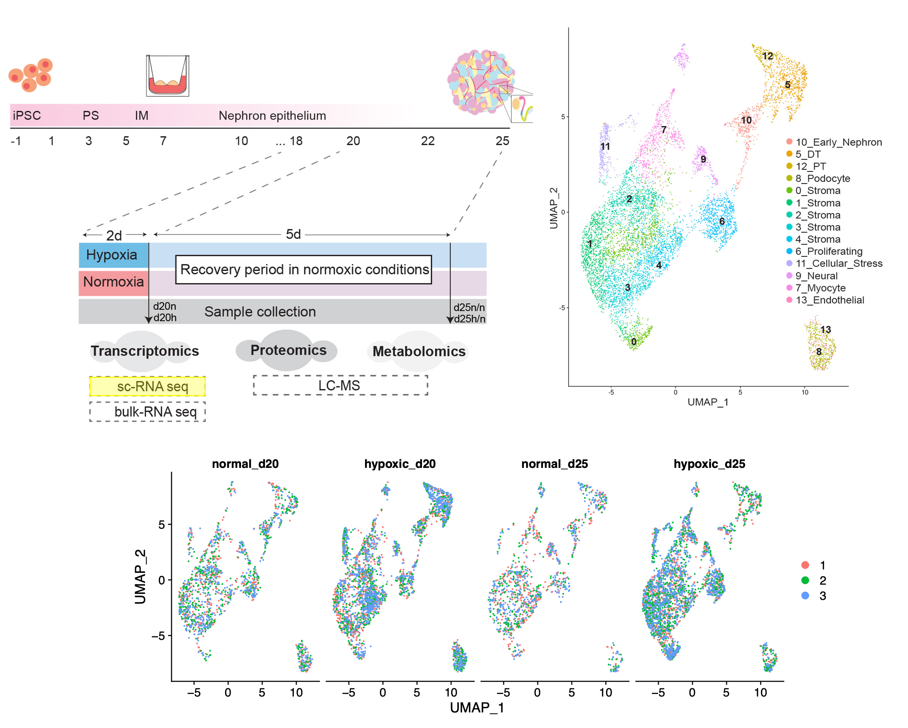

# sc-hyp-org
This repository contains detailed code for the analysis of scRNAseq data

# Analysis
 
* [Quality and Preprocessing](Analysis/1.QC_and_Preprocessing.md)  
* [Clustering and Cell Classification](Analysis/2.Clustering_and_Cell_Classification.md)   
* [Cell Proportions Analysis](Analysis/3.Cell_Proportions_Analysis.md)  
* [Clusters Markers Interactive](https://bioinformatics3.erc.monash.edu/rsconnect/content/349/)
* [Deconvolution Analysis](Analysis/5.Deconvolution.md)   
* [Pseudobulk Differential Expression](Analysis/4.Pseudobulk/)  
&nbsp;&nbsp;&nbsp;&nbsp;&nbsp;&nbsp;&nbsp;&nbsp;- [0_Stroma Pseudobulk](Analysis/4.Pseudobulk/0_StromaPseudobulk.md)  
&nbsp;&nbsp;&nbsp;&nbsp;&nbsp;&nbsp;&nbsp;&nbsp;- [1_Stroma Pseudobulk](Analysis/4.Pseudobulk/1_StromaPseudobulk.md)  
&nbsp;&nbsp;&nbsp;&nbsp;&nbsp;&nbsp;&nbsp;&nbsp;- [2_Stroma Pseudobulk](Analysis/4.Pseudobulk/2_StromaPseudobulk.md)  
&nbsp;&nbsp;&nbsp;&nbsp;&nbsp;&nbsp;&nbsp;&nbsp;- [3_Stroma Pseudobulk](Analysis/4.Pseudobulk/3_StromaPseudobulk.md)  
&nbsp;&nbsp;&nbsp;&nbsp;&nbsp;&nbsp;&nbsp;&nbsp;- [4_Stroma Pseudobulk](Analysis/4.Pseudobulk/4_StromaPseudobulk.md)  
&nbsp;&nbsp;&nbsp;&nbsp;&nbsp;&nbsp;&nbsp;&nbsp;- [5_Distal_Tubule Pseudobulk.md](Analysis/4.Pseudobulk/5_Distal_TubulePseudobulk.md)  
&nbsp;&nbsp;&nbsp;&nbsp;&nbsp;&nbsp;&nbsp;&nbsp;- [6_Proliferating Pseudobulk.md](Analysis/4.Pseudobulk/6_ProliferatingPseudobulk.md)  
&nbsp;&nbsp;&nbsp;&nbsp;&nbsp;&nbsp;&nbsp;&nbsp;- [7_Myocyte Pseudobulk](Analysis/4.Pseudobulk/7_MyocytePseudobulk.md)  
&nbsp;&nbsp;&nbsp;&nbsp;&nbsp;&nbsp;&nbsp;&nbsp;- [8_Podocyte Pseudobulk](Analysis/4.Pseudobulk/8_PodocytePseudobulk.md)  
&nbsp;&nbsp;&nbsp;&nbsp;&nbsp;&nbsp;&nbsp;&nbsp;- [9_Neural Pseudobulk](Analysis/4.Pseudobulk/9_NeuralPseudobulk.md)   
&nbsp;&nbsp;&nbsp;&nbsp;&nbsp;&nbsp;&nbsp;&nbsp;- [10_Early_Nephron Pseudobulk](Analysis/4.Pseudobulk/10_Early_NephronPseudobulk.md)   
&nbsp;&nbsp;&nbsp;&nbsp;&nbsp;&nbsp;&nbsp;&nbsp;- [11_Cellular_Stress Pseudobulk](Analysis/4.Pseudobulk/11_Cellular_StressPseudobulk.md)   
&nbsp;&nbsp;&nbsp;&nbsp;&nbsp;&nbsp;&nbsp;&nbsp;- [12_Proximal_Tubule Pseudobulk](Analysis/4.Pseudobulk/12_Proximal_TubulePseudobulk.md)   
&nbsp;&nbsp;&nbsp;&nbsp;&nbsp;&nbsp;&nbsp;&nbsp;- [13_Endotelial Pseudobulk](Analysis/4.Pseudobulk/13_EndotelialPseudobulk.md)  

